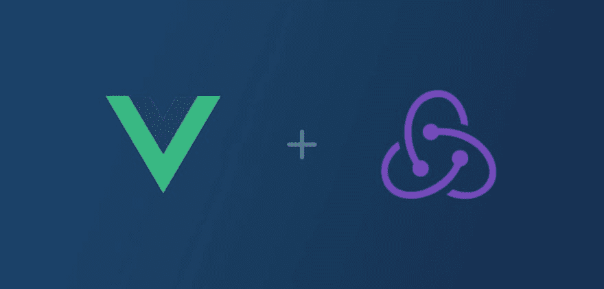

# 我们如何在 Vue 中使用 Redux & Redux-Observable

> 原文：<https://dev.to/couellet/how-we-use-redux--redux-observable-with-vue-2mff>

[T2】](https://res.cloudinary.com/practicaldev/image/fetch/s--AzdlS1fd--/c_limit%2Cf_auto%2Cfl_progressive%2Cq_auto%2Cw_880/https://snipcart.com/media/203945/redux-vuejs-example-1.jpg)

当涉及到重构一个技术栈时，我们经常声称要谨慎。

但是总会有这样的时候，它需要 T1 来完成。

当这种情况发生时，您需要选择正确的工具:

除非你有大量的风投资金，否则你负担不起每个季度进行一次完整的重构。

对于我们自己的购物车 3.0 重写，我们选择了 [Vue.js](https://snipcart.com/blog/progressive-migration-backbone-vuejs-refactoring) 和 Redux。

你说奇怪的组合？不完全是！在这篇文章中，我将向你展示我们如何以及为什么将 Vue.js 捆绑在 [Redux](https://redux.js.org/) 之上。

更具体地说，我将介绍:

*   什么是冗余和冗余可观察
*   为什么我们选择 Redux(而不是 Vuex)
*   我们如何利用 redux-observable
*   我们如何将 Vue.js 插入反应商店

我很高兴终于可以和你们分享我们在最新版本 Snipcart 上的一些工作了！

让我们从一点背景开始。

## 你说的那个购物车 3.0 版是什么？

在过去的几个月里，Snipcart 的整个团队一直在努力为开发人员打造新版本的购物车。

> [*阅读我们的文档*](https://docs.snipcart.com/getting-started/installation) *了解我们的 HTLM/JS 驱动的购物车是如何工作的。*

我们必须确定的第一件事是改进后的购物车必须实现的目标:

*   提供下一级结帐和购物车模板定制。
*   让开发者使用任何栈——这是 Snipcart 从一开始就承诺的。
*   打造市场上最牛逼的电子商务开发 UX。

这些促使我们仔细选择我们的新技术堆栈。

→点击阅读全文