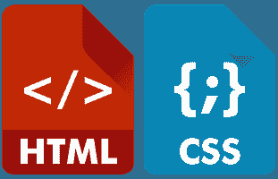

# HTML 和 CSS:编程的 90 年代孩子

> 原文：<https://dev.to/meg_gutshall/html--css-the-90s-kids-of-programming-50hg>

为了简洁起见，我将在这篇文章中使用缩略语。完整的短语和相关信息将涵盖在这篇文章的结尾。

在参加了近两个月的在线软件工程项目后，我终于感觉到我已经进入了熨斗的课程了。我已经完成了 Ruby 开发入门，学习了 Git 和 [GitHub](https://github.com/meg-gutshall) ，快速浏览了过程化 Ruby，现在正在进行面向对象 Ruby 部分的工作。我特别喜欢的一个部分是 HTML 和 CSS 介绍。

[T2】](https://res.cloudinary.com/practicaldev/image/fetch/s--SQWXViCA--/c_limit%2Cf_auto%2Cfl_progressive%2Cq_auto%2Cw_880/https://thepracticaldev.s3.amazonaws.com/i/6z59r46fvrjdl76ow8mu.png)

## HTML:网络的语言

HTML 是网络语言，然而，它不是编程语言，而是一种*标记*语言。HTML 文档由内容(用简单英语编写的文本)和标记(用来组织内容的 HTML 标签)组成。web 服务器和 web 浏览器使用这些文档在一个称为呈现的过程中显示文档的非标记版本(网页)。

这里有一个渲染过程的基本概述:HTML 文档存储在 web 服务器上的唯一位置(IP 地址),并通过互联网提供给 web 浏览器。用户将在 web 浏览器的搜索栏中键入一个 URL，web 浏览器将该 URL 输入 DNS，然后 DNS 将该 URL 地址转换为相应的 IP 地址。然后，web 浏览器使用 HTTP 与返回的 IP 地址上的服务器进行通信，并请求所需的信息——用于呈现网页的 HTML 文件。一旦网络浏览器接收到这些文件，它就翻译 HTML 代码并在我们的屏幕上显示网页。

## HTML 的语义

作为一个语言学呆子(如果你错过了，在我的上一篇文章中有一个我的西班牙语语言学呆子的很好的例子，[“小事情很重要”](https://meghangutshall.com/2018/07/21/the_little_things_matter/))，我喜欢 HTML，因为它的语义能力，所以请容忍我一会儿…

HTML 文档由两部分组成:头部和主体。当浏览器呈现 HTML 文档时，页眉不作为网页的一部分显示。相反，它包含的数据(如页面标题、favicon、到文档的 CSS 和 JavaScript 的链接以及元数据)将正文部分中不包含的附加信息传递给 web 浏览器。网页的标题和图标出现在网页浏览器的窗口标签中。CSS 链接为 HTML 文档提供样式规则，JavaScript 链接支持更多更复杂的特性。元数据定义文档的语言、字符编码、作者和描述。添加包含适用关键字的准确描述尤为重要，因为它会影响网站的 SEO，并决定网页在互联网搜索结果中出现的频率。

文档的主体由 HTML 元素组成。HTML 元素包含一个开始标签、一段内容和一个结束标签*。元素中使用的标记类型决定了含义和结构(语义！)的内容。常见的 HTML 标签表示链接、换行符、标题、图像、列表、段落和表格。Web 浏览器读取 HTML 标记，并在呈现网页时将它们的含义应用于所包含的内容。HTML 元素也可以接受属性来传递关于所包含内容的更详细的信息。准确分配 HTML 标记非常重要，这不仅是为了正确构建网页，也是为了使那些使用屏幕阅读器和其他工具浏览网页的人能够访问网站。

## CSS:美女对 HTML 的野兽

通过将 CSS 选择器分配给 HTML 元素并将声明分配给选择器，CSS 样式网页。最常用的 CSS 选择器指向 HTML 元素、类或 id，但也可以调用元素的属性或它与周围元素的关系。CSS 声明由属性及其对应的属性值组成。多个 CSS 声明可以应用于一个或多个 CSS 选择器——称为声明块——并且多个 CSS 选择器可以应用于一个或多个 HTML 元素，从而为 CSS 提供完全可定制的执行。

程序员之间的一个通用约定是将编写内容(HTML)和样式化内容(CSS)的任务完全分开。虽然 CSS 是专门为 HTML 设计的，但在大多数情况下，一个站点的 CSS 是在一个完全独立于 HTML 的文档中。相反，HTML 文档在 head 部分存储了一个指向其相应 CSS 文档的链接，web 浏览器在呈现时调用该链接来设计 web 页面的样式。

## 为什么 HTML 和 CSS 对程序员很重要

这两种语言的结合构成了前端 web 开发的很大一部分。作为一名软件工程师，你需要能够读写 HTML 来编码和调试你的程序...你会想要熟悉 CSS 来使你的程序变得漂亮！在 Flatiron 的学习平台上，HTML 和 CSS 介绍部分最突出的信息是:**所有 web 编程成功的途径都依赖于 HTML 方面的优势。**在我看来，这条道路的第一步是你的[投资组合网站](https://meghangutshall.com/)。没有 HTML 这是无法创建的，没有 CSS 看起来很糟糕。你的网站是你未来的雇主对你作为一名程序员的第一印象——所以要让它成为一个好网站！

有这么多关于 HTML 和 CSS 的信息，因为它们是基本的编程工具，简单地说，因为它们已经存在了很长时间。我可以写十几篇关于这个主题的博客文章，但是现在，我会给你一个简短的索引，上面提到的缩写以及一些我最喜欢的关于 HTML 和 CSS 的资源。

### 索引

CSS →层叠样式表
DNS →域名服务器
HTML →超文本标记语言
HTTP →超文本传输协议
SEO →搜索引擎优化
URL →统一资源定位符

### 资源

[Mozilla 开发网](https://developer.mozilla.org/en-US/docs/Learn/HTML)
[学习编码 HTML & CSS](https://learn.shayhowe.com/html-css/)
[CSS 招数](https://css-tricks.com/guides/)
[W3Schools](https://www.w3schools.com/)

**并不是所有的 HTML 元素都需要一个结束标签(比如`img`、`input`、`br`、`hr`、`meta`等等)，但这是另一篇博文的主题。如有疑问，使用结束标记。*