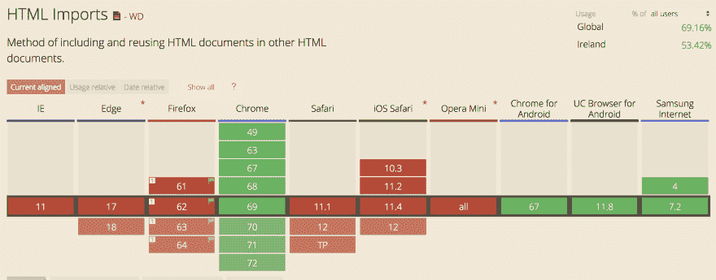

# HTML 导入和组件驱动的开发

> 原文：<https://dev.to/teej/html-imports--component-driven-development-38cl>

这最初是[发布在我的博客](https://tj.ie/html-imports-component-driven-development/)上。

我在想今天和八年前建立一个网站的过程。当需要 WordPress 的时候，我通常会在 WordPress 中从头到尾构建网站。在一段时间内，你不会看到任何 CSS，因为需要创建自定义帖子类型，需要获取内容，需要安装插件。整个前端都被这种配置搅在了一起，在站点上线之前，什么都没有真正完成。

现在，8 年前我还不知道很多，所以现在回想起来，有很多方法可以做得更好。如果我能回到过去，我可能会先用所有的部分建立一个静态网站，然后在它准备好的时候把它移植到 WordPress。可能是我，但我发现在做最初的前端工作时不必考虑 CMS 非常自由。当我想专注于样式设计时，我不想去解决为什么模板会损坏的问题。对我来说，偏离主题摆弄 PHP 太容易了，因为我刚刚想到了一种更好的方法来做某事。

多年后，这种在正确的时间专注于正确的事情的想法，至少对我来说，被原子设计所概括，所以我想借此机会感谢布拉德·弗罗斯特保存了我仅存的几个脑细胞。我使用了像[模式实验室](https://patternlab.io/)和[分形](https://fractal.build/)这样的工具，它们真的让我看到了一次专注于一件事的好处。

在团队中工作并整合这些工具有时会带来麻烦。当我想介绍从组件构建项目的概念时，每个人都必须在同一页上，并对我们使用的工具有一个坚实的理解。技术错误源于错误配置的环境或未满足的期望，当您快速进行多个项目时，它可能会成为动力杀手。

在很多情况下，我认为用`php -S localhost:8080`在一个目录中建立一个本地 PHP 服务器，并为组件建立单独的文件，然后用`include`将它们拉进一个模板中并没有什么错。并不是所有的项目都需要可以向客户展示的包含电池的模式库。有时他们不在乎，只要项目在预算内按时完成。有时用 Pattern Lab 中打包的如此强大的资源给客户带来惊喜是很好的，但是当不需要它时，我们仍然会从对其他文件的少量 PHP 调用中获得那种很好的组件化感觉。开发人员仍然可以一次专注于一件事情。

## HTML 导入

我在想，是否有什么方法可以在浏览器中复制这一点，而不依赖于外部库。也许这可以用我们今天的工具来完成，而不需要太依赖 JavaScript 来进行一系列 AJAX 调用。这时我想起了 HTML 导入。我想知道现在进展到什么程度了...

[T2】](https://res.cloudinary.com/practicaldev/image/fetch/s--Td31D_Kh--/c_limit%2Cf_auto%2Cfl_progressive%2Cq_auto%2Cw_880/https://thepracticaldev.s3.amazonaws.com/i/0gwmfcz3o8sdn9wvqfh8.png)

嗯，[目前还不太好](https://caniuse.com/#search=html%20imports)。Mozilla 已经[发表了他们对支持它的想法](https://hacks.mozilla.org/2015/06/the-state-of-web-components/)。

> 在 Mozilla，我们希望探索导入定制元素定义如何与即将到来的 ES6 模块 API 保持一致。如果/当它们能让开发者做他们还不能做的事情时，我们会准备实施。

Chrome 也将移除当前的实现。

尽管如此，我还是想尝试复制拥有组件并在需要的地方包含它们的过程，而不需要开发人员知道细节，这样他们就可以专注于编码。

### 导入 HTML

假设我有一个`index.html`，一个部分文件夹(想想可能由组件组成的页眉和页脚)，和一个组件文件夹，我想加载它们，并将它们注入页面。首先要做的是用`<link rel="import">`将它们注册到我的文档的`<head>`中。

```
<link rel="import" id="site-header" href="partials/site-header.html">
<link rel="import" id="primary-nav" href="components/navigation/primary-nav.html"> 
```

Enter fullscreen mode Exit fullscreen mode

ID 对于引用导入很重要，以便将它们注入页面。那么我们如何引用这些导入呢？我将用一个数据属性来定义它。

```
<div data-import="site-header"></div> 
```

Enter fullscreen mode Exit fullscreen mode

在我的网站标题中，我也引用了主导航。

```
<header>
  <div>
    <span>Logo</span>
    <div data-import="primary-nav"></div>
  </div>
</header> 
```

Enter fullscreen mode Exit fullscreen mode

### JavaScript

我们需要一些 JavaScript 来启动这个球。我们需要找到导入，获取它们的内容，并用它们各自的内容替换`[data-import]`的实例。公平地说，代码并不多，这是一个很好的惊喜。

1.  获取导入 id，以标识稍后导入到我们文档中的位置
2.  获取导入的内容。因为它将包含 body 标签，所以我们想把所有东西都放在里面。
3.  找到放它的地方。
4.  遍历每个`data-import`并用内容替换它。

对于步骤 4，我使用`content.clondNode(true)`而不是传递`content`。我这样做是因为如果页面上有多个实例，它将只在最后一次引用的地方显示导入，本质上是移动它。通过使用`cloneDeep`，并传递`true`来包含子节点，我们将它复制到每个被引用的地方。

```
let imports = document.querySelectorAll('link[rel="import"]')

imports.forEach(htmlImport => {
  let id = htmlImport.getAttribute('id'), // [1]
      content = htmlImport.import.querySelector('body *'), // [2]
      domTemplate = document.querySelectorAll(`[data-import="${id}"]`) // [3]

  domTemplate.forEach(el => {
    el.parentNode.replaceChild(content.cloneNode(true), el) // [4]
  })
}); 
```

Enter fullscreen mode Exit fullscreen mode

我认为这是一个有趣的小实验，在未来创建网站的工具中看到这个因素会很酷。如果有支持的话。否则，需要研究定制元素，或者我很乐意坚持使用 PHP 的静态设置。

[查看演示](https://htmlimports.tj.ie)
[查看来源](https://github.com/tjFogarty/html-imports/)