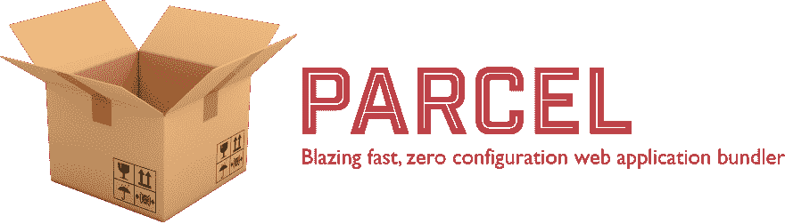

# 带包裹的 HTML SASS 初学者工具包

> 原文：<https://dev.to/aravindballa/html-sass-starter-kit-with-parcel-14k8>

[T2】](https://res.cloudinary.com/practicaldev/image/fetch/s--fyPFw4wP--/c_limit%2Cf_auto%2Cfl_progressive%2Cq_auto%2Cw_880/https://user-images.githubusercontent.com/19409/31321658-f6aed0f2-ac3d-11e7-8100-1587e676e0ec.png)

[package](https://github.com/parcel-bundler/parcel)是一款令人惊叹的零配置捆扎机。(你认识 bundlers 吧？比如 webpack？)它对我们通常做的许多事情都有现成的支持。与这个领域的其他产品相比，它的速度非常快。

说了这么多，你可以把它用在像 [React](https://github.com/jaredpalmer/react-parcel-example) 、 [Angular](https://github.com/DeMoorJasper/Angular-Parcel-Boilerplate) 、 [Vue](https://github.com/parcel-bundler/examples/tree/master/Vue) 等等流行的框架上。用它可以做很多事情。这个[牛逼榜单🕶](https://github.com/parcel-bundler/awesome-parcel) 讲的就是这个。

我的目标有所不同。我想要它作为基本用途。比如，用 HTML 和 Sass(或者你可以说是 SCSS)构建小网站(或者只是一个页面)。包裹对这个也很好。

我是 [DevTips](https://www.youtube.com/channel/UCyIe-61Y8C4_o-zZCtO4ETQ) 的粉丝，并修改了他们的[启动套件](https://github.com/DevTips/DevTips-Starter-Kit)以使用**包**。酷的事情是，它支持 ES6，并做开箱即用的代码分割(#OOTB)。

这是回购协议:

[https://github.com/aravindballa/DevTips-Starter-Kit](https://github.com/aravindballa/DevTips-Starter-Kit)

* * *

继续黑✌🏻