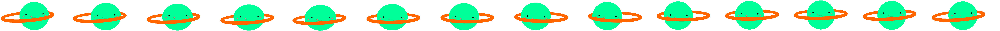

# HTML5 画布.第 3 部分:图像

> 原文：<https://dev.to/gmartigny/html5-canvas---part-3-images-28ig>

# 图像

在第二部分中，我们用变换赋予矩形生命。然而，它仍然是一个黑色的长方形...没那么棒。
您可以使用`drawImage`轻松地在画布上绘制图像，让我们试试吧。

## [画图](////developer.mozilla.org/en-US/docs/Web/API/CanvasRenderingContext2D/drawImage)

有 3 种方法可以调用`drawImage`方法——使用 3、5 或 9 个参数。是的，9 个论点，但是不要害怕，当你得到它的时候，它是有意义的。
第一个参数总是要绘制的图像数据。它可以在不同的形式下，但最简单的方法是像传递任何 HTML DOM 图像元素一样传递一个 [HTMLImageElement](////developer.mozilla.org/en-US/docs/Web/API/HTMLImageElement) 。

### 1。3 个参数

然后，接下来的两个参数将是绘图的 x 和 y 坐标。图像将以与源相同的大小绘制在这些坐标上。

```
drawImage(image, x, y); 
```

Enter fullscreen mode Exit fullscreen mode

### 2。5 个参数

和前面的方法一样，它只是多了两个目标的宽度和高度参数。换句话说，它允许你在画之前缩放图像。

```
drawImage(image, x, y, width, height); 
```

Enter fullscreen mode Exit fullscreen mode

### 3。9 个参数

这一次，事情有点变化。
第一个是一如既往的图像数据。然后，有 4 个参数表示源的 x，y 坐标，宽度和高度。同样，4 代表目的地的 x，y 坐标，宽度和高度。
我认为，从 MDN 的总结中可以清楚地看出这一点。

```
drawImage(image, sx, sy, sWidth, sHeight, dx, dy, dWidth, dHeight) 
```

Enter fullscreen mode Exit fullscreen mode

[T2】](//mdn.mozillademos.org/files/225/Canvas_drawimage.jpg)

> 如果你没有使用所有的图片，为什么要加载呢？你可以用 GIMP 来修剪它？

我想到的主要用例是使用 tileset。拼贴集是由许多较小的图像拼接而成的图像。主要用于游戏中，允许你只加载一个大图片而不是许多小图片，简化了程序。
在谷歌上快速搜索，会返回很多例子。甚至谷歌自己也在用。

[T2】](//ssl.gstatic.com/img/i1_1967ca6a.png)

这个想法是在任何地方使用相同的图像，只针对你需要的部分。

所以，我用 gif 动画的帧创建了一个简单的 tileset。

[T2】](//image.ibb.co/jfpeqo/tinyplanet.png)

我们将使用“9 个参数”调用一个接一个地绘制每一帧。

[https://codepen.io/GMartigny/embed/xjyVKv?height=600&default-tab=result&embed-version=2](https://codepen.io/GMartigny/embed/xjyVKv?height=600&default-tab=result&embed-version=2)

他是不是很可爱？

如果你看看代码，没有太多变化。我用一个 URL 加载一个`new Image`，然后用一个`getFrame`函数的参数绘制它。这个函数返回`sx, sy, sWidth, sHeight`部分。最后，我将一个监听器连接到图像的`"load"`事件，开始循环。

## 更进一步

现在，你应该有了在网页中使用画布和创建各种动画和交互的所有工具。使用形状、变换和图像，您可以构建各种各样的视觉效果。所以，要聪明，要有创造力，要有好奇心。

为了结束这个系列，我将分享一些使用画布时的有用技巧(很快)。与此同时，花一些时间在 [CodePen](////codepen.io/) 上，试着重现你所看到的。或者，在[运球](////dribbble.com)上找一个你喜欢的动画，用代码搭建。

再见。