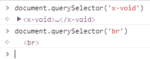

# [HTML5/JS]定义自定义自结束(void) HTML 元素，如 BR 和 IMG

> 原文：<https://dev.to/jochemstoel/html5js-define-a-custom-self-closing-void-html-element-like-br-and-img-aif>

我无法(重新)生成一个自结束元素。不可能吗？

```

<br />
<link />
<meta /> 
```

Enter fullscreen mode Exit fullscreen mode

自结束 HTML 元素不需要或不支持结束标记。

现代浏览器支持使用 document.registerElement 的自定义元素标记和行为。

尝试扩展已经无效的 HTML 元素失败。

```
class HTMLVoidElement extends HTMLBRElement {
}

document.registerElement('x-void', HTMLVoidElement)
document.createElement('x-void') // returns <x-void></x-void> 
```

Enter fullscreen mode Exit fullscreen mode

如果元素在文档 HTML 中，而不是以编程方式创建的，这没有什么区别。

```
<x-void />
<br /> 
```

Enter fullscreen mode Exit fullscreen mode

[T2】](https://res.cloudinary.com/practicaldev/image/fetch/s--3y1eJBo4--/c_limit%2Cf_auto%2Cfl_progressive%2Cq_auto%2Cw_880/https://thepracticaldev.s3.amazonaws.com/i/g2s39b87vhg09zc77ljm.png)

# 思想？