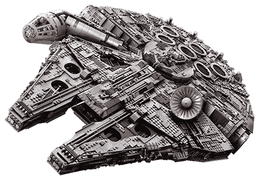

# Hubrix 从现在到 3 月 1 日接受 Hur IMA Beta 的申请

> 原文：<https://dev.to/hubrixco/hubrix-accepting-applicants-for-hurima-beta-now-through-march-1-327a>

Hubrix 很高兴地宣布，我们正在接受 Hur IMA Beta 测试的申请。

Hurima 是一个**访问控制和用户权限管理 API** ，适合与任何本地、网络、移动或云应用集成。**它不是 IAM 组件，也不提供认证服务。**相反，它依赖其他更好的 API 来提供认证。因此，Hurima 本身只是访问控制。但是 Hurima + PAM、Hurima + LDAP 或 Hur IMA+auth 0——这些对中的任何一对*都是 IAM 组件。*

# 贝塔社的第一条规则是...

1.  任何人都可以申请，但只有 50 人会被选中。我们正在寻找真正需要访问控制功能集的开发人员，他们当前或不久的将来的工作将受益于 Hurima。

2.  这是封闭的测试版。在我们发布之前，测试版将是使用 Hurima 的唯一途径。参与者将被要求签署一份保密协议，该协议将在 Hurima 1.0 发布时到期。

3.  这是一个时间承诺。如果你不能每周至少花 2 个小时在测试项目上，请不要加入。

4.  有额外津贴。我们对测试版用户期望很高，我们打算回报他们:

    *   限量版“Hur IMA Beta Blaster”T 恤，仅向 Beta 版参与者发放
    *   25 欧元亚马逊礼品卡
    *   1 个优惠券代码，可让您在发布后的 6 个月内免费使用 Hurima Cloud
    *   5 个优惠券代码，可在 6 个月内享受 Hurima Cloud 40%的优惠，送给您的朋友和同事
    *   法国巴黎 Hurima 发布会的 VIP 通行证
    *   Hubrix 员工将选出一名 MVT(“最有价值的测试者”)，他将在测试结束时获得**Lego Millenium Falcon**(零售价 800 欧元)

[T2】](https://res.cloudinary.com/practicaldev/image/fetch/s--a5DlD4Mp--/c_limit%2Cf_auto%2Cfl_progressive%2Cq_auto%2Cw_880/https://thepracticaldev.s3.amazonaws.com/i/0u5hzm0e4alpqxm7oy6i.png)

# 如何申请

**只要完成表格**:**[https://hbr.li/hbeta](https://hbr.li/hbeta)**

这份表格(最多)有 13 个问题，您应该能够在不到 2 分钟的时间内完成。

完成表格后，您将收到一封确认电子邮件。就这样，你已经申请了。

# 接下来会发生什么

我们在 2018 年 3 月 1 日欧洲中部时间**晚上 11:59 之前接受申请。我们将对所有申请人进行筛选，以获得入围名单。我们将为每位决赛选手安排在线面试。3 月 26 日，我们将通知那些被接受加入测试计划的人。测试计划将从 4 月 2 日持续到 5 月 31 日。**

我们很高兴欢迎你加入我们的社区！