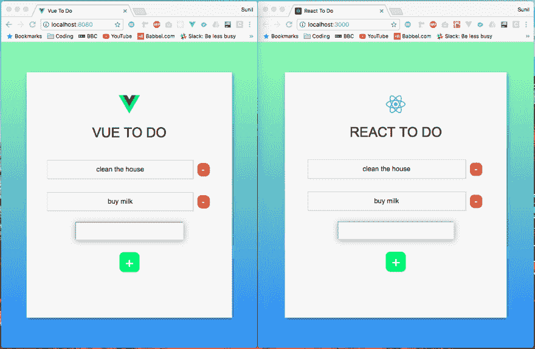
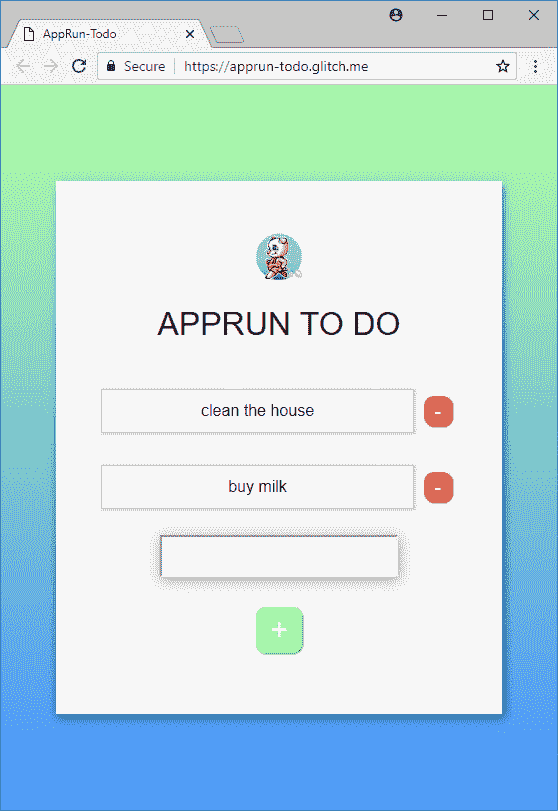
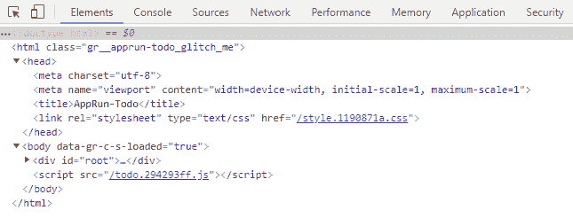

# 我还使用 AppRun 创建了完全相同的应用程序

> 原文：<https://dev.to/yysun/i-also-created-the-exact-same-app-using-apprun-37kc>

上次比较 AppRun 和 Redux 和 React Context API 感觉还挺好玩的。

今天，我发现了另一个很棒的帖子，标题是[“我在 React 和 Vue 中创建了同一个应用。区别就在这里。”](https://medium.com/javascript-in-plain-english/i-created-the-exact-same-app-in-react-and-vue-here-are-the-differences-e9a1ae8077fd)我想把 [AppRun](https://github.com/yysun/apprun) 也加入到比较中。

[T2】](https://res.cloudinary.com/practicaldev/image/fetch/s--tLHuoL2P--/c_limit%2Cf_auto%2Cfl_progressive%2Cq_auto%2Cw_880/https://cdn-images-1.medium.com/max/2000/1%2AmJ-qdNqldpgae2U5oS0qDg.png)

我将重新创建该应用程序，并回答在原始帖子中探索的相同问题:

*   项目结构是什么？
*   我们如何改变数据？
*   我们如何创建新的待办事项？
*   我们如何从列表中删除？
*   我们如何传递事件侦听器？
*   我们如何将数据传递给子组件？
*   我们如何将数据发送回父组件？
*   最后，有什么区别？

我像往常一样在 glitch.com 上创建了应用程序。使用 glitch.com 非常方便。下面是现场演示链接:[https://apprun-todo.glitch.me/](https://apprun-todo.glitch.me/)。

[T2】](https://res.cloudinary.com/practicaldev/image/fetch/s--4a1M4Rzu--/c_limit%2Cf_auto%2Cfl_progressive%2Cq_auto%2Cw_880/https://cdn-images-1.medium.com/max/1600/1%2ADWsG3B2utcEmD1rKSbIVpA.png)

# 1。项目结构是什么？

在本例中，我使用的是包裹捆扎机。该项目仅依赖于 Parcel、TypeScript 和 AppRun。

```
{  "name":  "apprun-todo",  "version":  "1.0.0",  "scripts":  {  "start":  "parcel -p 8080 src/index.html --no-hmr",  "build":  "parcel build src/index.html"  },  "devDependencies":  {  "parcel-bundler":  "^1.9.7",  "typescript":  "^2.9.2"  },  "dependencies":  {  "apprun":  "^1.15.2"  }  } 
```

Enter fullscreen mode Exit fullscreen mode

包裹允许我们在 index.html 包括打字稿文件。

```
<!doctype html>
<html>
<head>
  <meta charset="utf-8">
  <meta name="viewport" content="width=device-width, initial-scale=1, maximum-scale=1">
  AppRun-Todo
  <link rel="stylesheet" type="text/css" href="style.css"/>  
</head>
<body>
  <div id="root"></div>
  <script src="todo.tsx"></script>
</body>
</html> 
```

Enter fullscreen mode Exit fullscreen mode

Parcel 将 src/index.html 编译为新的 dist/index.html。新的 html 文件引用编译的 CSS 和 JavaScript 文件。

[T2】](https://res.cloudinary.com/practicaldev/image/fetch/s--ZnSfrBSU--/c_limit%2Cf_auto%2Cfl_progressive%2Cq_auto%2Cw_880/https://cdn-images-1.medium.com/max/1600/1%2AHpWNhgqzxm7PwPs10krxHg.png)

todo.294293ff.js 编译自 src/todo.tsx，style.1190871a.css 编译自 style.css. BTW，我更喜欢一个 css/Scss，而不是在组件文件中有单独的 CSS 文件或 CSS。此外，我更喜欢将 CSS 嵌入到 HTML 中(package 目前不这么做)。

该应用程序在 todo.tsx 文件中有 38 行。

```
import app, { Component } from 'apprun';

const ToDoItem = ({ item }) => <div className="ToDoItem">
  <p className="ToDoItem-Text">{item.todo}</p>
  <div className="ToDoItem-Delete" onclick={()=> app.run('delete-item', item.key)}>-</div> </div> 
const state = {
  list: [ 
    { 'todo': 'clean the house' },
    { 'todo': 'buy milk' } ]
};

const view = (state) => <div className="ToDo">
  
  <h1 className="ToDo-Header">AppRun To Do</h1>
  <div className="ToDo-Container">
    <div className="ToDo-Content">
      {state.list.map((item, key) => <ToDoItem item={{ ...item, key }} />)}
    </div>
    <input type="text" onkeypress={e => app.run('keypress', e)} />
    <div className="ToDo-Add" onclick={e => app.run('create-item')}>+</div>
  </div> </div>; 
const update = {
  'keypress': (_, e) => {
    e.keyCode === 13 && app.run('create-item');
  },
  'create-item': (state) => {
    const input = document.querySelector('input');
    if (input.value) return ({ list: [...state.list, { todo: input.value }] });
  },
  'delete-item': (state, key) => ({ list: state.list.filter((_, idx) => idx !== key) })
}

app.start('root', state, view, update); 
```

Enter fullscreen mode Exit fullscreen mode

该应用程序是一个不使用组件的 AppRun 全球应用程序。我一直在辩论自己是否要使用组件来创建应用程序，以便与 React/Vue 进行密切比较。最后，YAGNI 赢了。如果“你不需要它”(YAGNI)，就不要做。我决定继续使用全局应用程序模式，因为这表明我可以使用 AppRun 为更简单的应用程序选择更简单的架构。

可以对比一下 [Vue app 源代码](https://github.com/sunil-sandhu/vue-todo/)和 [React app 源代码](https://github.com/sunil-sandhu/react-todo/)。

# 2。我们如何改变数据？

让我们从如何存储数据开始。我们创建一个数据对象作为初始状态。

```
const state = {
  list: [ 
    { 'todo': 'clean the house' },
    { 'todo': 'buy milk' } ]
}; 
```

Enter fullscreen mode Exit fullscreen mode

当我们更新数据对象时，例如，将“name”属性更新为“John”，我们创建一个新的数据对象作为事件处理程序中的新状态。

```
const update = {
  'update-name': return ({...state, name: 'John' })
}; 
```

Enter fullscreen mode Exit fullscreen mode

# 3。我们如何创建新的待办事项？

我们开发了一个事件处理程序，它创建了一个新的状态，其中包含了新的条目。

```
const update = {
  'create-item': (state) => {
    const input = document.querySelector('input');
    if (input.value) return ({ 
      list: [...state.list, { todo: input.value }] });
  }
} 
```

Enter fullscreen mode Exit fullscreen mode

我们发布“创建项目”事件来创建新的待办事项。

```
<div className="ToDo-Add" onclick={() => app.run('create-item')}>+</div> 
```

Enter fullscreen mode Exit fullscreen mode

# 4。我们如何从列表中删除？

我们开发了一个事件处理程序，它创建了一个新的状态，不包括被移除的项目。

```
const update = {
  'delete-item': (state, key) => ({ 
    list: state.list.filter((_, idx) => idx !== key) })
} 
```

Enter fullscreen mode Exit fullscreen mode

我们发布“删除项目”事件来删除项目。

```
<div className="ToDoItem-Delete" onclick={()=> app.run('delete-item', item.key)}>-</div> 
```

Enter fullscreen mode Exit fullscreen mode

# 5。我们如何传递事件侦听器？

我们在 DOM 事件处理程序中发布 AppRun 事件。

```
<input type="text" onkeypress={e => app.run('keypress', e)} />

<div className="ToDo-Add" onclick={e => app.run('create-item')}>+</div> 
```

Enter fullscreen mode Exit fullscreen mode

# 6。我们如何将数据传递给子组件？

我们使用无状态组件(也称为纯函数组件)，它看起来像一个 JSX 标签(<todoitem>)，但它只是一个函数调用。</todoitem> 

```
<div className="ToDo-Content">
  {state.list.map((item, key) => <ToDoItem item={{ ...item, key }} />)}
</div> 
```

Enter fullscreen mode Exit fullscreen mode

我们破坏函数参数来获得无状态组件中的数据。

```
const ToDoItem = ({ item }) => <div className="ToDoItem">
  <p className="ToDoItem-Text">{item.todo}</p>
  <div className="ToDoItem-Delete" onclick={()=> app.run('delete-item', item.key)}>-</div> </div> 
```

Enter fullscreen mode Exit fullscreen mode

# 7。我们如何将数据发送回父组件？

我们发布一个 AppRun 事件。

```
<div className="ToDoItem-Delete" onclick={()=> app.run('delete-item', item.key)}>-</div> 
```

Enter fullscreen mode Exit fullscreen mode

# 8。是什么让 AppRun 与众不同？

## 1)我们使用事件驱动应用/组件更新生命周期。

你可以看到上述六个问题中的五个问题的答案是“发布 AppRun 事件”

AppRun 控制整个应用/组件更新生命周期，包括管理状态、创建新的虚拟 DOM 和渲染真实 DOM。

在 AppRun 事件生命周期中，AppRun 首先通过传入当前状态来调用事件处理程序。当状态需要更新时，事件处理程序创建一个新的状态，并将其返回给 AppRun。然后 AppRun 将新状态传递给视图函数。view 函数创建虚拟 DOM。最后，AppRun 将虚拟 DOM 渲染为真实 DOM。如果事件处理程序不返回新状态，或者如果视图函数不返回虚拟 DOM，则为。事件生命周期停止。这是用户控制应用程序逻辑流程一种统一而直观的方式。

web events = > AppRun events = > Update/Event handlers = >(新状态)=> View = >(虚拟 DOM) => DOM

AppRun 事件处理程序在集中位置定义，即*更新*对象。

```
const update = {
  'keypress': (state) => {},
  'create-item': (state) => {},
  'delete-item': (state) => {},
} 
```

Enter fullscreen mode Exit fullscreen mode

每当我们想做某件事的时候，我们就通过调用 *app.run()* 来发布 AppRun 事件。AppRun 从更新对象中查找并调用事件处理程序。例如，当创建和删除新的待办事项时，我们发布“创建事项”和“删除事项”事件。

```
<div onclick={() => app.run('create-item')}>+</div>
<div onclick={() => app.run('delete-item', item.key)}>-</div> 
```

Enter fullscreen mode Exit fullscreen mode

与 React 应用和 Vue 应用相比，React 代码如下:

```
<div onClick={this.createNewToDoItem}>+</div>
<div onClick={this.props.deleteItem}>-</div> 
```

Enter fullscreen mode Exit fullscreen mode

Vue 代码看起来像:

```
<div @click="createNewToDoItem()">+</div>
<div @click="deleteItem(todo)">-</div> 
```

Enter fullscreen mode Exit fullscreen mode

在 React app 中，我们要自己管理状态，使用 *this.setState()* 触发 DOM 渲染。在 Vue 应用中，我们直接改变状态，让 Vue 反应性地渲染 DOM。

在 AppRun 应用程序中，我们发布事件。因为我们调用了那么多次 *app.run()* 来发布事件，所以库本身就以此命名——*AppRun*！

## 2) AppRun 函数不需要“这个”

虽然有时 JavaScript 中的这个关键字会给人带来惊喜，因为它的行为与其他语言中的不同，但看着 Vue 组件，我在一个新的层面上感到困惑。*什么是‘这个’*？

```
export default {  
  data() {      
    return {
      list: []
    } 
  } 
  methods: {
    createNewToDoItem() {
      this.list.push(...);
    }
  }
} 
```

Enter fullscreen mode Exit fullscreen mode

怎么*‘this . list’*就是 data()函数创建的对象的列表数组？

AppRun 管理状态。它将状态传递给事件处理程序和视图函数。这些函数拥有执行所需的所有数据。没必要用这个。此外，AppRun view 函数是纯函数。AppRun view 函数只对输入状态起作用，没有副作用。

```
const view = (state) => <div className="ToDo">
......
</div> 
```

Enter fullscreen mode Exit fullscreen mode

在 AppRun app 开发中，我们可以分别对事件处理程序和视图功能进行开发和单元测试。它允许我们一次只关注一个。我们都知道纯函数更容易推理、测试和维护。

## 3)双向数据绑定是可能的，但 YAGNI 认为

AppRun 能够进行双向数据绑定。我们可以对 React 使用相同的方法，即处理<输入/ >节点的 *onchange* 事件，将<输入/ >节点的值带入状态。同样，从[这个 AppRun 示例](https://apprun.js.org/#hello-directive)，您可以看到如何使用自定义指令实现双向数据绑定。

在待办 app 中，我们不需要双向数据绑定。我们可以在创建新项目时从 DOM 中获取用户输入。

```
'create-item': (state) => {
  const input = document.querySelector('input');
  if (input.value) return ({ 
    list: [...state.list, { todo: input.value }] });
} 
```

Enter fullscreen mode Exit fullscreen mode

此外，当 AppRun 渲染虚拟 DOM 时，它不会重置<input>节点的值。当用户添加或删除项目时，屏幕被重新呈现，但是用户的输入被保留。我故意在创建新项目后不清理<input>，这样你就可以看到效果了。

如果 YAGNI 不这样做。

我将以编译后的 JavaScript 文件大小来结束这篇文章:

AppRun:18.3 Kb
Vue:77.84 Kb
React:127.24 Kb
我鼓励你在 glitch.com 重新混(叉)一下 app:[https://glitch.com/edit/#!/remix/apprun-todo](https://glitch.com/edit/#!/remix/apprun-todo)。

玩得开心！