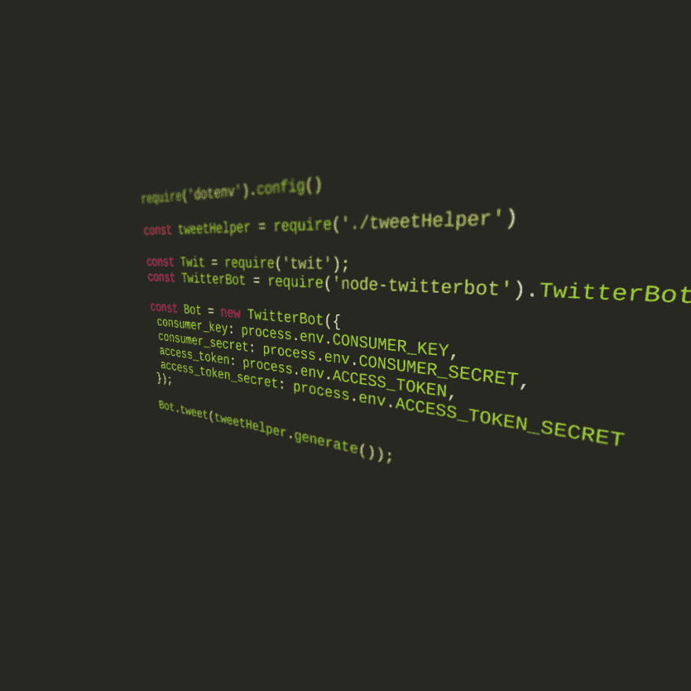
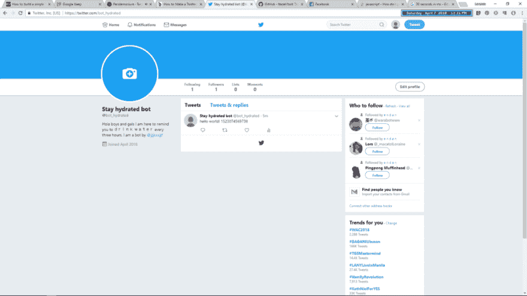
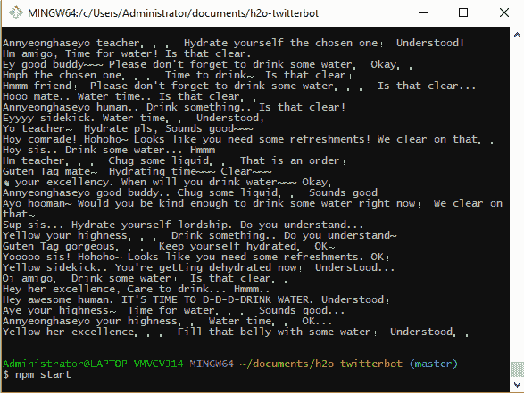
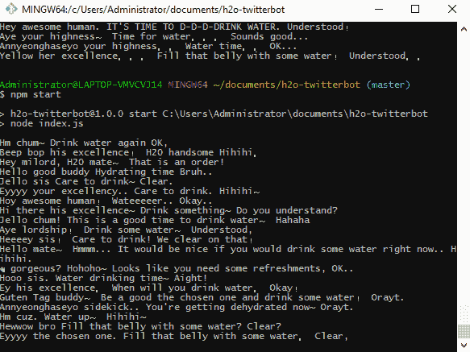
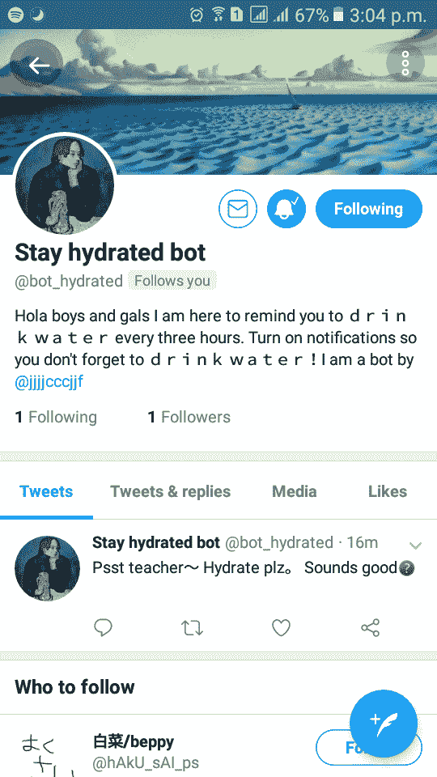

# 我总是忘记喝水，所以我建了一个推特机器人来提醒我

> 原文：<https://dev.to/jjjjcccjjf/i-always-forget-to-drink-water-so-i-built-a-twitter-bot-to-remind-me-4chk>

[T2】](https://res.cloudinary.com/practicaldev/image/fetch/s--f4weE3WW--/c_limit%2Cf_auto%2Cfl_progressive%2Cq_auto%2Cw_880/https://cdn-images-1.medium.com/max/1024/1%2AfSpHXKrUknfz7-qRi5L6_Q.png)

这些天我总是很难保持水分…尤其是在家的时候。几个小时，我全神贯注于一本书，忘了喝水。这导致我的皮肤和嘴唇变得更加干燥。最近，我追随了许多机器人来帮助我构建世界。将这两个想法结合在一起，我想*为什么不造一个机器人来提醒我喝水呢？*

我在 dev.to 的阅读清单上一直有这篇特别的[帖子](https://dev.to/omarhashimoto/how-to-build-a-simple-twitter-bot-in-17-lines-ofcode-2aan)，就在本周，我决定最终读完它。我在研究时也偶然发现了[这篇文章](https://medium.com/@mattpopovich/how-to-build-and-deploy-a-simple-twitter-bot-super-fast-with-node-js-and-heroku-7b322dbb5dd3)，并最终选择了它而不是前者。

### 修补机器人

这是我希望发生的事情(最初)。我只是想让机器人每 3 个小时提醒我喝水。下面是我如何实现这一目标的思考过程。

1.  在本地建立一个原型。让它 tweet 而不是 retweet(参考第一个教程)
2.  让它每 3 小时发一次微博
3.  让它喷出̶r̶a̶n̶d̶o̶m̶ ̶n̶o̶n̶s̶e̶n̶s̶e̶鼓励的话让我喝水
4.  创建句子生成器的算法
5.  部署

### 建筑原型

我去了 [Twit 的文档](https://github.com/ttezel/twit)，寻找如何发推特而不是转发。自述文件有点乱，但是可以理解，所以没问题。

然后砰！这是我的机器人的 *hello world* tweet。

<figure> 

<figcaption>工作示例✨</figcaption>

</figure>

1.  很明显，你不能连续发布同一条推文，所以我在这里加上了当前的时间戳，这样它就唯一了。(出于测试目的)
2.  我使用了 [dotenv](https://www.npmjs.com/package/dotenv) 依赖关系，这样我就不会将我的敏感信息和密钥公之于众。

### 改变计划

我没有真正按照我的清单去做，而是首先从部署过程开始，然后在本地构建我的句子生成器。这里有一些有趣的句子！

[T2】](https://res.cloudinary.com/practicaldev/image/fetch/s--cLtltt8p--/c_limit%2Cf_auto%2Cfl_progressive%2Cq_auto%2Cw_880/https://cdn-images-1.medium.com/max/587/1%2AbarJMouX64HY8RtUNkkaRQ.png)

[T2】](https://res.cloudinary.com/practicaldev/image/fetch/s--RbPZurfj--/c_limit%2Cf_auto%2Cfl_progressive%2Cq_auto%2Cw_880/https://cdn-images-1.medium.com/max/583/1%2AZXzSmQtKuFAPo_leDdoopw.png)

第二个教程利用了 Heroku 的插件。我使用了一个调度程序插件，每小时运行一次脚本(而不是最初计划的 3 小时)，仅此而已。

<figure> 

<figcaption>我的初始截屏</figcaption>

</figure>

### 就是这样！

这个帖子不是教程，只是我学习经验的文档。如果你想每小时提醒你喝水，那么你可以关注 [@bot_hydrated](https://twitter.com/bot_hydrated) 。😅夏天到了，天气越来越热了！必须保持水分，伙计们！如果你想提交一个拉取请求，这里有一个[回购](https://github.com/jjjjcccjjf/bot_hydrated)的链接。也可以随意叉。这只是一个有趣的项目，我不确定我是否会非常认真地对待这个项目(例如，在未来改进机器人)。不过，我有几个其他的机器人想法！所以要小心。😅

如果你正在读这篇文章，感谢你读到最后。😎🙏下一集再见！

编辑:修复了错误的回购链接