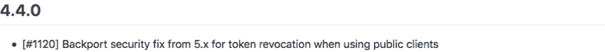
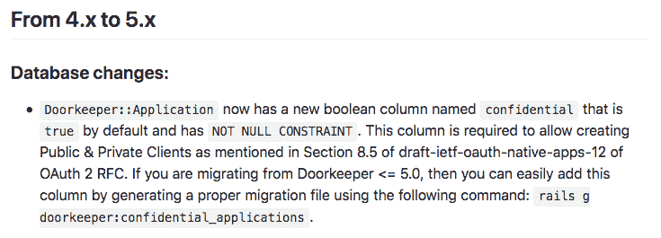

# 我中断了 8 万用户的登录

> 原文：<https://dev.to/rhymes/i-broke-login-for-80k-users-3bjm>

让我先说我对此很不高兴:-D

以下是对粗心、幼稚和糟糕的变更日志和升级指南的事后剖析。

## 发生了什么事

我的一个客户有一个移动应用，其登录使用的是 [OAuth2 密码授权](https://www.oauth.com/oauth2-servers/access-tokens/password-grant/)。这是一款适用于 Android 和 iOS 的应用程序。

我们开始收到关于用户无法登录的投诉，所以我进入了“调查模式”(持续了一整天，直到现在)。

这个应用程序是“经典”的应用程序，没有人真正关心它，它是由许多系统集成商制造的，可以与许多服务器通信，其中包括我为登录部分编写的 API。老实说，我不知道移动应用程序内部是如何工作的，我从未见过代码，但我编写了服务器端 API，它已经工作了很多年。

Rails 服务器也已经成功地跨所有 4.x 版本迁移到 5.2 版本，我们所做的测试仍然有效。Rails 服务器是共享通用功能的各种不同移动应用程序的后端。肯定是预 Firebase 或应用程序同步:D

回到主要问题:一些用户无法登录。我开始与继承该应用程序代码的移动开发者交谈(他不是最初的编码者)，我们讨论了这种情况。

注:这是第一次投诉后的许多周。在意大利，八月是死气沉沉的一个月。移动团队在度假，系统集成商在度假，我客户的客户也在度假。可能穷用户也在度假，并试图从那里使用应用程序。

与此同时，应用程序的其他部分停止工作。同样，我不知道它实际上是如何工作的，我只看到他们在一个服务器上的流量的 API 日志，但我知道代码或多或少的记忆，绝对没有理由应用程序的其余部分与此功能有任何关系。嗯，除非有糟糕的异常处理和流程，我不知道，但这完全是猜测。

我问了一些常见的问题:你最近发布了新版本吗？我们能有用户行为的日志吗(他们没有，改天再说)等等。

在服务台应用程序(yay)上收到一个账户后，我们注意到一个模式:只有 Android 设备出现故障:潜在的 8 万用户，实际上他们收到了 400 起投诉。尽管如此，还是很多，但情况可能会更糟。我想即使是用户也会对这个应用感到寒心。

## 夏洛克时刻

然后，我下载了 40 天的日志，并开始使用 [ripgrep](https://github.com/BurntSushi/ripgrep) (用 Rust 编写，是有史以来最好的 grep 工具，带有“向前看”和“向后看”)来寻找发生了什么的线索。我发现 REST 客户端发出的 API 调用模式存在异常。

之后，我说服移动开发者开始调试应用程序。

我还注意到，在第一封邮件的前一天，我发布了一个对 Rails OAuth2 服务器[看门人](https://github.com/doorkeeper-gem/doorkeeper)的更新(我们稍后将回到这个问题)。我恢复了，但仍然...没用。

我让移动开发者给我看登录代码(我在:D 已经几年没看过 Java 代码了)。几分钟后，我发现了客户端的一个错误:如果刷新令牌过期，代码会引发一个异常，但无法再次登录。

我们认为可能是这种情况，并要求其中一个客户重新安装该应用程序，相信一组新的 oauth 令牌可以达到目的。几分钟后，客户回来说它不工作。事实上，移动团队甚至不使用这个应用程序告诉你很多，我们不得不通过帮助台要求客户重现错误...

我开始有点出汗。与此同时，iOS 的运行没有一丝风。我确信我的 Rails 应用程序不会对平台进行任何区分。REST 客户端就是 REST 客户端，与平台无关。

我回到看门人的 GitHub。我开始重读[变更日志](https://github.com/doorkeeper-gem/doorkeeper/blob/master/NEWS.md)、[升级指南](https://github.com/doorkeeper-gem/doorkeeper/wiki/Migration-from-old-versions)(尽管我同时恢复了版本)，问题和一些事情开始变得奇怪:

[T2】](https://res.cloudinary.com/practicaldev/image/fetch/s--VH4zUxaX--/c_limit%2Cf_auto%2Cfl_progressive%2Cq_auto%2Cw_880/https://thepracticaldev.s3.amazonaws.com/i/zbb65c9i4o0fdsl83c9u.png)

这指向[问题 1120](https://github.com/doorkeeper-gem/doorkeeper/pull/1120) 关于撤销令牌的能力的安全问题的返回。

我想“这和我有什么关系？”无论如何，我们在撤销访问令牌方面没有问题。还有，他们突然警告的“机密”是什么？

在升级中，我注意到另一个线索:

[T2】](https://res.cloudinary.com/practicaldev/image/fetch/s--EG23vo44--/c_limit%2Cf_auto%2Cfl_progressive%2Cq_auto%2Cw_880/https://thepracticaldev.s3.amazonaws.com/i/e0zufmlu4th64a0uttgp.png)

> gate keeper::Application 现在有一个名为 confidential 的新布尔列，默认为 true，并且没有 NULL 约束。此列是允许创建公共和私有客户端所必需的，如 OAuth 2 RFC 的 draft-IETF-OAuth-native-apps-12 的第 8.5 节所述。如果您正在从 Doorkeeper <= 5.0 进行迁移，那么您可以通过使用以下命令生成一个适当的迁移文件来轻松添加该列:rails g door keeper:confidential _ applications。

请告诉我你也完全不清楚。

我最后略读了 OAuth2 RFC 提到的内容，因为在变更日志和升级指南中没有什么是足够清楚的。

与此同时，移动开发者发给我 Android 应用程序正在做的 API 调用，在它的 curl 版本中。

丁。

我立刻注意到一些事情:他们没有发送客户秘密。等等什么？他们对代码做了一个`git blame`操作，然后告诉我“客户机秘密部分已经被注释掉两年了”。

那么我肯定问题出在服务器的某个地方。这显然是 Android 和 iOS 的唯一区别。

丁。

这时我有了直觉。看门人升级指南说*一个名为机密的栏默认为真*。我打开生产控制台，将标志翻转为假，然后爆炸。一切正常。

## 结论

*   从变更日志中完全看不出标志`confidential`的含义。特别是因为这个补丁讨论的是撤销，而不是强制客户端保密
*   我应该花更多的时间来阅读差异(我没有这样做，因为我相信变更日志)
*   默认情况下，标志`confidential`可能是假的
*   拜托，拜托，Flutter，让这种用不同的错误写两遍同样的程序的废话消失吧

正如我在开始时所说的，我们花了这么长时间来解决这个问题的事实是一个粗心的组合(我在没有阅读差异的情况下应用了安全修复，只是修改日志)，天真(我认为关于撤销的安全修复是无害的，我没有深入测试它)和这个应用程序肯定不是任何人的优先事项的事实。

我不知道这个故事的寓意，我在看门人的 GitHub 上开了一期:[https://github.com/doorkeeper-gem/doorkeeper/issues/1142](https://github.com/doorkeeper-gem/doorkeeper/issues/1142)

【2018 年 9 月 12 日更新:问题票在 wiki 和 changelog 中有了更清晰的解释，耶:-)