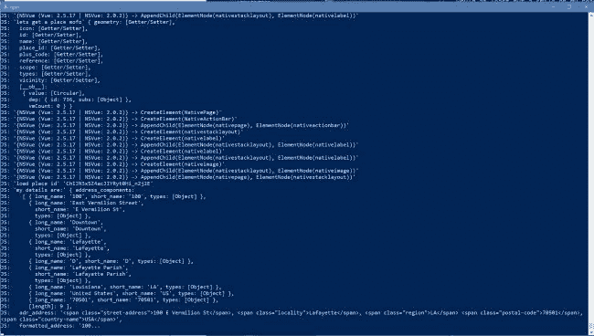
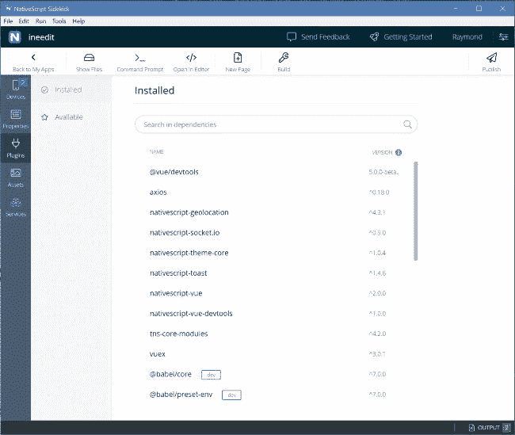
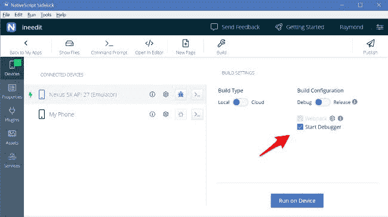
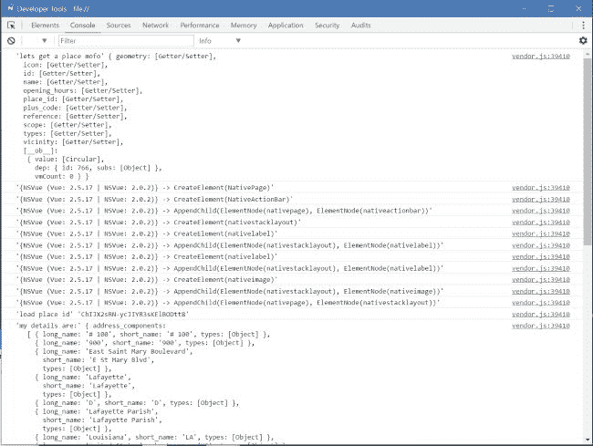
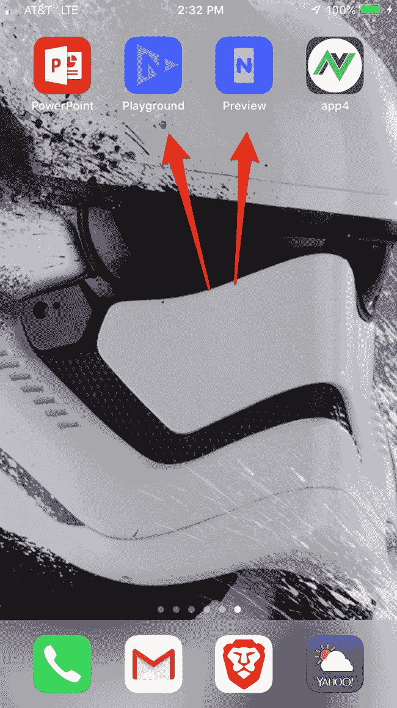
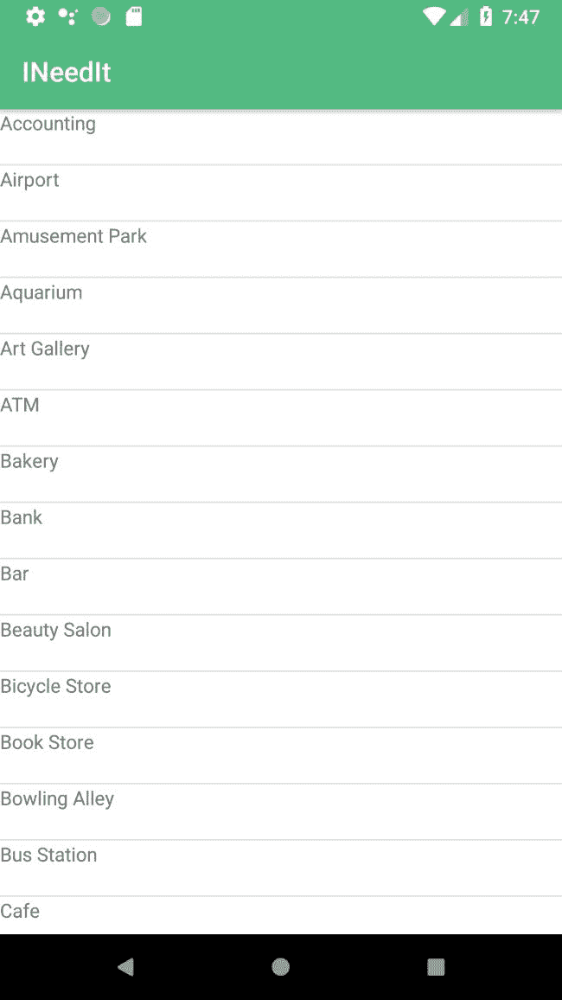
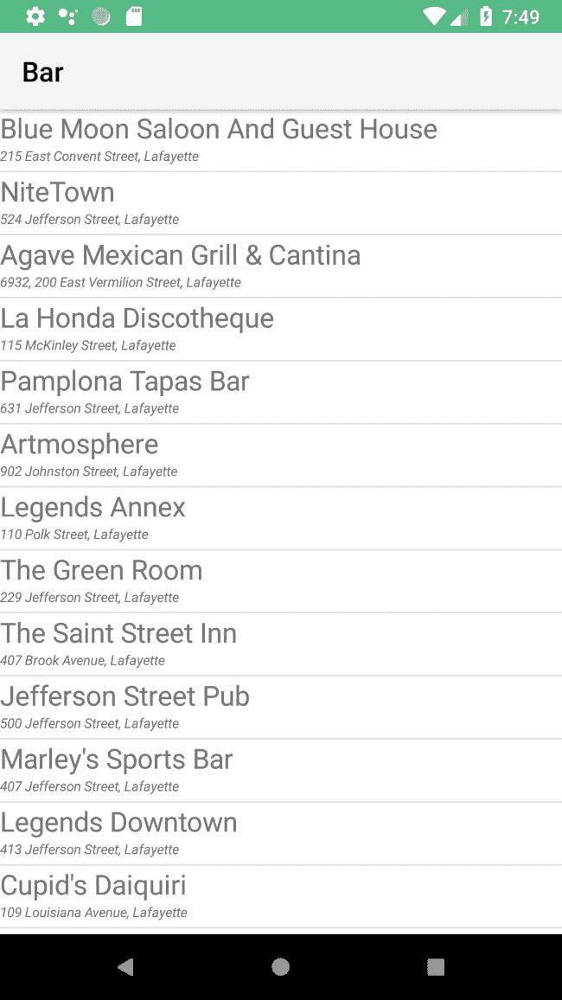
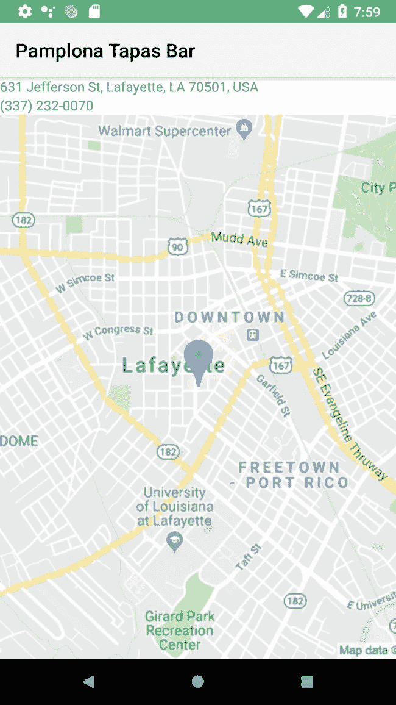

# 我构建了一个 NativeScript/Vue.js 应用程序，你不会相信接下来发生了什么...

> 原文：<https://dev.to/raymondcamden/i-built-a-nativescriptvuejs-app-and-you-wont-believe-what-happened-next-3ikf>

请原谅 clickbait 标题。我一直在为这篇博客的标题纠结，决定放弃，有点过头了。鉴于我最近很少写博客，我想这至少会让我的读者脸上露出笑容，这是有价值的。；)说到我的读者，那些已经在这里呆了一段时间的人都知道，自从 [NativeScript](https://www.nativescript.org/) 发布以来，我一直是它的粉丝，但我也很少写关于它的博客。它一直出现在我的“今年我要做的事情”的帖子上，但我从来没有真正着手去做。嗯，对我来说好消息是，当我在找工作的时候，我有一个客户想开发一个 NativeScript 应用程序，我有时间(在工作的时候，是的，我非常幸运)在我构建项目的时候学习。对我来说更幸运的是，有一个 [NativeScript Vue](https://nativescript-vue.org/) 项目非常成功。我想我应该分享一下我在过去一周使用它的经验，以及我用它构建的一个简单应用程序。

我首先要解决的是开发体验。我一直在关注 NativeScript 团队在这方面所做的工作，但我实际上玩了它的多个版本，我不得不说——他们在这方面做了令人难以置信的工作。

### CLI

是的，你有一个命令行。在安装和速度方面，我一直觉得有点“沉重”。这不是很科学，但感觉安装过程有点长，而且有很多活动部件。我在 PowerShell 中做了测试，因为我不想让 Android SDK 在 WSL 下运行。CLI 实际上可以为您处理，但在我的情况下，我已经安装了 Android。你可以在 [CLI 安装文档](https://docs.nativescript.org/angular/start/quick-setup)中看到更多关于这个过程的信息，但是我想我在这里的观点是不要期望在几秒钟内完成。我不认为有什么可以做的，只是把它当作一个警告。

一旦你安装好了，CLI 就能正常工作，但在我的测试中，Android 项目的第一次运行似乎慢得令人难以置信。比我在科尔多瓦看到的多得多。但那是一次性的痛苦。你可以运行`tns run android --bundle`，它会在你保存文件时自动重新加载你的应用程序。

在初始加载之后，这个过程——我会说——“相当”快。对于我的小型项目，每次重新加载可能需要 3-4 秒。总的来说，这从来没有困扰过我，直到我开始从事设计类的工作，当我把事情搞砸的时候，这让我有点沮丧。

命令行将扩展任何`console.log`消息，但我希望它也能在自己的输出中有所区分。这里有一个随机的例子，虽然我知道我的消息在哪里，但我希望看到它被更多地调用。(是的，它太小了，甚至无法阅读。抱歉。但是我还没有附上照片，而且已经过期了。)

[T2】](https://res.cloudinary.com/practicaldev/image/fetch/s--mowQGATr--/c_limit%2Cf_auto%2Cfl_progressive%2Cq_auto%2Cw_880/https://static.raymondcamden.cimg/2018/10/nsv1.jpg)

在我离开这一部分之前，有一个简短的说明。我多次发现，如果我让 CLI 整夜运行，到了早上，它似乎不会刷新得很好。我只是再次运行命令行界面，一切都会好的。我假设终端和 Android 模拟器之间丢失了一些东西。如果我是一个打赌的人，我会完全责怪 Android。

### 你认为自己不需要但无论如何都应该尝试的 GUI 应用程序

所以，是的，我知道我们都是“真正的”开发人员，我们必须使用 CLI 做任何事情，但你可能想看看 [Sidekick](https://www.nativescript.org/nativescript-sidekick) 应用程序。这是一个桌面 GUI，它包装了 CLI 操作，让您可以快速生成新项目并测试它们。它还可以很好地呈现关于项目的信息，如已安装的插件和其他设置。

[T2】](https://res.cloudinary.com/practicaldev/image/fetch/s--b5U4gsDR--/c_limit%2Cf_auto%2Cfl_progressive%2Cq_auto%2Cw_880/https://static.raymondcamden.cimg/2018/10/nsv2.jpg)

更令人印象深刻的是，它可以处理从 Windows 到 iOS 设备的构建。在我的测试中，这有点古怪。我知道(或者我很确定；)它成功了几次，但我很难让我的上一个项目正常工作。我将假设它*将*工作一致，但这相当令人印象深刻。

如果你想了解更多，你可以看看这个 NativeScript 制作的小视频。

Sidekick 的一个奇怪之处是，虽然它有一个“logs”输出面板，但你不会在那里找到 console.log 消息。相反，您希望确保选择“启动调试器”:

[T2】](https://res.cloudinary.com/practicaldev/image/fetch/s--UC8I_aXM--/c_limit%2Cf_auto%2Cfl_progressive%2Cq_auto%2Cw_880/https://static.raymondcamden.cimg/2018/10/nsv3.jpg)

这将打开一个新窗口，虽然仍然像 CLI 一样“嘈杂”,但我认为终端更容易阅读。

[T2】](https://res.cloudinary.com/practicaldev/image/fetch/s--IRBqbI8g--/c_limit%2Cf_auto%2Cfl_progressive%2Cq_auto%2Cw_880/https://static.raymondcamden.cimg/2018/10/nsv4.jpg)

### 最简单的解决方案——操场

所以第三个选择，也是最简单的一个，如果你想跳过对 SDK 的担心，就是[操场](https://play.nativescript.org/)。这是一个基于 web 的 IDE，可以让您在不安装任何东西的情况下使用 NativeScript。它甚至包括多个演练教程来帮助您学习。更好的是，你可以使用二维码功能(“是！”所有的标记器大喊)和一个相应的应用程序在你的移动设备上测试代码。奇怪的是——你需要在你的设备上安装*两个*应用，而他们的文档并没有告诉你这一点——操场应用和预览应用。

[T2】](https://res.cloudinary.com/practicaldev/image/fetch/s--N7d0wzpg--/c_limit%2Cf_auto%2Cfl_progressive%2Cq_auto%2Cw_880/https://static.raymondcamden.cimg/2018/10/nsv5.jpg)

总的来说，感觉这种刷新工作得很好，与 CLI 方法不相上下。但这绝对是最简单的入门方式，所以如果你不习惯或不熟悉 SDK，我会去看看。见鬼，即使是你，也应该考虑把它用在好的教程上。

### 我的应用

所以在浏览了几个教程，只是简单地试了试之后，我决定再次构建“INeedIt”。这是我用多种语言、平台等构建的应用程序。在过去的几年里。这是一个简单的 [Google Places API](https://developers.google.com/places/web-service/intro) 的包装。这是一个相当简单的应用程序，包含三个独立的页面。

第一页获取您的位置，然后提供服务类型列表(酒吧、餐馆、自动取款机等)。这是基于 API 支持的硬编码列表。

[T2】](https://res.cloudinary.com/practicaldev/image/fetch/s--pe_2T7t4--/c_limit%2Cf_auto%2Cfl_progressive%2Cq_auto%2Cw_880/https://static.raymondcamden.cimg/2018/10/nsv6.jpg)

当您选择一种类型时，它会要求 API 在您所在位置的特定范围内查找该类型的所有结果。

[T2】](https://res.cloudinary.com/practicaldev/image/fetch/s--K8CazFyD--/c_limit%2Cf_auto%2Cfl_progressive%2Cq_auto%2Cw_880/https://static.raymondcamden.cimg/2018/10/nsv7.jpg)

最后一页只是一个“细节”视图。

[T2】](https://res.cloudinary.com/practicaldev/image/fetch/s--D1PqxAjF--/c_limit%2Cf_auto%2Cfl_progressive%2Cq_auto%2Cw_880/https://static.raymondcamden.cimg/2018/10/nsv8.jpg)

在我展示代码之前，需要注意一些事情。

*   这不是一个非常漂亮的应用程序。NativeScript 提供的 UI 控件工作得很好，但是您必须花一些时间使用 CSS 来使它看起来更好，并为您的应用程序定制。我花了一点时间摆弄 CSS，但决定不要太担心它。
*   在细节视图中，Google Place 的 API 曾经返回照片及其细节结果，现在它有了一个单独的 API。我本可以加上这一点，但决定不去担心它。我提出它只是因为我构建的最后一个版本支持它。
*   你看到的那张地图是静态地图 API 的一个例子，这是我最喜欢的谷歌服务之一。

好了，我们来看看代码吧！首先，初步看法。顺便说一句，我从`serviceTypes`变量中删除了大部分数据，以减少帖子的长度。我应该把它抽象成一个服务。

```
<template>
    <Page>
        <ActionBar title="INeedIt"/>

        <GridLayout rows="*, auto, *" columns="*, auto, *">
            <ListView for="service in serviceTypes" @itemTap="loadService" rowHeight="40" :visibility="loading?'hidden':'visible'" rows="0" rowSpan="3" col="0" colSpan="3">
                <v-template>
                    <Label :text="service.label" verticalAlignment="middle" />
                </v-template>
            </ListView>
            <ActivityIndicator :busy="loading" row="1" col="1"/>
        </GridLayout>
    </Page>
</template>

<script>
import * as geolocation from 'nativescript-geolocation';
import { Accuracy } from 'ui/enums';
import TypeList from './TypeList';

export default {
    data() {
        return {
            loading:true,
            location:{},
            serviceTypes:[
                {"id":"accounting","label":"Accounting"},{"id":"airport","label":"Airport"}, {"id":"veterinary_care","label":"Veterinary Care"},{"id":"zoo","label":"Zoo"}
            ]            
        }
    },
    mounted() {
        console.log('lets get your location');
        geolocation.getCurrentLocation({ desiredAccuracy: Accuracy.high, maximumAge: 1000, timeout: 20000})
        .then(res => {
            let lat = res.latitude;
            let lng = res.longitude;
            this.location.lat = lat;
            this.location.lng = lng;      
            this.loading = false;

        })
        .catch(e => {
            console.log('oh frak, error', e);
        });
    },
    methods:{
        loadService(e) {
            let service = e.item;
            this.$navigateTo(TypeList, {props: {service:service, location:this.location}})
        }
    }

}
</script>

<style scoped>
ActionBar {
    background-color: #53ba82;
    color: #ffffff;
}
</style> 
```

Enter fullscreen mode Exit fullscreen mode

这是一个 SFC(单个文件组件)的示例，您在使用 Vue 时可能已经很熟悉了。我喜欢它的每个方面都是一样的，除了布局，坦率地说，这没什么大不了的。我遇到的唯一困难是在页面中间呈现加载组件，而不是其他内容，幸运的是 NativeScript Slack 组中的好心人帮我解决了这个问题。我不想贬低这一点。学习 NativeScript 的布局将是一个过程，但在大多数情况下，我认为它通常是有意义的。

现在让我们看看下一个组件，TypeList.vue.

```
<template>
    <Page>
        <ActionBar :title="service.label"/>

        <GridLayout rows="*, auto, *" columns="*, auto, *">
            <ListView for="place in places" @itemTap="loadPlace" rowHeight="45" :visibility="loading?'hidden':'visible'" rows="0" rowSpan="3" col="0" colSpan="3">
                <v-template>
                    <StackLayout>
                        <Label :text="place.name" className="placeName" />
                        <Label :text="place.vicinity" className="placeAddress" />
                    </StackLayout>
                </v-template>
            </ListView>
            <Label rows="0" rowSpan="3" col="0" colSpan="3" text="Sorry, there were no results." :visibility="noResults?'visible':'hidden'" />
            <ActivityIndicator :busy="loading" row="1" col="1"/>
        </GridLayout>

    </Page>
</template>

<script>
import places from '../api/places';
import Place from './Place';

export default {
    data() {
        return {
            loading:true,
            noResults:false,
            places:[]
        }
    },
    props: ['service', 'location'],
    mounted() {
        places.search(this.location.lat, this.location.lng, this.service.id)
        .then(results => {
            console.log('results', results.data.result);
            this.places = results.data.result;
            if(this.places.length === 0) this.noResults = true;
            this.loading = false;
        });
    },
    methods: {
        loadPlace(event) {
            let place = event.item;
            this.$navigateTo(Place, {props: {place:place}})
        }
    }
}
</script>

<style scoped>
Label.placeName {
    font-size: 20px;
}

Label.placeAddress {
    font-style: italic;
    font-size: 10px;
}
</style> 
```

Enter fullscreen mode Exit fullscreen mode

在启动时，它使用一个 API(稍后将详细介绍)来获取正在查看的特定类型的结果列表。然后它简单地在 ListView 中呈现出来。我要导入的 API 在这里:

```
import axios from 'axios/dist/axios';

// radius set to 2000
const RADIUS = 2000;

export default {

    detail(id) {
        return axios.get(`https://wt-c2bde7d7dfc8623f121b0eb5a7102930-0.sandbox.auth0-extend.com/googleplaces_detail?placeid=${id}`);

    },

    search(lat, lng, type) {
        return axios.get(`https://wt-c2bde7d7dfc8623f121b0eb5a7102930-0.sandbox.auth0-extend.com/googleplaces_search?lat=${lat}&lng=${lng}&radius=${RADIUS}&type=${type}`);
    }

} 
```

Enter fullscreen mode Exit fullscreen mode

我为我的 Google Places API 调用编写了 [Webtask.io](https://webtask.io) 包装器，使代码共享变得更加容易。你得丢掉关于半径的评论。史诗般的评论。

最后一个组件 Place.vue 处理细节的获取和渲染。我真的只展示了几个值。你在这里可以做得更多。

```
<template>
    <Page>
        <ActionBar :title="place.name" />
        <StackLayout>
            <Label :text="details.formatted_address" />
            <Label :text="details.formatted_phone_number" />
            <Image :src="mapUrl" stretch="aspectFill" width="100%" />
        </StackLayout>

    </Page>
</template>

<script>
import places from '../api/places';

export default {
    data() {
        return {
            loading:true,
            details:{
                formatted_address:''
            },
            mapUrl:''
        }
    },
    props: ['place'],
    mounted() {
        console.log('load place id', this.place.place_id);
        places.detail(this.place.place_id)
        .then(res => {
            console.log('my details are:', res.data.result);
            this.details = res.data.result;
            this.mapUrl = `https://maps.googleapis.com/maps/api/staticmap?center=${this.details.geometry.location.lat},${this.details.geometry.location.lng}&zoom=14&markers=color:blue|${this.details.geometry.location.lat},${this.details.geometry.location.lng}&size=500x500&key=mykeyhere`;
        });
    },
    methods: {
    }
}
</script>

<style scoped>
</style> 
```

Enter fullscreen mode Exit fullscreen mode

您会注意到我对静态地图 API 的使用包括一个硬编码的键。您可以像使用 Places API 一样使用 sample 键。我通常会把它抽象出来，但是当我在演示结束时，我变得有点懒了。；)

### 原生脚本视图

总之，我对 Vue 在 NativeScript 下运行印象深刻。我将继续为客户的项目使用它，我绝对认为它值得你花时间。如果你已经在使用它，我很想听听你的经历，所以请在下面给我留言。

我通常分享我的样本代码，但我没有在任何地方回购。如果有人想要，尽管开口，我很乐意分享。