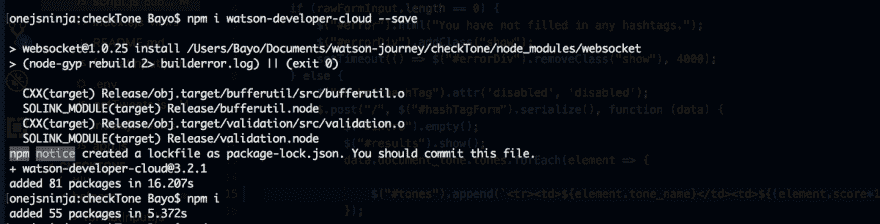
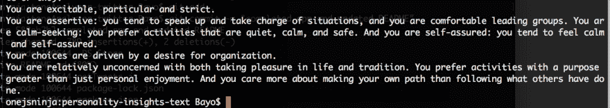

# 我可以从你的微博上看出你的个性

> 原文：<https://dev.to/onejsninja/i-can-tell-your-personality-from-your-tweets-27g6>

在本教程中，我们将了解沃森个性洞察服务。我假设您已经有一个 IBM Cloud 帐户。如果您没有，请阅读我的[IBM Watson 入门教程](https://medium.com/ibm-watson-tutorials/getting-started-with-ibm-watson-95b10ca145f6)来创建一个。这很简单。

该服务主要使用社交媒体、博客帖子或其他文本数据源提供的数据来识别决定购买决策、意图和行为特征的心理特征。这是一项相当有趣的服务。您可以从[文档](https://console.bluemix.net/docs/services/personality-insights/index.html#about)中获得更多信息。这里和这里也有来自官方文档的演示，您可以随意使用。你应该会玩得很开心！

让我们用一些代码来弄脏我们的手。在本教程中，我们将制作一个简单的应用程序，它接收一个人的 Twitter 句柄并返回一个人的个人资料。

第一步是创建个性洞察服务。访问 [IBM Cloud Catalog](https://console.bluemix.net/catalog/) ，选择 Personality Insights 并创建服务。然后，创建服务凭证，我们就可以开始了！如果您在创建服务和生成凭证方面有任何问题，请访问[我的 IBM Watson 入门教程](https://medium.com/ibm-watson-tutorials/getting-started-with-ibm-watson-95b10ca145f6)。

要开始使用 IBM Watson 的 Node.js SDK，打开您的终端(或命令行)，导航到您的项目文件夹，并运行`npm i watson-developer-cloud -- save`。您应该将 watson-developer-cloud 添加到 package.json 文件中。

[T2】](https://res.cloudinary.com/practicaldev/image/fetch/s--SyNoAwen--/c_limit%2Cf_auto%2Cfl_progressive%2Cq_auto%2Cw_880/https://cdn-images-1.medium.com/max/1600/1%2AJBctOjHX4ZzYdMyxXqmKWw.png)

完成后，您现在可以将以下代码写入您的项目，以使用 Personality Insights 服务。请注意，我正在从一个`.env`文件加载我的凭证，并且我正在使用`dotenv`模块。您可以运行`npm i dotenv --save`将它添加到您的`package.json`文件中，并能够在您的项目中使用它。您的代码现在应该是这样的:

```
require("dotenv").config();
const PersonalityInsightsV3 =require('watson-developer-cloud/personality-insights/v3');
const personality_insights = new PersonalityInsightsV3({
    username: process.env.PERSONALITY_INSIGHTS_USERNAME,
    password: process.env.PERSONALITY_INSIGHTS_PASSWORD,
    version_date: process.env.PERSONALITY_INSIGHTS_VERSION_DATE 
```

我们必须创建一个函数，它接受一个 Twitter 句柄，并从该帐户获取 tweets。这意味着我们需要 Twitter npm 模块。继续运行`npm i twitter --save`将模块添加到您的`package.json`文件中。创建一个文件并保存为`fetchTweets.js`。它将包含我们检索推文的代码。

```
let Twitter = require('twitter');
require("dotenv").config();

let client = new Twitter({
  consumer_key: process.env.TWITTER_CONSUMER_KEY,
  consumer_secret: process.env.TWITTER_CONSUMER_SECRET,
  access_token_key: process.env.TWITTER_ACCESS_TOKEN,
  access_token_secret: process.env.TWITTER_ACCESS_TOKEN_SECRET
});

const fetchTweets = (username) => {
  return new Promise((resolve, reject) => {

    let params = {
      screen_name: username,
      count: 200,
      include_rts: false,
      trim_user: true,
      exclude_replies: true,
      tweet_mode: "extended"
    };

    let tweets = [];

    const fetchTweets = (error, newTweets) => {
      if (error) {
        reject(Error(error));
      }
      // Filter out tweets with only relevant info
      filteredTweets = newTweets.map(function (tweet) {
        return {
          id: tweet.id_str,
          language: tweet.lang,
          contenttype: 'text/plain',
          content: tweet.full_text.replace('[^(\\x20-\\x7F)]*', ''),
          created: Date.parse(tweet.created_at),
          reply: tweet.in_reply_to_screen_name != null
        };
      });
      // check if tweets are actually retrieved and get more tweets if yes.
      if (newTweets.length > 1) {
        tweets = tweets.concat(filteredTweets);
        params.max_id = tweets[tweets.length - 1].id - 1;
        client.get('statuses/user_timeline', params, fetchTweets);
      } else {
        // if there are no more tweets to retrieve, return already retrieved tweets
        resolve(tweets);
      }
    };
    client.get('statuses/user_timeline', params, fetchTweets);

  });
};

module.exports = fetchTweets; 
```

现在我们可以用这几行代码访问推文。现在，让我们编辑包含代码的文件，以收集检索到的推文，并将它们发送到 Personality Insights 服务。编辑`personalityInsights.js`。它应该具有以下代码:

```
require("dotenv").config();
const readline = require('readline');
const PersonalityInsightsV3 = require('watson-developer-cloud/personality-insights/v3');
const personality_insights = new PersonalityInsightsV3({
  username: process.env.PERSONALITY_INSIGHTS_USERNAME,
  password: process.env.PERSONALITY_INSIGHTS_PASSWORD,
  version_date: '2017-10-13'
});

const fetchTweets = require('./fetchTweets');

const rl = readline.createInterface({
  input: process.stdin,
  output: process.stdout
});

rl.question('Please enter a twitter Handle for Watson to analyze...', (handle) => {

  console.log("Your results should show up soon. Thank you.");

  fetchTweets(handle).then((tweets) => {
    let params = {
      // Content items are tweets.
      content_items: tweets,
      consumption_preferences: true,
      raw_scores: true,
      headers: {
        'accept-language': 'en',
        'accept': 'application/json'
      }
    };
    personality_insights.profile(params, function (error, personalityProfile) {
      if (error && error.code == 400) {
        reject(Error("Ouch! You either do not have sufficient tweets, or your language is not supported. Sorry."));
      } else
        console.log(JSON.stringify(personalityProfile, null, 2));

    });

    rl.close();

  }).catch(err => console.error(err));

}); 
```

让我们稍微检查一下代码。在第 15 行中，我们包含了之前创建的`fetchTweets.js`模块，这样我们就可以访问这个函数来检索`personalityInsights.js`文件中的 tweets。然后，我们调用第 27 行中的函数，并将用户输入的句柄传递给它，这样我们就可以检索 tweets 并将其发送给 Personality Insights 服务。

现在你可以在你的终端上运行`node personalityInsights`来运行你的应用程序。您应该会看到类似这样的内容:

```
{
  "word_count": 15223,
  "processed_language": "en",
  "personality": [
     . . .
  ],
  "needs": [
     . . .
  ],
  "values": [
     . . .
  ],
  "behavior": [
     . . .
  ],
  "consumption_preferences": [
     . . .
   ],
  "warnings": []
} 
```

我们的结果是四个主要部分的组合:

*   基于五大个性特征和方面的个性结果
*   需求，它在高层次上描述了产品的那些方面，这些方面可能会引起输入文本作者的共鸣
*   价值观，描述影响作者决策的激励因素
*   消费偏好，表明作者喜欢不同产品、服务和活动的可能性。

你可以从官方文档中获得更多的细节。

我知道很难理解所有这些 json 内容，所以如果您需要对来自 Personality Insights 服务的 JSON 响应进行文本分析，您需要做的就是通过`personality-text-summary` npm 模块运行这个 JSON 响应。让我们看看你怎么做。

回到你的终端，运行`npm i personality-text-summary --save`。这应该会将模块添加到您的`package.json`文件中。下一步是更新我们的代码，以便我们可以使用它。更新后，我们应该有以下内容:

```
require("dotenv").config();
const readline = require('readline');
const PersonalityInsightsV3 = require('watson-developer-cloud/personality-insights/v3');
const personality_insights = new PersonalityInsightsV3({
  username: process.env.PERSONALITY_INSIGHTS_USERNAME,
  password: process.env.PERSONALITY_INSIGHTS_PASSWORD,
  version_date: '2017-10-13'
});
const PersonalityTextSummaries = require('personality-text-summary');
const v3EnglishTextSummaries = new PersonalityTextSummaries({
  locale: 'en',
  version: 'v3'
});

const fetchTweets = require('./fetchTweets');

const rl = readline.createInterface({
  input: process.stdin,
  output: process.stdout
});

rl.question('Please enter a twitter Handle for Watson to analyze...', (handle) => {

  console.log("Your results should show up soon. Thank you.");

  fetchTweets(handle).then((tweets) => {
    let params = {
      // Content items are tweets.
      content_items: tweets,
      consumption_preferences: true,
      raw_scores: true,
      headers: {
        'accept-language': 'en',
        'accept': 'application/json'
      }
    };
    personality_insights.profile(params, function (error, personalityProfile) {
      if (error && error.code == 400) {
        reject(Error("Ouch! You either do not have sufficient tweets, or your language is not supported. Sorry."));
      } else
            console.log(getTextSummary(response));
            // console.log(JSON.stringify(personalityProfile, null, 2));

    });

    rl.close();

  }).catch(err => console.error(err));

});

const getTextSummary = personalityProfile => {
  let textSummary = v3EnglishTextSummaries.getSummary(personalityProfile);
  if (typeof (textSummary) !== 'string') {
    console.log("Could not get summary.");
  } else {
    return textSummary;
  }
}; 
```

如果一切顺利，应该会有这样的结果:
[](https://res.cloudinary.com/practicaldev/image/fetch/s--k8YcTZa2--/c_limit%2Cf_auto%2Cfl_progressive%2Cq_auto%2Cw_880/https://cdn-images-1.medium.com/max/1600/1%2AExK7_uaGTDevDQvw6JD4vQ.png)

就是这样。我们已经到了本教程的结尾。本教程的代码可以在 Github 上找到。

我将在下一篇文章中做一些真正有趣的事情，所以准备好享受美好时光吧！