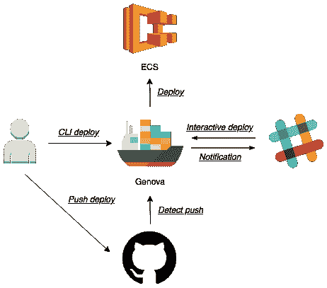

# 发布的 AWS ECS 部署管理器

> 原文：<https://dev.to/naomichi_yamakita/i-developed-aws-ecs-deployment-manager-43o2>

我开发了名为`genova`的 [AWS ECS](https://aws.amazon.com/ecs/) 部署管理器。
该软件包提供 ECS 部署功能。

## 特性

*   基于 YAML 的任务定义
    *   通过 [KMS](https://aws.amazon.com/kms/) 支持环境变量的加密
*   支持多种部署方法
    *   指挥基地部署
    *   松弛交互式部署
    *   GitHub 推送检测部署
*   提供 web 控制台
*   部署执行
    *   从 GitHub 上的存储库构建映像
    *   将图像推送到 [ECR](https://aws.amazon.com/ecr/)
    *   创建服务
    *   更新服务
    *   支持预定事件
    *   ECR 上仓库的循环清理

[T2】](https://res.cloudinary.com/practicaldev/image/fetch/s--pbWrTM2q--/c_limit%2Cf_auto%2Cfl_progressive%2Cq_auto%2Cw_880/https://raw.githubusercontent.com/wiki/metaps/genova/asseimg/overview.png)

## 这个包是开源的

有关内容，请参阅自述文件。

(核心库:[https://github.com/naomichi-y/ecs_deployer](https://github.com/naomichi-y/ecs_deployer))