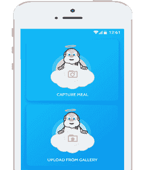
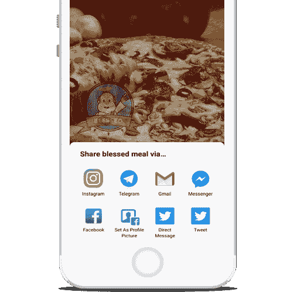
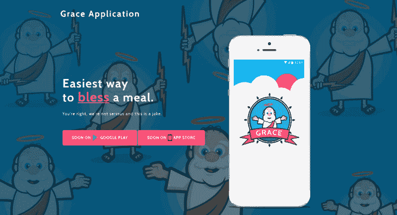
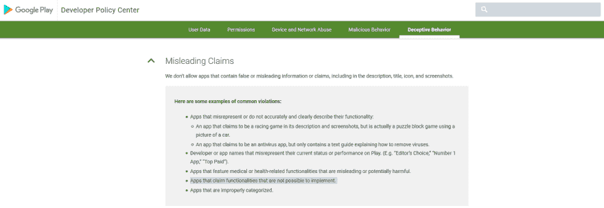
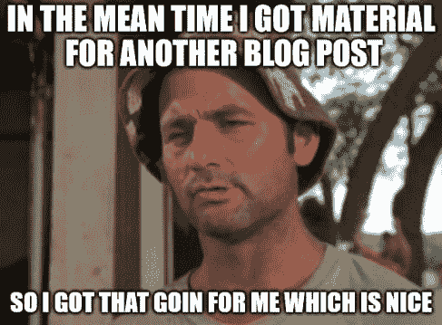

# 我为祝福餐开发了 Grace - app。以及(为什么)我没有发表。

> 原文：<https://dev.to/viksaaskool/i-developed-grace---app-for-blessing-meals-and-why-i-didnt-publish-it--5e99>

这一切都是从一个问题开始的——毫无意义的、基本的和一些简单的愚蠢的应用程序是如何在 App Store/Google Play 上传播开来的？这些下载中至少有一个是你的——[裂屏](https://is.gd/AE4iSE)(1000 万+)[Windows XP 错误](https://is.gd/ZyDdLS)(100 万+)[Yo](https://is.gd/42tHU7)(100 万+)[纸赛](https://is.gd/IL2CdX)(500 万+)，对吧？有办法预测这个看似随机的过程吗？有许多关于病毒主题的研究，显然从经济学到数学等领域的许多人都对它很感兴趣。

我的方法是从人性和进化心理学中获取见解——为什么我们倾向于喜欢这种应用程序，即使它们没有生存价值。从进化的角度来看，我们只不过是一套非常复杂的问题解决机制，为 DNA 分子自我复制的自私需求服务。

进化心理学产生了预测决策的模型装置，以及我们选择如何(以及为什么/在什么上)花费我们的时间和金钱。这可能过于简单化了，但是我们所做的一切要么是为了生存，要么是为了繁殖。从这个角度来看，为什么导航/地图应用会受欢迎，或者为什么我们可以无休止地向潜在伴侣传达我们的美德和地位的社交网络会受欢迎，这并不是一个谜。

考虑到所有这些，我提出了一个假设——如果我创建一个跨文化的应用程序，具有动态而简单的用户界面——即使该应用程序什么也不做——它也能成为病毒。我想到了 Grace——祈福餐的应用——这个概念存在于大多数独立发展了很多年的文化中。

有人可能会说，但是维克多，你肯定不是认真的，你实际上也没有“祝福”这顿饭。这个是对的。像本文中的大多数应用程序一样，这是一个明显的笑话。用户打开应用程序，可以选择拍摄一顿饭的照片，或者从图库中选择一张——然后“陛下”分析照片，如果是一顿饭，用户可以选择继续为这顿饭祝福。如果用户选择继续，pic 将被打上“祝福”的“水印”。用户可以分享图片，仅此而已。看起来是这样的:

甚至还有一个 Grace 应用程序的官方页面。如果你好奇，你可以在我的 [github 页面](https://is.gd/BhOnVh)上找到更多关于这个项目的信息——是的，我已经开源了代码。你可以从[这里](https://is.gd/Rv99wr)抢 apk。

[T2】](https://res.cloudinary.com/practicaldev/image/fetch/s--wwKUcjT8--/c_limit%2Cf_auto%2Cfl_progressive%2Cq_auto%2Cw_880/https://is.gd/MWl2qT)

**问题:**

一切都很好，让我们测试一下假设，上传到 Google Play，然后等待病毒式下载，对吗？不对。也就是说， [Google Play 开发者政策](https://is.gd/Hm6PZP)最近变得非常严格，作为一名开发者，即使是违反规则的小错误也会让你被禁止。作为全职 Android 开发人员，被禁止使用 Google Play 是他/她无法承受的职业变化，所以要非常认真地对待这件事。显然，Google Play 政策中有一个立场可能存在问题:

 
“声称功能无法实现的应用”

“不可实现”的功能——见鬼，你怎么能说这个应用程序实际上不是在为这顿饭祈福。我想，这个问题在某种意义上是哲学性的，但如果谷歌认为这是操纵行为，那么这个应用就过时了，我可能会被封禁。嗯，这很简单——只要问谷歌关于你的情况和你要做的事情——嗯，这是你第二次错了，两次错并不意味着是对的(我知道，不要再幽默了)。如果你只是另一个编码的人，几乎没有办法让为谷歌工作的人来回答这类问题。

过去我遇到过[这种情况](https://wp.me/p1XCff-2K)——因为侵犯版权而暂停应用程序。马其顿体育新闻社的手机版应用程序——侵犯——蒂埃里·亨利的照片，该照片出现在上传到应用程序 Google Play 页面的截图中。最后一切都解决了，但这是一次可怕的经历。

我正处在一个点上，我必须用我投入到假设中的努力做一些事情，即使它不是以我想要的方式，我已经决定格蕾丝需要看到光学互联网的光芒。我想只有他的恩典知道如果应用程序得到上传到应用程序商店在未来。

[T2】](https://res.cloudinary.com/practicaldev/image/fetch/s--EwyI0uXL--/c_limit%2Cf_auto%2Cfl_progressive%2Cq_auto%2Cw_880/https://is.gd/g0SDlJ)