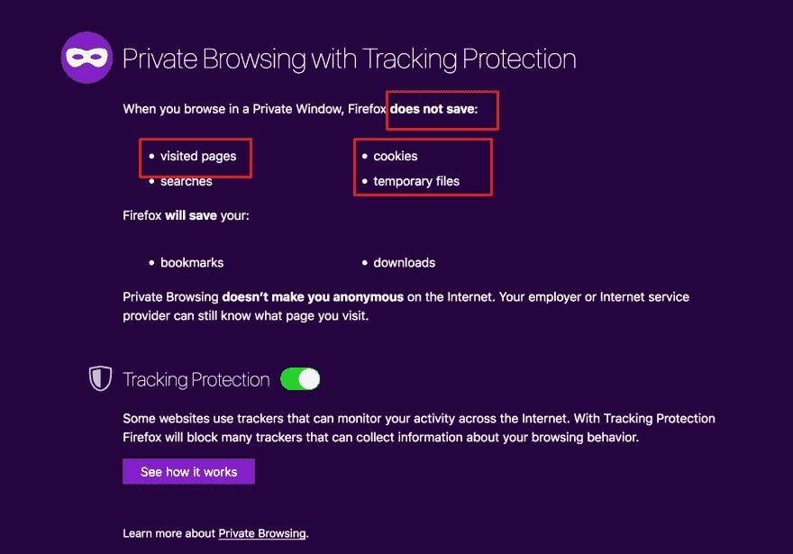
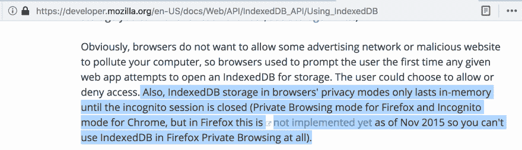
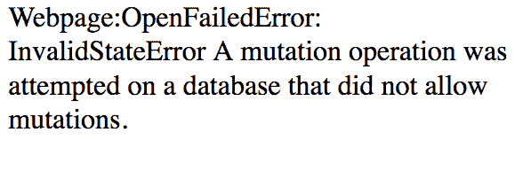
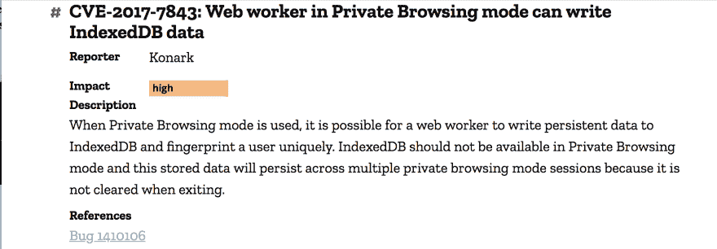

# 我发现了 Mozilla 的隐私浏览模式的一个重大缺陷。

> 原文：<https://dev.to/konarkmodi/i-found-a-major-flaw-in-mozillas-private-browsing-mode-26hi>

如果不修复，这个缺陷可能会造成严重破坏，但 Mozilla 的及时修复挽救了局面。

在本文中，我将详细讨论我在 Mozilla Firefox 隐私浏览模式中发现的一个漏洞，该漏洞使得隐私浏览会话有可能被跟踪。

[T2】](https://res.cloudinary.com/practicaldev/image/fetch/s--eEGy2iDG--/c_limit%2Cf_auto%2Cfl_progressive%2Cq_auto%2Cw_880/https://cdn-images-1.medium.com/proxy/1%2A_wACV-5_7XXEx3uUSW4sUw.png)

[隐私浏览](https://support.mozilla.org/en-US/kb/private-browsing-use-firefox-without-history)是当今现代浏览器中最广为人知和使用最多的功能之一。浏览器不断地为隐私浏览添加[许多](https://blog.mozilla.org/security/2018/01/31/preventing-data-leaks-by-stripping-path-information-in-http-referrers/)增强功能，以增强用户的隐私。

不同浏览器提供的功能可能不同，但至少使用隐私浏览的用户有两个最基本的要求:

1.  私下访问的网站不能保存任何数据

2.  访问过的页面不会被保存

嗯，我发现火狐浏览器隐私浏览模式不符合上述任何一项要求。

对于一个跟踪用户隐私浏览会话的网站来说，它需要在浏览器级别使用一些持久存储。

在浏览器中存储数据有多种方式——[local storage](https://developer.mozilla.org/en-US/docs/Web/API/Storage/LocalStorage)、 [WebSQL](http://www.w3.org/TR/webdatabase/) 和 [IndexedDB](https://developer.mozilla.org/en-US/docs/Web/API/IndexedDB_API) 。

我最近遇到了索引数据库存储。

> IndexedDB 是一个低级 API，用于客户端存储大量结构化数据，包括文件/blob——Mozilla 开发者网络

尽管根据文档，IndexedDB 在私人浏览模式下不可用。

[T2】](https://res.cloudinary.com/practicaldev/image/fetch/s--fERj7-8l--/c_limit%2Cf_auto%2Cfl_progressive%2Cq_auto%2Cw_880/https://cdn-images-1.medium.com/proxy/1%2AwYLRaMD6WFi62ndBMCJnDQ.png)

如果直接在网页上使用 IndexedDB，会抛出一个错误:

[T2】](https://res.cloudinary.com/practicaldev/image/fetch/s--I-gtiy4h--/c_limit%2Cf_auto%2Cfl_progressive%2Cq_auto%2Cw_880/https://cdn-images-1.medium.com/proxy/1%2ASAoSUwkjpuqHw9KPZloWjg.png)

但是如果把 IndexedDB 和 [Web Workers](https://developer.mozilla.org/en-US/docs/Web/API/Web_Workers_API) 结合起来会怎么样呢？

> Web Workers 使得在独立于 Web 应用程序主执行线程的后台线程中运行脚本操作成为可能——Mozilla Developer Network

IndexedDB 可以通过 Web Workers 在私有浏览模式下访问。不仅如此，当浏览器关闭时，IndexedDB 数据也不会被清除。该存储的**数据将在多个私人浏览会话**中持续存在，因为它在退出时没有被清除。😮

因此，让我们看看这个问题可能被滥用的几种方式。

恶意网站可以利用 IndexedDB 并跟踪用户的私人浏览会话。例如，假设你访问了**badsite.com，**它使用 Web Workers 和 IndexedDB 在私人浏览模式。关闭私密浏览窗口，关闭 Firefox，再次启动 Firefox，启动私密浏览模式，再次访问 badsite.com。该网站将能够访问您之前的私人浏览会话中的数据，因为这些数据仍然存储在 IndexedDB 中。

让我们假设 siteA.com 从 BadAnalyticsSite.com 的 T2 加载了一个分析脚本。然后另一个网站，siteB.com**，也从同一个网站**BadAnalyticsSite.com**加载分析脚本。由于恶意网站**BadAnalyticsSite.com**使用 Web Workers 和 IndexedDB，网站**BadAnalyticsSite.com**现在可以跟踪网站**siteA.com**和**siteB.com**的用户的所有私人浏览会话。**

 **[IndexedDB 遵循同源策略](https://developer.mozilla.org/en-US/docs/Web/API/IndexedDB_API/Basic_Concepts_Behind_IndexedDB)，这意味着每个数据库都有一个在源中标识它的名称。因为域名被用作文件名的一部分，所以在私有模式下使用时会导致严重的问题。

例如，如果用户访问一个使用 Web Workers + IndexedDB 托管在 cdn.cliqz.com 上的[测试网页](https://cdn.cliqz.com/browser-f/fun-demo/test-webworker-indexed-db.html) (demo)，并从 konarkmodi.github.io 加载一个资源，则在磁盘上创建以下两个条目。

 

<figcaption>被索引的位置 DB: `<em>profile/storage`列出 Poc 网页。</figcaption>

由于上述缺陷，网站/追踪器可以有效地生成指纹并保存它。即使用户要清除网站历史或选择选项“忘记这个站点”，IndexDB 存储也不会被移除。这可以为一个网站或一个可以永远利用的追踪器创建一个永久的存储。

Mozilla 鼓励对他们的产品进行安全研究。用他们自己的话说:

> Mozilla 客户端安全漏洞奖励计划旨在鼓励 Mozilla 软件的安全研究，并奖励那些帮助我们创建现有最安全的互联网软件的人。

我在 2017 年 10 月通过他们的 [Bug 赏金计划](https://www.mozilla.org/en-US/security/client-bug-bounty/)报告了这个问题，这个问题在 2017 年 11 月被修复。他们很快发现并解决了问题。

[T2】](https://res.cloudinary.com/practicaldev/image/fetch/s--O4LRRA13--/c_limit%2Cf_auto%2Cfl_progressive%2Cq_auto%2Cw_880/https://cdn-images-1.medium.com/proxy/1%2AHD_jFBEd4XNq3UGb6J_nBg.png)

要了解更多细节，你可以在 Mozilla 的 Bugzilla 上阅读完整的错误报告。

我真的很感谢 Mozilla 在解决用户隐私问题上的努力和行动。

黑客快乐！

你可以在推特上关注我

感谢阅读和分享！:)

如果你喜欢这个故事，请随意👏👏👏几次(最多 50 次。说真的)。

*鸣谢:特别感谢* [*Remi*](https://twitter.com/Pythux) *和*[*Pallavi*](https://twitter.com/Pi_Modi)*审阅此贴:*

*原载于 2018 年 4 月 22 日*[*【medium.freecodecamp.org】*](https://dev.to/konarkmodi/i-found-a-major-flaw-in-mozillas-private-browsing-mode--and-got-them-to-fix-it-18n3-temp-slug-2572352)*。***