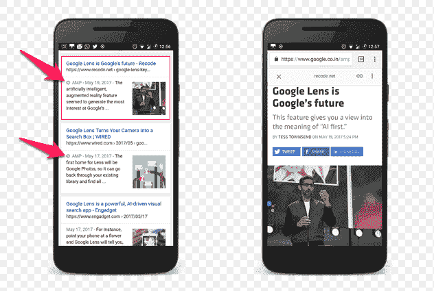

# 我讨厌加速移动页面

> 原文：<https://dev.to/ben/i-have-beef-with-accelerated-mobile-pages-kpo>

我不是第一个对加速的移动页面发出小牢骚的人。但这是一个我们可能不应该马上停止的话题。

AMP 页面是那些带有小闪电的移动谷歌搜索结果。闪电意味着快。

[T2】](https://res.cloudinary.com/practicaldev/image/fetch/s--oji5VPgZ--/c_limit%2Cf_auto%2Cfl_progressive%2Cq_auto%2Cw_880/https://www.smartinsights.com/wp-content/uploads/2017/10/AMP-Symbol.png)

速度很快，但是我不能绕到 AMP 方法。当用户访问 AMP 结果时，他们不会去那个网页，而是去`google.com/amp/...`。

有很多方法可以逃离放大器的世界，但这并不直观。

用户最终共享了`google.com/amp/...`，我们最终回到了`mobile.website.com`的世界，在那里 URL 不能跨设备工作。这是一个我们曾经试图摆脱的世界。

这些用户体验或困惑问题可能会被“解决”,但我不抱太大希望。在一个 AMP 是网络门户的世界里，网站的潜在商业模式更多地局限于那些可以立即赚钱的模式，因为从这里保留是一个白日梦。在那个阅读时刻可以赚钱的模型有...广告！

广告不是世界上最糟糕的邪恶，但它们也不是我们想要限制自己的东西。除非你是谷歌，那个统治所有广告公司的广告公司。从他们的角度来看，这很好。当然，你可以用 AMP 做更多的事情，但是许多人都倾向于把 Google 作为一个平台，而不是把 web 作为一个平台。

谷歌的垄断地位使他们能够微妙地侵蚀开放网络，为自己谋利。作为坐在温水中的青蛙，这并没有那么糟糕，但是水正在变暖，我们不想让它沸腾。

<figure>

[T2】](https://res.cloudinary.com/practicaldev/image/fetch/s--AXV8HMs4--/c_limit%2Cf_auto%2Cfl_progressive%2Cq_auto%2Cw_880/https://img.buzzfeed.com/buzzfeed-static/static/2017-09/8/16/campaign_images/buzzfeed-prod-web-13/9-oh-no-moments-by-alex-norris-gauranteed-to-make-2-8570-1504902780-4_dblbig.jpg)

<figcaption>Credit Alex Norris (https://twitter.com/dorrismccomics)</figcaption>

</figure>

谷歌一直是开放网络的最大支持者，并将这项技术推向了我们今天的位置。我认为我自己和我的组织是大 G 的朋友，但我仍然想尽可能地质疑他们的动机。开发者都与他们平台领域的大玩家有关系，正是这些小事决定了健康关系和糟糕关系的区别。

谷歌可以实现这些“更快的移动网页”的目标，而无需诉诸这些集中化策略。不清楚为什么仅仅在排名中奖励快速、高效的体验是不够的。为了帮助开发者快速有效地将他们的信息和资产提供给用户，公司还可以做其他事情。他们已经在他们的工作中做了一些这样的事情，总体上推动了网络技术的发展。

不把移动网络变成谷歌网络，我们为什么不能解决 AMP 试图解决的问题，这还不清楚。