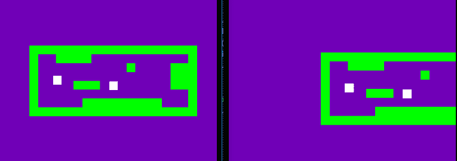
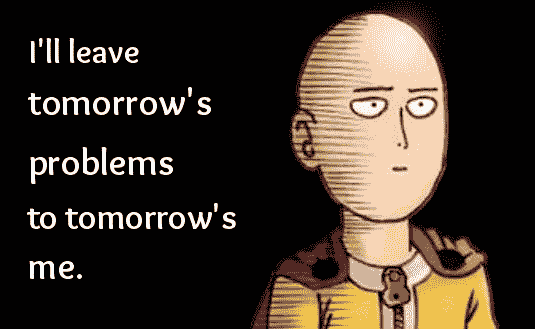

# 我实现了服务器端冲突检测

> 原文：<https://dev.to/webdva/i-implemented-server-side-collision-detection-1l90>

*一点点自我推销，这是我的[博客](https://webdva.github.io/)的交叉帖子。这是一个我正在制作的多人浏览器游戏。*

辉煌的成就。我在提升我的游戏开发技能。

[T2】](https://res.cloudinary.com/practicaldev/image/fetch/s--aP-f83aA--/c_limit%2Cf_auto%2Cfl_progressive%2Cq_66%2Cw_880/https://thepracticaldev.s3.amazonaws.com/i/afm601vbqgqrl07pkp48.gif)

我花了四个小时来实现冲突检测，这是在一个集中和权威的服务器上执行的，用于分发到一个连接的游戏客户端网络。

在游戏的运行物理例程中进行物理移动之前，使用对未来位置的推断或预测来检测玩家-地图块碰撞的先验碰撞*。* 

```
willCollide(object1, object2, object1_extension) {
    if (object1.x + object1_extension.x < object2.x + object2.width &&
        object1.x + object1_extension.x + object1.width > object2.x &&
        object1.y + object1_extension.y < object2.y + object2.height &&
        object1.y + object1_extension.y + object1.height > object2.y) {
        return true;
    } else {
        return false;
    }
} 
```

Enter fullscreen mode Exit fullscreen mode

在上面的函数中，`object1`和`object2`函数参数是 Javascript 对象文字，它们具有用于执行冲突检测的`x`、`y`、`width`和`height`属性。`object1_extension`函数参数是另一个 Javascript 对象文字，它具有`x`和`y`属性，算法使用这些属性来确定潜在碰撞对象的外推或预测未来位置。

上面的函数(它只是 git commit 中添加了碰撞检测的一小部分)用于在游戏的物理处理例程中执行玩家-地图图块碰撞，该例程变得很大且非常复杂。

在*所有*连接的玩家和**所有**当前地图/关卡中的方块之间执行碰撞检测检查。这可能会导致服务器性能问题。为了解决这个问题，一种叫做*四叉树*的东西(这让我想起了数据科学中的 k 近邻概念——有联系吗？是的，有。)或者可以使用基于扇区的方法。

但是，当问题出现时，解决方案就会出现，我决定将这个潜在的性能问题归类为明天的我的明天的问题。

[T2】](https://res.cloudinary.com/practicaldev/image/fetch/s--wzjcdilO--/c_limit%2Cf_auto%2Cfl_progressive%2Cq_auto%2Cw_880/https://thepracticaldev.s3.amazonaws.com/i/hkquwxv2o7apzjq94ca3.jpg)

意思是，我会在以后解决这样的问题。我已经有了一个初步的产品发布，我想尽快实现。自从我开始玩这个多人游戏已经将近两个星期了，我还没有把它发布给心爱的玩家。我想在感恩节前发布一个最小可行的工作版本，但圣诞节前后的某个时间可能是一个更有可能的发布日期，因为这是我的第一个多人游戏，它有很多复杂的制作和发布。