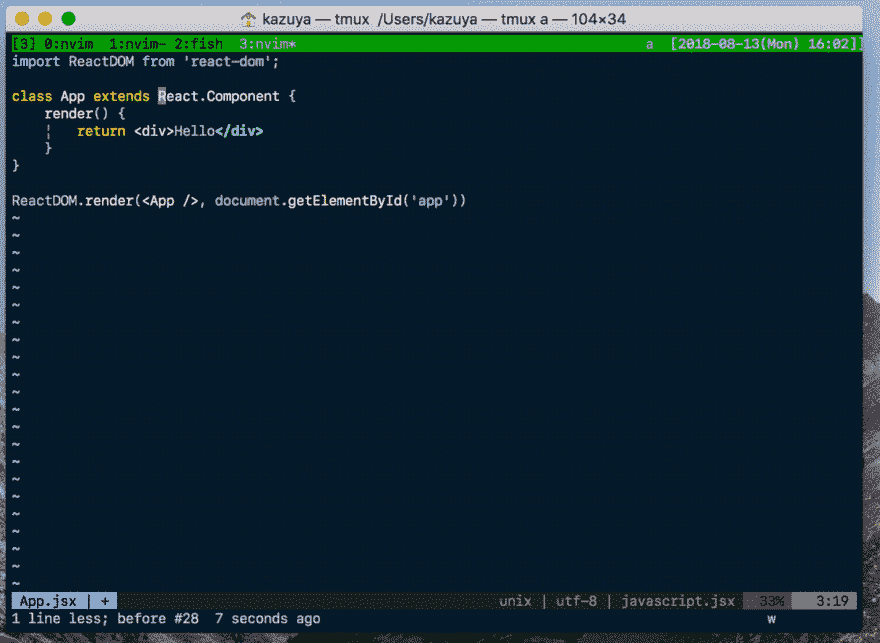

# 我刚刚发布了我的第一个 Vim 插件，import-js-from-history

> 原文：<https://dev.to/acro5piano/i-just-published-my-first-vim-plugin-import-js-from-history-3a4l>

我是 Vim 爱好者，但我从未创建或发布过我的 Vim 插件。

这次我创建了我的第一个插件`import-js-from-history`。

[https://github.com/acro5piano/import-js-from-history](https://github.com/acro5piano/import-js-from-history)

# 什么是`import-js-from-history`

[T2】](https://res.cloudinary.com/practicaldev/image/fetch/s--3ETYWQrv--/c_limit%2Cf_auto%2Cfl_progressive%2Cq_66%2Cw_880/https://thepracticaldev.s3.amazonaws.com/i/8xk0fj59psegudks5mq1.gif)

`import-js-from-history`帮助编写 JS & TS `import`语句。
读取所有 git 文件中的`import`语句，并建议`import`语句。

# 为什么

我已经厌倦了在文件顶部写`import`语句。我一直在一遍又一遍的重复写`import React from 'react'`。

当我使用 Visual Studio Code (VSCode)时，我惊讶地发现，当我键入要导入的包名时，它可以提示`import`。

回到 Vim(技术上是 Neovim)之后，我错过了这个特性。所以我创建了 Vim 插件。

你可能会奇怪我为什么不用 VScode。

实际上，我试图切换到 VSCode。我安装了主要的 VSCode 扩展，包括`Visual Studio Vim`。然而，我不能接受一些与 Vim 的小差异，比如我不能在文件浏览中使用`zz`。

# 为什么不用其他插件

我知道有一些 Vim 插件可以通过编程方式导入 js，但是我试过的所有插件都不太好用。因此我创建了这个解决方案，以及我的 Vim 培训。