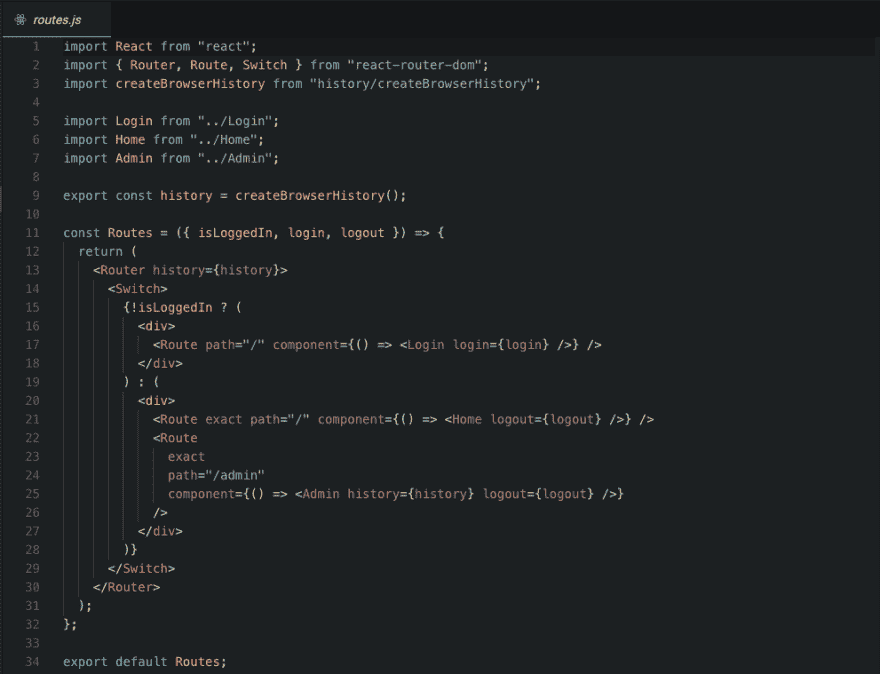
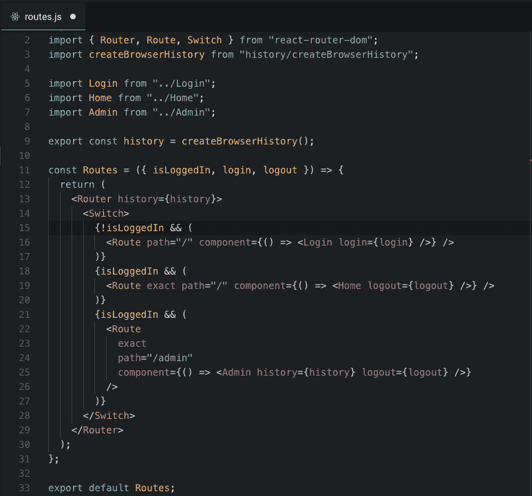
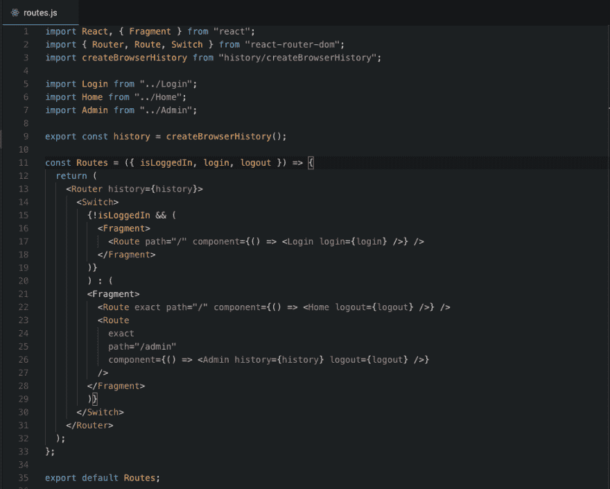

# 我学会了反应碎片

> 原文：<https://dev.to/clickclickonsal/i-learned-reactfragments--1oaj>

[T2】](https://res.cloudinary.com/practicaldev/image/fetch/s--2bC_f3W9--/c_limit%2Cf_auto%2Cfl_progressive%2Cq_auto%2Cw_880/https://thepracticaldev.s3.amazonaws.com/i/5p3r4ze0bgzbg1uoxsim.jpg)

我打赌你读过这个标题&心想“哇，那句话简直是断章取义！”😜哈哈标题应该说的是“我了解到了 React 片段”。不管怎样，我知道你在问什么“什么是反应碎片？！?"它们是组件返回子列表的常见模式。

> 注意:React 16 增加了对从组件的`render`方法中返回元素数组的支持&从 React 16.2 开始提供了一个一级`Fragment`组件，可以用来代替数组。)

我刚刚了解到它们(我知道我对这个游戏来说有点晚了)&碰到了一个很好的用例，它派上了用场！

所以我正在设置我的路线&想让某些路线只有在用户登录时才可用&反之亦然。

[T2】](https://res.cloudinary.com/practicaldev/image/fetch/s--au5eoEim--/c_limit%2Cf_auto%2Cfl_progressive%2Cq_auto%2Cw_880/https://cdn-images-1.medium.com/max/1600/1%2AnHMDhLMLaBbkezB1AqjTHg.png)

所以我想出了这样的东西&这很完美，但是这带来了一个小问题。运行上述设置时，如果打开浏览器控制台，您会注意到下面的错误。

[T2】](https://res.cloudinary.com/practicaldev/image/fetch/s--x3ITj_U2--/c_limit%2Cf_auto%2Cfl_progressive%2Cq_auto%2Cw_880/https://cdn-images-1.medium.com/max/1600/1%2AKpZyhhtrCH6zgAn1W4uE4A.png)

React 抛出这个错误的原因是因为`Switch`组件只需要`Route`组件的子组件。🤔嗯，让我们试试这个。让我们把每条路线都用它自己的条件&包装起来，看看这是否能修复我们的错误。

[T2】](https://res.cloudinary.com/practicaldev/image/fetch/s--jndlSBOC--/c_limit%2Cf_auto%2Cfl_progressive%2Cq_auto%2Cw_880/https://cdn-images-1.medium.com/max/1600/1%2AfD70WVaTz4FnLCkROEyi3g.png)

是的，它修复了我们的错误！嗯，但这似乎不是最好的解决方案，因为它不是[干](https://en.wikipedia.org/wiki/Don't_repeat_yourself) &包含[代码气味](https://en.wikipedia.org/wiki/Code_smell)。如果我们采用这种解决方案，我们将不得不为每一条新路线包含`isLoggedIn`条件。此外，我们的代码将为我们拥有的 x 条路由计算相同的条件(这是一种代码味道😷).那么我们能做什么呢？我真的很喜欢我们的第一个例子，因为它是干的&它不包含代码味道，但是用一个`div`包装我们的路线会给我们一个难看的错误。我知道你在对自己说什么，“我希望有一种方法可以神奇地把东西包起来！”。

[T2】](https://res.cloudinary.com/practicaldev/image/fetch/s--vlwNHKBg--/c_limit%2Cf_auto%2Cfl_progressive%2Cq_auto%2Cw_880/https://cdn-images-1.medium.com/max/1600/1%2A2oFH4ZWIpYwu5bb8uuGaZQ.png)

[反应过来的片段](https://reactjs.org/blog/2017/11/28/react-v16.2.0-fragment-support.html)来救援了！！！我们现在可以保留第一个例子中的内容&，只需用 Fragment(从“react”导入)替换`div`。

> 请参阅下面的注释，了解我们为什么要导入自定义交换机组件。

[T2】](https://res.cloudinary.com/practicaldev/image/fetch/s--z78zD2rg--/c_limit%2Cf_auto%2Cfl_progressive%2Cq_auto%2Cw_880/https://thepracticaldev.s3.amazonaws.com/i/q13k5nlejj3ql661ywtt.png)

> 请看一个活生生的例子:[https://codesandbox.io/s/7k9rn30jmq?module = % 2 fsrc % 2f config % 2f routes . js&view = editor](https://codesandbox.io/s/7k9rn30jmq?module=%2Fsrc%2Fconfig%2Froutes.js&view=editor)

耶，不会再有错误了！这篇文章就到此为止了！😉

* * *

*更多双关语和代码提示请在 twitter 上关注我的旅程[@ clickclickonsal](https://twitter.com/clickclickonsal)T3】*

*本文原载于我的[媒体刊物](https://medium.com/@clickclickonsal/i-learned-react-fragment-6db6d482cb1c)*

> 编辑(2018 . 2 . 27)
> 注意: [@leandroaps](https://medium.com/@leandroaps) 遇到了一个问题，他的路线总是被渲染。原来 React-Router 的组件不支持用片段包装的路由。虽然代码“看起来”工作正常，但当试图添加一个“全部捕获”的路由时，它会中断。我对此进行了调查，发现了一个与 Github 相关的问题&遇到了这个问题的解决方法[在这里](https://github.com/ReactTraining/react-router/issues/5785#issuecomment-359427800)。解决方法是包装 react-router 交换机组件，该组件包含将路由展平的逻辑。我已经更新了上面的代码沙箱来包含这个修复，所以你可以看到它是如何实现的。感谢 [@bripkens](https://github.com/bripkens) 对您开源的贡献！😃