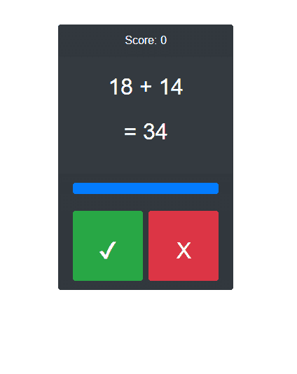

# 我在 VueJS 中做了一个简单的 android 游戏“该死的数学”的克隆

> 原文：<https://dev.to/oaltena_48/i-made-a-simple-clone-of-the-android-game-freaking-math-in-vuejs-47g2>

## [【oaltena】](https://github.com/oaltena)/[【vuemath】](https://github.com/oaltena/vuemath)

### 用 VueJs 制作的安卓应用“该死的数学”的克隆版

<article class="markdown-body entry-content container-lg" itemprop="text">

# vecmath

## 屏幕上显示程序运行的图片

[T2】](https://raw.githubusercontent.com/oaltena/vuemath/master/public/vuemath-screenshot.png)

## 项目设置

```
npm install 
```

### 为开发进行编译和热重新加载

```
npm run serve 
```

### 为生产进行编译和精简

```
npm run build 
```

</article>

[View on GitHub](https://github.com/oaltena/vuemath)

请随意投稿。