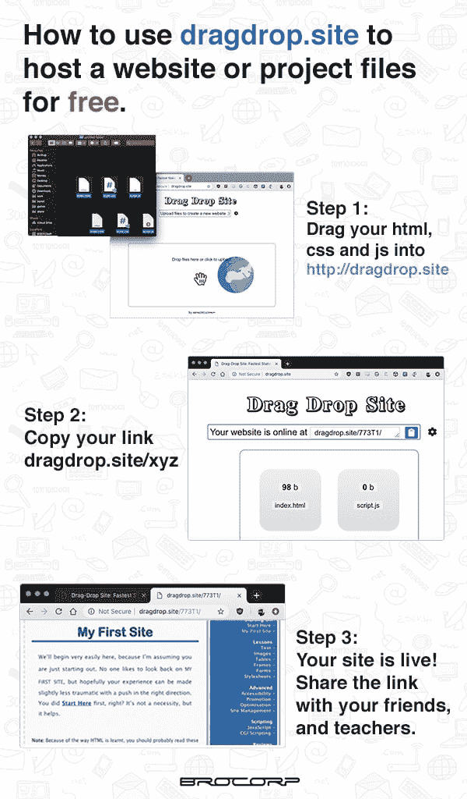

# 在 dragdrop.site 上即时部署静态网站

> 原文：<https://dev.to/prnthh/i-made-a-super-simple-static-site-hosting-service-44kp>

我是格林奇的超级粉丝。我在[无数次黑客马拉松](https://glitch.com/@prnthh)中使用它来快速托管 Node.js 项目，而不必担心部署服务器，当快速构建原型应用程序时，带有 autosave 的在线编辑器是与团队合作的一种令人惊叹的方式。

然而，我最近参加了一个网页设计课程，在那里我们被要求在互联网上主持我们的项目网站，但我的许多同龄人对像 XAMPP 这样的事情没有经验，会不断地向我寻求帮助。

这让我创建了 [dragdrop.site](http://dragdrop.site/) 。
这是一项简单的服务，你可以通过将 html、css 和 js 文件从电脑拖到浏览器窗口来创建一个静态网站。它立即返回一个新的子域，看起来像“xyzab.dragdrop.site”，你可以用它来与你的朋友分享你的项目。

[T2】](https://res.cloudinary.com/practicaldev/image/fetch/s--9pG9MrGA--/c_limit%2Cf_auto%2Cfl_progressive%2Cq_auto%2Cw_880/https://thepracticaldev.s3.amazonaws.com/i/vjc83se5hc6rm830sfaj.jpg)

我想这样做的一个主要好处是你可以在你喜欢的工具上本地开发它，并以一种视觉上非常独特的方式部署它。这对我的同学来说非常有效。

我鼓励他们尝试像 Firebase 这样的服务，为表单和其他东西设置后端功能。

我正在寻找一些反馈和想法，以使服务更有用。我希望尽快添加对使用 LetsEncrypt 的 HTTPS 的支持，以及允许用户选择自己的子域名。也最终用户帐户，所以你可以在电脑之间切换。如果人们需要的话，最终也会有中间件。