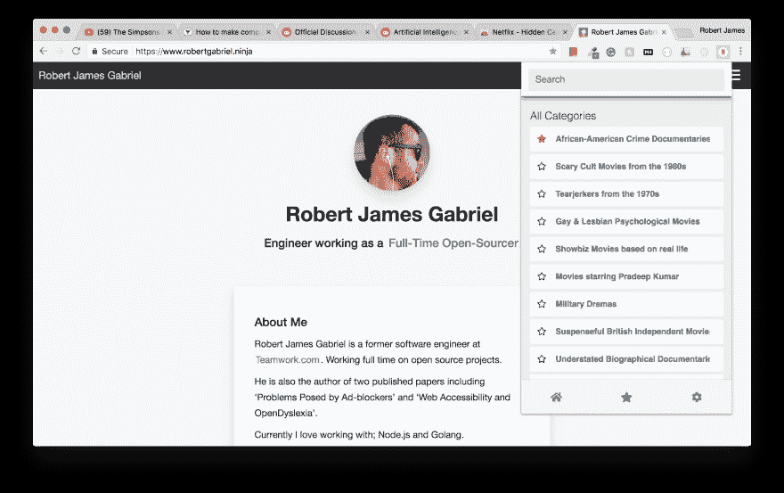

# 我做了一个应用程序，可以让你访问超过 20，000 个隐藏的网飞类别

> 原文：<https://dev.to/robertjgabriel/i-made-an-app-that-gives-you-access-too-20000-plus-hidden-netflix-categories-1i7k>

[T2】](https://res.cloudinary.com/practicaldev/image/fetch/s--z12kmFTr--/c_limit%2Cf_auto%2Cfl_progressive%2Cq_auto%2Cw_880/https://thepracticaldev.s3.amazonaws.com/i/6cln46t2nk6runeb25m2.png)

任何在 Twitter 或 T2 Github 上关注我的人都知道我在做自己的创业想法和一些自己喜欢的项目。其中一个包括这个。一个 chrome 扩展，搜索和发现网飞的隐藏类别，并与它们一起成长。它是由 Vue，Bem 和 Mocha 建造的。

网飞有数以千计的隐藏类别。我做的这个扩展可以帮助你解开许多秘密类别。

特点:

*   搜索已验证的隐藏类别
*   小尺寸~ 0.02 MB
*   最喜欢的类别
*   跨浏览器同步

隐私:

*   安装不需要权限
*   不发送任何数据

[你可以在这里观看视频演示](https://www.youtube.com/watch?v=V_L-SO4IDoI)

你可以在谷歌 Chrome 上免费下载一周。(之后的 1.99)

我很乐意回答任何反馈或问题。比如我如何得到新的目录？这上面的钱包括成本:)