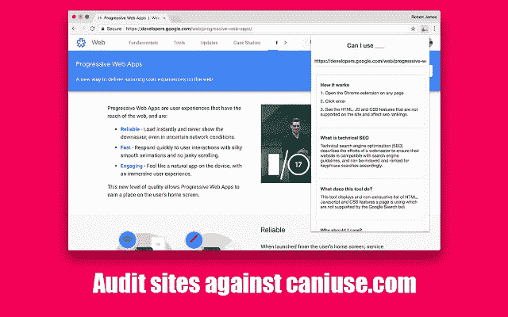

# 我制作并可以使用 __ audit 工具吗

> 原文：<https://dev.to/robertjgabriel/i-made-and-can-i-use--audit-tool-4dii>

[T2】](https://res.cloudinary.com/practicaldev/image/fetch/s--NmRAoMIe--/c_limit%2Cf_auto%2Cfl_progressive%2Cq_auto%2Cw_880/https://thepracticaldev.s3.amazonaws.com/i/y8mgd5knfdnq5fdh3zte.jpg)

任何在 Twitter 或 T2 Github 上关注我的人都知道我在做自己的创业想法和一些自己喜欢的项目。其中一个包括这个。一个 chrome 扩展，我可以使用它在当前站点上运行审计。它是由 Vue，Bem 和 Mocha 建造的。

它是如何工作的

1.  在任何页面上打开 Chrome 扩展
2.  检查 URL，然后单击 enter
3.  看到的 HTML，JS 和 CSS 功能，网站上不支持，影响 SEO 排名。

关于

我可以使用吗”提供了最新的浏览器支持表，以支持桌面和移动 web 浏览器上的前端 web 技术。因此，您可以在任何页面上运行它，并获得该页面上使用的和不支持的所有功能的响应。

这个工具是做什么的？

这个工具显示一个页面正在使用的 HTML、Javascript 和 CSS 特性的非详尽列表，这些特性不受 Google 搜索机器人或流行浏览器的支持。

[你可以在这里观看视频演示](https://www.youtube.com/watch?v=AkXtjIFgUFU)

你可以在谷歌 Chrome 上免费下载一周。(之后的 1.50)

我很乐意回答任何反馈或问题。这上面的钱包括成本:)