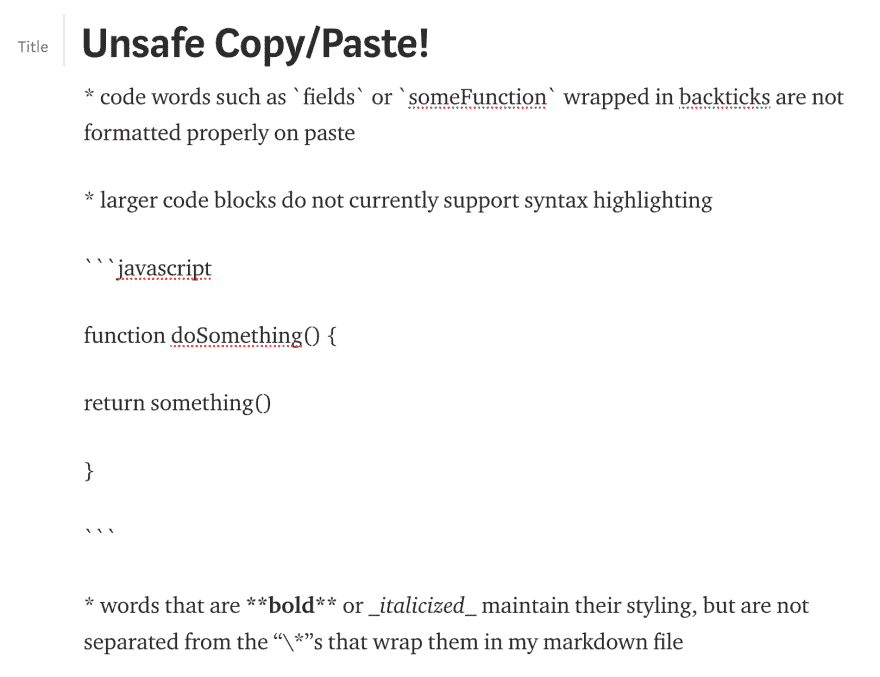

# 我写了一个 Go 脚本来生成 Gists，下面是我学到的东西

> 原文：<https://dev.to/iwilsonq/i-wrote-a-go-script-to-generate-gists-heres-what-i-learned-244m>

写博客并把它们发布到不同的平台上会有很多忙碌的工作。

例如，我通常通过在我的代码编辑器中创建一个 markdown 文件，在需要的地方插入代码片段和图像来开始写一篇文章。

然而，当我需要将同样的降价发布到[媒体](https://medium.com/@iwilsonq)时，问题出现了。虽然他们的文本编辑器很漂亮，但是在那里复制粘贴我的 markdown 文件并不完全安全。

以下是一些问题:

*   粘贴时，反勾号中的代码字(如`fields`或`someFunction`)的格式不正确
*   较大的代码块目前不支持语法突出显示
*   粗体字**或斜体字**或斜体字*保持它们的样式，但在我的减价文件中，它们不会与包装它们的*s 分开*

这是粘贴的 3 个要点的截图:

[T2】](https://res.cloudinary.com/practicaldev/image/fetch/s--WSGLKIKp--/c_limit%2Cf_auto%2Cfl_progressive%2Cq_auto%2Cw_880/https://thepracticaldev.s3.amazonaws.com/i/qydthikqfmlt7tv1zn84.png)

可以说我懒，但是写完一篇 2500+字的帖子，我必须:

*   仔细检查每一行，确保我的语法有意义。
*   确保我的代码示例工作，因为我的一些文章是教程。
*   通过 [Github Gists](https://gist.github.com) 让我的代码看起来很漂亮，从而带来了一个全新的制表符与空格的问题。
*   清理每一个降价风格的超链接，从突出显示的单词和短语中删除多余的星号或反勾号。

这就变成了**排水**。试图制作可以在多个网站上交叉发布的内容需要做大量的工作。

为什么我不干脆屈服，只在 [dev.to](https://dev.to/iwilsonq) 上发帖，在那里你可以直接粘贴你的降价文件？

因为那不是我的 nind。我必须在互联网上无所不在。

## 清理代码片段

先从最下面挂着的果子抓起，就是清理那些代码片段！我们如何做到这一点？

那么，强力的方法就是像平常一样复制和粘贴，但是，去掉表示代码块的反勾号，按“CMD+option+6”来创建一个 Medium Codeblock，然后在 Medium Codeblock 中处理笨拙的换行符和制表符。

没有。我不会再那样做了。

下一个选项是手动创建 Github Gists，它将代码格式化委托给 Github。此外，我们还可以从中突出语法。

然而，在我最近的工作中，gists 的标签大小似乎默认为 8，这是绝对荒谬的。

没人用 8 码的标签。

似乎解决这个问题的唯一方法是用空格替换所有的制表符(在我的例子中是 2)。

好处是我们得到了更漂亮的代码片段。缺点是每个制表符都必须用空格替换。我的上一篇文章有 18 个 JavaScript 代码片段。这是一次悲惨的编辑经历。

# 介绍要点生成器

* *我希望我能想出一个更酷的名字*

我决定利用我的开发能力，利用 Github API 来创建这些 Gists。这个用 Go 编写的脚本将如下进行:

1.  读入降价文件
2.  解析像“go”或“javascript”这样的语言片段
3.  为每个片段创建一个要点
4.  保持一个引用了片段和要点的结构
5.  用相关的要点 URL 替换片段
6.  编写一个新的 markdown 文件，用 gists 替换 Medium 的代码片段

如果你对查看源代码感兴趣，你可以在 [repo](https://github.com/iwilsonq/gist-generator) 中查看。在我决定向任何人出售它之前，我想把一些测试放在一起，但无论如何它都是开源的。目前用法是这样的:

```
./gist-generator -f example.md -token <GITHUB_ACCESS_TOKEN> 
```

Enter fullscreen mode Exit fullscreen mode

如果我创建一个 web 客户端来运行这个过程，用户将使用他们的 Github 帐户通过 OAuth 登录。这将消除他们必须手动生成个人访问令牌并将其粘贴到 CLI 中的步骤。

这是一件很好的事情，但是现在还不是我的目标——让我们来看看一些更紧迫的问题。

## 遇到的问题

虽然解决我在这篇文章前面提到的问题是我的主要目标，但是在编写这个脚本的时候，我在几个地方遇到了麻烦。

其中一个问题是处理将要创建的要点的格式。在我的减价文件中看起来不错的东西在要点中不一定好看。

在第一遍中，由于换行和过大的制表符，我有过多的空白。通过迭代代码片段中的字节，我可以删除不必要的换行符并用空格替换制表符。这里有一个例子:

```
// Unicode constants
const (
    TAB     = 9
    SPACE   = 32
    NEWLINE = 10
)

func removeInitialNewline(content string) string {
    if content[0] == NEWLINE {
        content = content[1:]
    }
    return content
}

func replaceTabsWithSpaces(content string) string {
    var buffer bytes.Buffer
    for _, c := range content {
        if c == TAB {
            buffer.WriteRune(SPACE)
            buffer.WriteRune(SPACE)
        } else {
            buffer.WriteRune(c)
        }
    }
    return buffer.String()
} 
```

Enter fullscreen mode Exit fullscreen mode

在我为这个脚本编写的所有 Go 代码中，为什么我首先显示了换行和制表符的修剪？为什么我没有展示我创建的表示要点和片段的结构？

因为空白问题是解决我在开头提到的最大问题之一的关键！这是最简单的问题，却能产生最大的结果。

还有一些较低层次的问题，涉及如何最好地解析文件或使用字节缓冲区构建字符串。我将在以后的帖子中解决这个问题，因为它值得拥有。

## 经验教训和未来项目

我喜欢这个项目有几个原因:

*   它足够小，不会太吓人
*   最终目标很明确也很实际:提高我博客文章的质量
*   我有机会练习开发一个 Go 命令行工具
*   它可以很容易地融入类似博客生产力工具的生态系统

关于最后一点，我意思是要点生成步骤可以是几个步骤中的一个。

我可以写一个类似的脚本，从博客文本中删除多余的减价字符。通过[这篇文章](https://medium.com/@andymcfee/how-to-import-markdown-into-medium-c06dc981bd96)，我发现了部分完成这一步的方法。

Medium 允许导入一个粘贴在 gist 中的 markdown 文件(因为它需要一个 URL)。这使得它能够正确处理反勾号和星号换行的单词。它甚至可以处理文本中的超链接。

为了处理语法错误，我可以添加一个步骤，可能调用一个简单的语法上的 API。如果开源解决方案还不存在，这可能是另一个未来项目的想法。

我甚至可以创建一个仪表板，如果我的脚本中的一个错误导致其中任何一个错误，它将允许我轻松地删除 gists。当前的[官方要点仪表板](https://gist.github.com)对于编辑或删除要点来说是相当低效的。

最后，我一直在思考一个基于云的 markdown 编辑器的想法，这个编辑器可以在手机上使用。你知道，当我在迪斯尼排队等着编辑我的一篇文章的时候。这种时候。

# 包装完毕

这么多事要做，时间却这么少。我想我的下一步是讨论关于从 markdown 引入故事的其他美学问题。

在这一点上，任何减少编写技术内容所涉及的摩擦的项目都是有价值的。

这个项目源于我想消除大量冗余编辑带来的一些痛苦。有些问题是由于对平台不熟悉造成的，有些是由于平台的实际限制造成的。

写这样的文章并着手类似的项目可以解决这两个问题:你一直在学习这个平台的能力，同时改进它的不足之处。

毫无疑问，以生产力的名义，这是一次很棒的学习经历。

同样，[这里的](https://github.com/iwilsonq/gist-generator)是项目回购的链接。

好奇更多帖子或者妙语连珠？给我点个赞，在 [Medium](https://medium.com/@iwilsonq) 、 [Github](https://github.com/iwilsonq) 和 [Twitter](https://twitter.com/iwilsonq) 上关注我吧！