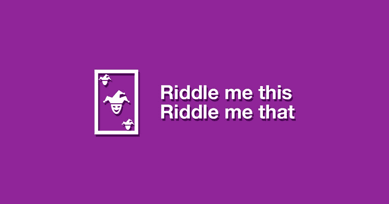

# 使用浏览器识别对象使用 TensorFlowJS

> 原文：<https://dev.to/oninross/identifying-objects-using-yourbrowser-1i3d>

你可能熟悉电视节目[硅谷](https://en.wikipedia.org/wiki/Silicon_Valley_(TV_series))和[“热狗”剧集](https://www.youtube.com/watch?v=ACmydtFDTGs)，演员们创建了一个应用程序来简单地(但也很有趣地)确定物体是不是热狗。随着谷歌镜头等应用程序被应用到大多数现代智能手机上，这不再是科幻小说了。如今，任何人都可以简单地对准相机，快速获取他们需要的信息。

[T2】](https://res.cloudinary.com/practicaldev/image/fetch/s--CCXGy8i5--/c_limit%2Cf_auto%2Cfl_progressive%2Cq_66%2Cw_880/https://thepracticaldev.s3.amazonaws.com/i/g474ilocbdst7mofjyv0.gif)

举几个例子，市场上有像 [Google Cloud Vision API](https://cloud.google.com/vision/) 、 [AWS Rekognition](https://aws.amazon.com/rekognition/) 和 [Clarifai](https://clarifai.com/) 这样的服务可供任何人实现和使用。虽然这些服务可以让你用更少的代码做更多的事情，但它确实有一个随用随付的价格标签。此外，它是一个通用的图像标识符，可能有不同的用例。

回车: ***TensorFlowJS*** 。

[T2】](https://res.cloudinary.com/practicaldev/image/fetch/s--zh5I0Pqp--/c_limit%2Cf_auto%2Cfl_progressive%2Cq_auto%2Cw_880/https://thepracticaldev.s3.amazonaws.com/i/eq6fpdrg0jqthcufidur.jpg)

它是由谷歌大脑团队发布的 JavaScript 库，为每个人带来机器学习。最初是用 Python，C++和 CUDA 写的。多亏了这个团队，他们已经将它移植到 JavaScript 上，在浏览器中经常使用。虽然 TensorFlowJS 与他的老大哥 Python 版本不完全相同，但该库已经配备了必要的 API，可以从头构建和训练模型，运行 TensorFlow 模型并重新训练预先存在的模型，所有这些都是浏览器的便利之处。

TensorFlow 一直在我的阅读资料中流传，随着谷歌最近的 IO 事件，它激励并推动我涉足机器学习。

## 探索之路

[T2】](https://res.cloudinary.com/practicaldev/image/fetch/s--o8nJtyj_--/c_limit%2Cf_auto%2Cfl_progressive%2Cq_auto%2Cw_880/https://thepracticaldev.s3.amazonaws.com/i/3ycvbc8x6j8w9c0h237l.jpg)

不同来源的警告表明，如果你没有任何机器学习背景，TensorFlow 将不会有帮助。Python 不断成为机器学习领域开发的首选语言，看起来我需要学习一些基础知识来继续进行创作。这是我遇到的众多障碍之一。但是我仍然决定创造我自己的图像标识符。

### 警告:如果你没有任何机器学习背景，TensorFlow 不适合你

第一步总是回到基础，阅读 TensorFlowJS 网站上的文档。一开始看起来很简单，但我错了。更多的问题浮出水面，我开始相信之前的警告信号。也许在深入 TensorFlowJS 之前，我确实需要学习一下机器学习。甚至在 YouTube 上搜索教程和参考资料也没有多大帮助。我确实设法在我的机器上本地“创建”了一个图像分类器，但是它是在 Python 中运行的。我需要它是客户端的，就像[表情符号寻宝游戏](https://emojiscavengerhunt.withgoogle.com/)。

找到表情符号寻宝游戏的[库](https://github.com/google/emoji-scavenger-hunt)并花费数小时逆向工程代码以适应我的需求后，我终于能够创建我自己的图像分类器，它可以在客户端顺利工作。

### 像教 2 岁小孩一样教它

我认为我最大的障碍是用 Python 开发。我最初是在 Windows 环境下开发的，设置起来既混乱又痛苦。但是当我切换到 Mac 环境时，一切都一帆风顺了。我学到的最大教训是为系统提供良好的数据。我的同事告诉我，为了得到高精度的结果，你必须提供良好的初始数据。

[T2】](https://res.cloudinary.com/practicaldev/image/fetch/s--WMq48E7Z--/c_limit%2Cf_auto%2Cfl_progressive%2Cq_auto%2Cw_880/https://thepracticaldev.s3.amazonaws.com/i/gtg68zr81gchr1912dvw.jpg)

一个简单理解机器学习如何工作的类比是，通过像一个 2 岁的孩子一样显示图像来教它，其中数据是图像的集合，2 岁的孩子是机器学习系统。例如，如果你想让孩子知道苹果是什么，你可以只给孩子看不同的苹果图片。照片里不应该有其他东西。没有其他水果，没有其他元素。在孩子看过一定数量的图片后，他们将能够知道他们在现实生活中什么时候看到苹果。另一方面，如果你给孩子苹果和橘子、苹果和香蕉、苹果和葡萄的图片。当孩子看到那些水果在一起时，他们会感到困惑。

这个类比的寓意是，最初将被输入到机器学习系统的图像应该很容易被不知道主题是什么的人或物理解。

## 给我猜谜这个 PWA

[T2】](https://res.cloudinary.com/practicaldev/image/fetch/s--KDdo9NZQ--/c_limit%2Cf_auto%2Cfl_progressive%2Cq_auto%2Cw_880/https://thepracticaldev.s3.amazonaws.com/i/mzs2802qaetkpnsmtbkk.jpg)

> *给我出这个谜语给我出那个谜语
> 从帽子里拿出来的随机谜语
> 当你知道答案的时候拍一拍
> 如果你答对了我就给你鼓掌*

我的目标是想出我自己的图像标识符，并把它用在一些好的地方。这是一个 PWA，它将向你展示你家周围常见物品的随机谜语。你的挑战是找到答案并拍下照片。如果你是正确的，你继续其他的谜语。如果你错了，那么...继续猜。

请点击下面的链接！狩猎愉快！

[【https://goo . GL/oavldu】](https://goo.gl/oaVLDu)