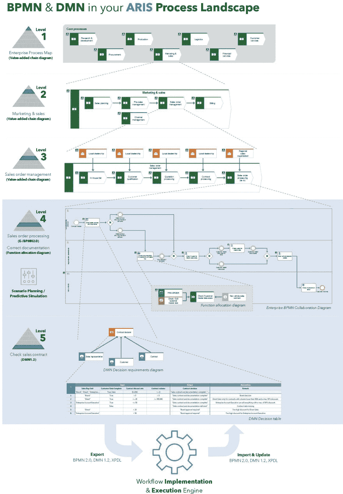
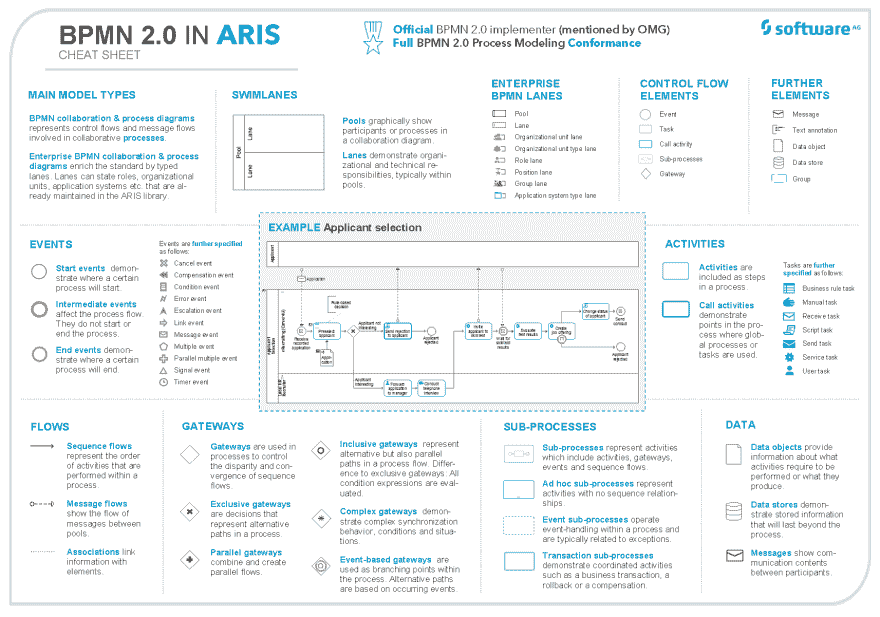

# 如果 BPMN 2.0 那么 BPMN 2.0 在 ARIS，请！

> 原文：<https://dev.to/techcommunity/if-bpmn-2-0-then-bpmn-2-0-in-aris-please-ch1>

# 跟随领导者，受益于我们独特而强大的标准支持

**思考 BPMN 2.0？ARIS 现在是一名重要的球员。在这篇文章中，你将深入了解为什么 ARIS 是 BPMN 2.0 的领导者，以及 BPMN 2.0 标准如何在 ARIS 实施和扩展，使其成为一个独特而强大的组合，为用户提供众多优势。**

软件公司 ARIS 产品营销经理 josèphe blond aut&软件公司 ARIS 产品经理 Tom Thaler

| 2018 年第四期 | [ 下载 PDFT4】](http://techcommunity.softwareag.com/ecosystem/download/techniques/2018-issue4/SAG_BPMN_2.0_TECHniques_Oct18_WEB.pdf) |
| --- | --- |

## BPMN 概述

BPMN 代表业务流程建模符号，是说明业务流程的标准方法。对象管理小组(OMG)现在正在维护由业务流程管理倡议(BPMI)开发的 BPMN。创建 BPMN 是为了用一种独立于工具的标准化建模语言将业务和 IT 结合起来，这种语言将使不同系统之间的交换和交互更加容易和安全。BPMN 服务于过程建模，并且是一个标准，现在它的 2.0 版本已经可用。

由 OMG 发起的 BPMN 模型交换工作组(MIWG)的目的是支持、促进和推动 BPMN 模型的交换。一项重要任务是就 BPMN 标准的解释达成共识，以确保更好的交流。在这种背景下，他们建立了一个测试套件来验证现有工具是否符合协议。验证包括:

*   **Import**–测试套件的所有模型都可以正确导入，包括可视化、对象类型和属性
*   **导出**——设计的模型能够正确导出，涉及文件有效性、对象类型和属性
*   **往返**–导入的模型可以再次导出(反之亦然)，不会丢失任何信息

成功提交了三个不同结果组的所有模型的工具只有三个，而 ARIS 是其中之一，强大的导入、导出和往返能力可以得到证明([http://bpmn-miwg.github.io/bpmn-miwg-tools/](http://bpmn-miwg.github.io/bpmn-miwg-tools/))。最后，ARIS 展示了对跨供应商标准协议的大力支持。

## ARIS 如何支持 BPMN 2.0

作为流程设计和建模领域的领导者，ARIS 提供了一系列广泛的功能来支持 BPMN 2.0，而没有任何中断。ARIS 不仅能够支持 BPMN 2.0 标准格式，而且还扩展了它。让我们来详细看看:

*   **模拟 BPMN 2.0**–ARIS 提供了围绕 BPMN 2.0 的一切协作、流程和分配图。如果你想对这些物体及其符号有一个详细的概述，请参阅第 4 页的“备忘单”。
*   ARIS 提供了从 EPC(事件驱动的流程链——业务蓝图)到 BPMN(解决方案蓝图)的自动转换。这减少了升级障碍，简化了您进入过程自动化的第一步。ARIS 使用一种开放的算法，可以根据个人习惯进行调整。
*   **将 BPMN** 图引入 ARIS，并将其嵌入 ARIS 流程图中。这意味着，一旦 BPMN 2.0 图表被导入 ARIS 数据库，它就可以通过分配和对象连接无缝集成到现有流程中。事件概念也受到支持，它使得导入的 BPMN 2.0 信息可以在 ARIS 存储库中的其他图中重用。
*   **验证 BPMN 2.0** 图得益于集成的 ARIS 语义检查，确保了流程图的质量。ARIS 语义检查显示模型是否符合建模约定并检测异常。因此，ARIS 用户将得到错误、警告或注释，直接标记在模型中相应的对象上。ARIS 提供了具体的指导，帮助用户改进和纠正过程信息，使其适合 it。
*   **更新 BPMN** 图，并对其进行更改。想象你已经有了某个特定领域的过程信息；这可以通过导入进行更新，这样您就可以将相关的 IT 更改包含到 ARIS 存储库中。
*   **与 BPMN 2.0 的往返**与 ARIS 很容易，因为当模型在业务和 IT 之间传输时，绝对没有信息丢失。这包括双方各自的属性和 IDs 的稳定性，这是专业往返场景的关键要求。支持 BPMN 流程建模一致性级别内的所有内容。

## 为什么 BPMN 在 ARIS 是独特而强大的

ARIS 从商业角度扩展了 BPMN(从 EPC 中得知)。企业 BPMN (E-BPMN)图使建模者能够在 BPMN 图中将业务信息，如角色、组织单位和应用系统，描绘成类型化的通道。这种方法允许在整个流程中无缝集成，并在整个层次结构中提供强大的分析能力。此外，它不影响标准或导入/导出功能，而是以一致的方式扩展标准。因此，BPMN 不仅可以作为 EPC 的替代方案，还可以作为进一步的层级，为过程自动化计划提供所有相关信息(见图 1)。

此类计划的一个重要方面是业务和决策规则的设计。作为早期采用者，ARIS 现在支持(从 ARIS 10 SR6 开始)即将由 OMG 发布的决策建模符号(DMN)1.2 标准。DMN 不仅允许决策层次的概念定义和所需的输入数据，还允许具体决策规则的逻辑规范。相应的导入和导出可以轻松地转移到规则引擎(通常是通用工作流实现和执行引擎的一部分)，然后自动做出决策。

最后，ARIS 集成了 BPMN 2.0 流程信息和来自 ARIS 知识库的任意附加信息。如图 1 中的示例层次结构所示，功能分配图(FAD)用于详细描述 BPMN 活动，例如风险、控制或物联网对象。这表明完美集成到一个全面的业务蓝图中，该蓝图考虑了所有相关的业务观点，如组织结构、数据、控制、功能和产品/服务。

标准 ARIS 功能进一步支持 BPMN 2.0 建模，并通过语义检查、报告、预测模拟、场景规划、SAP 同步等为卓越铺平道路。ARIS 使用户能够以图形或表格的形式快速地模拟 BPMN。相关的 BPMN 对象(如车道、事件、活动和数据)易于插入和重用。

模板和导向对齐使设计者的生活更轻松，并确保 BPMN 2.0 模型不仅没有错误，而且看起来很好，可重复使用来呈现信息。最后，过程知识可以以一种简单的方式传达给最终用户(查看者),这种方式不需要任何符号知识。steps 视图引导他们完成单个流程步骤，并并排提供所有相关的(基于角色的)信息。最后，通过流程挖掘获得的运行时信息可以在模型环境中使用——ARIS 根本原因挖掘器支持分析师识别瓶颈和缺陷。

## ARIS 的 BPMN 2.0 有很多优点

ARIS 在使用 BPMN 2.0 时提供了多种优势:

*   你符合标准，进出口容易
*   ARIS 用商业信息扩展和提高了标准
*   ARIS 将 BPMN 和 DMN 整合在一个全面的流程环境中，考虑了所有相关的业务前景
*   ARIS 支持您建立业务流程蓝图的质量关
*   ARIS 不仅仅是 BPMN 2.0 的设计，而是基于分析、预测模拟、场景规划和仪表板采取下一步措施

ARIS 没有止步于 BPMN 2.0，而是执行其他标准。ARIS 将是 DMN 1.2 标准的早期采用者，并将从 2018 年 10 月起支持该标准。这意味着，作为 ARIS 的用户，你将能够在 ARIS 将 BPMN 2.0 图与 DMN 1.2 决策模型结合起来。2018 年 10 月，您可以期待:

*   DMN 1.2 支持
*   专业 DMN 决策表建模
*   DMN 进出口公司

# trust the leader # trust aris # aris 10

 

**图 1:** 一个包括 ARIS BPMN 和 DMN 在内的 5 级流程景观样本

 

**图 2:**BPMN 2.0 ARIS