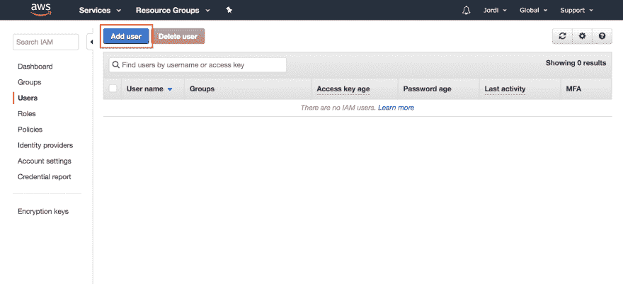
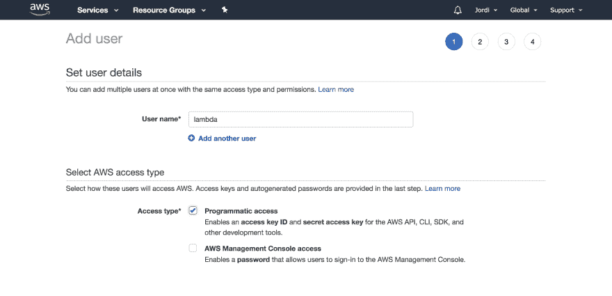
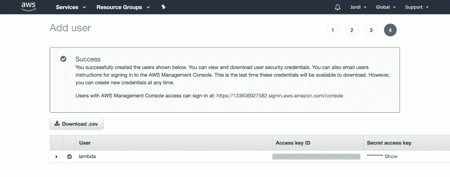
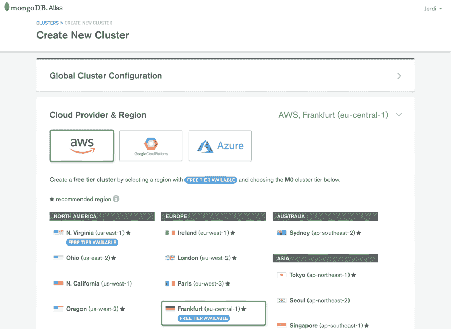
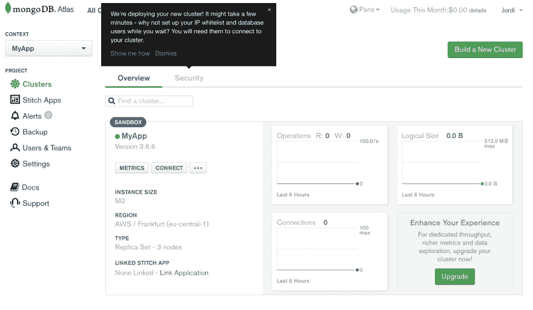
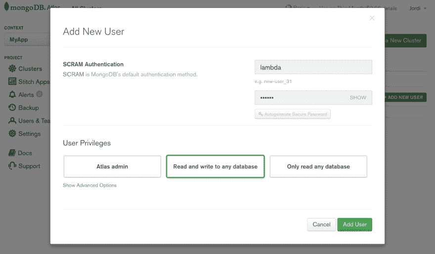
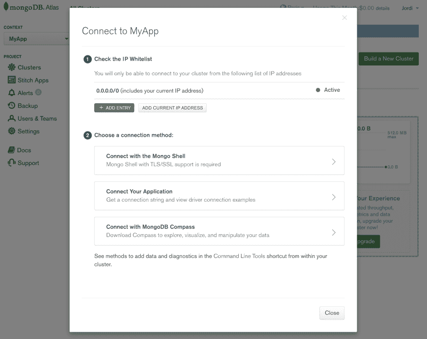
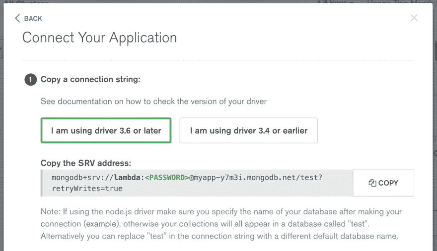

# 如果 TDD 是 Zen，那么添加无服务器带来了涅槃

> 原文：<https://dev.to/ledfusion/if-tdd-is-zen-adding-serverless-brings-nirvana-545c>

# 如果 TDD 是禅，添加无服务器带来涅槃

今天，我们将使用 TDD 和无服务器技术为您的初创公司构建梦想后端。

传统的 API 服务器已经走过了漫长的道路，但是今天快速发展的项目需要友好地考虑无服务器，越快越好。

要求#1 到*尽快发布*，常见的副作用是一旦产品和团队成长，代码库和基础设施变得更难维护。

无服务器架构有助于以多种方式缓解这种情况:

*   Lambda 函数鼓励编写精细、干净和具体的 API 操作。

*   它们还迫使代码与本地架构(url、端口等)分离。

*   结合 TDD，你可以开发得更快更精简。

*   没有服务器就意味着没有系统管理员。更多的时间花在你的项目上。

简而言之，我们将要探索的是:

*   一个干净的无服务器 API 项目

*   准备好**测试驱动开发**

*   连接到**云数据库** (MongoDB Atlas)

*   使用**秘密管理**

*   使用**自动部署**

*   使用**暂存环境**

所以让我们开始吧！

## 启动我吧！

首先，确保您的系统上有 [NodeJS](https://nodejs.org/en/) 并安装无服务器框架:

```
npm i -g serverless       (Windows)
sudo npm i -g serverless  (Linux and MacOS) 
```

Enter fullscreen mode Exit fullscreen mode

## 云账户

在[亚马逊网络服务](https://aws.amazon.com/)上创建一个账户，完成后打开 [IAM 管理控制台](https://console.aws.amazon.com/iam/home)。您需要添加一个新用户。

[T2】](https://res.cloudinary.com/practicaldev/image/fetch/s--damyPAA3--/c_limit%2Cf_auto%2Cfl_progressive%2Cq_auto%2Cw_880/https://cdn-images-1.medium.com/max/4900/1%2AIH84jGRkzFyWKdZsZSz12g.png)

给它一个有意义的名字，并为它启用“编程访问”。

[T2】](https://res.cloudinary.com/practicaldev/image/fetch/s--mBfHw088--/c_limit%2Cf_auto%2Cfl_progressive%2Cq_auto%2Cw_880/https://cdn-images-1.medium.com/max/4898/1%2A7lBKdnCA7hLl2BULeSYVwg.png)

到目前为止，我们只是在开发，所以我们将附加 *AdministratorAccess* 策略，并继续致力于该项目。

**重要的**:当项目准备好生产时，回到 lambda IAM 用户那里，[查看这篇关于如何应用**最小特权原则**的文章](https://serverless.com/blog/abcs-of-iam-permissions/)。

[T2】](https://res.cloudinary.com/practicaldev/image/fetch/s---J7vz9pS--/c_limit%2Cf_auto%2Cfl_progressive%2Cq_auto%2Cw_880/https://cdn-images-1.medium.com/max/4934/1%2AMSd-Sil0QCBuo378R-R3ng.png)

我们的 AWS 用户现在已经准备好了。复制屏幕上显示的密钥，并在控制台中运行:

```
serverless config credentials --provider aws --key <the-access-key-id> --secret <the-secret-access-key> 
```

Enter fullscreen mode Exit fullscreen mode

搞定了。您的无服务器环境已经准备好连接到 Amazon 并发挥它的魔力。现在让我们连接一个数据库。

* * *

特定数据库的选择超出了本文的范围。因为 MongoDB 是最受欢迎的 NoSQL 数据库之一，我们将在 [MongoDB Atlas](https://www.mongodb.com/cloud/atlas) 开设一个账户。

[T2】](https://res.cloudinary.com/practicaldev/image/fetch/s--o09GMVfX--/c_limit%2Cf_auto%2Cfl_progressive%2Cq_auto%2Cw_880/https://cdn-images-1.medium.com/max/4152/1%2Aqd23A2I_jheI47KCq34eLw.png)

选择符合您需求的提供商和地区。因为我们的代码将在 AWS Lambda 上运行，所以选择 **AWS** 作为提供者是有意义的，并且是我们将部署 Lambda 的相同区域。

检查任何附加设置，并为您的群集选择一个名称。等待几分钟，让它进行调配。

准备就绪后，打开集群的*安全*选项卡，添加新用户。

[T2】](https://res.cloudinary.com/practicaldev/image/fetch/s--UWn065tQ--/c_limit%2Cf_auto%2Cfl_progressive%2Cq_auto%2Cw_880/https://cdn-images-1.medium.com/max/4152/1%2ApPMg97sZuIvTGvEpqimjKQ.png)

由于我们只是在测试，请输入您选择的用户名/密码，然后选择“*读取和写入任何数据库”*。

**重要提示**:当你准备好生产时，你应该再次应用**最小特权原则**，将特权限制在你的应用程序的数据库。您还应该为生产和暂存环境创建不同的用户。

[T2】](https://res.cloudinary.com/practicaldev/image/fetch/s--ZkfZKsw3--/c_limit%2Cf_auto%2Cfl_progressive%2Cq_auto%2Cw_880/https://cdn-images-1.medium.com/max/4152/1%2AqpVpCVio8g6ASjnxHISD6A.png)

保留用户名和密码，并返回集群概述。点击*【连接】*按钮。接下来，我们需要将允许连接到数据库的 IP 地址列入白名单。不幸的是，在 AWS Lambda 上，我们没有可预测的方法来确定将连接到 MongoDB Atlas 的 IP 地址。所以唯一的选择是选择*“允许从任何地方访问”。*

[T2】](https://res.cloudinary.com/practicaldev/image/fetch/s--eF0JwlPV--/c_limit%2Cf_auto%2Cfl_progressive%2Cq_auto%2Cw_880/https://cdn-images-1.medium.com/max/4148/1%2AHW2PgbEME2_c-dZg1je_kg.png)

最后，点击*“连接您的应用”*，选择版本 3.6 并复制 URL 字符串以备后用。

[T2】](https://res.cloudinary.com/practicaldev/image/fetch/s--99ehkUbG--/c_limit%2Cf_auto%2Cfl_progressive%2Cq_auto%2Cw_880/https://cdn-images-1.medium.com/max/2844/1%2A11iuBp6GGlSiPVN5GzEt1Q.png)

## 咱们码！

帐户够了，现在让我们把手弄脏。打开控制台，在文件夹`my-api`上创建一个 NodeJS 项目:

```
serverless create --template aws-nodejs --path my-api
cd my-api 
```

Enter fullscreen mode Exit fullscreen mode

让我们调用默认函数:

```
serverless invoke local -f hello

(output)
{
    "statusCode": 200,
    "body": "{\"message\":\"Go Serverless v1.0! Your function executed successfully!\",\"input\":\"\"}"
} 
```

Enter fullscreen mode Exit fullscreen mode

好的，跑步。让我们创建`package.json`并添加一些依赖项:

```
npm init -y
npm i mongodb
npm i -D serverless-offline serverless-mocha-plugin 
```

Enter fullscreen mode Exit fullscreen mode

接下来，让我们定义我们的环境。无服务器 CLI 刚刚为我们创建了 serverless.yml 文件。清理并编辑 serverless.yml，如下所示: