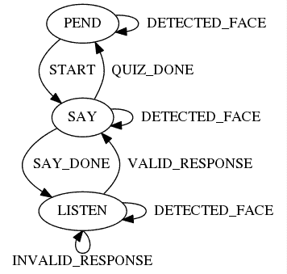
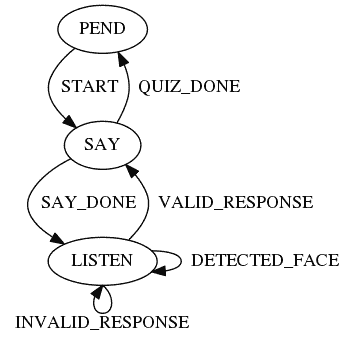
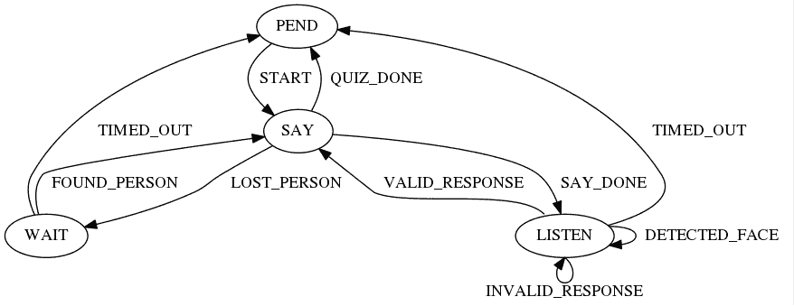

# 在 Cycle.js 中实现有限状态机

> 原文：<https://dev.to/mjyc/implementing-a-finite-state-machine-in-cyclejs-1e63>

*原载于[媒体](https://medium.com/@chungjy9/implementing-a-finite-state-machine-in-cycle-js-c498b6cfb231)T3】*

> ***注:**查看其他关于使用 Cycle.js 编写社交机器人的帖子太:*
> T5】1 .[使用 Cycle.js](https://dev.to/mjyc/programming-a-social-robot-using-cyclejs-23jl)
> *2 编程一个社交机器人。[在 Cycle.js 中实现有限状态机](https://dev.to/mjyc/implementing-a-finite-state-machine-in-cyclejs-1e63)*

在这篇文章中，我将向你展示如何实现一个反应式社交机器人程序作为一个有限状态机。我们将从上一篇文章[停止的地方继续使用 Cycle.js](//./programming_socialrobot_with_cyclejs.md) 编程一个社交机器人——所以如果你还没有的话就去看看吧！如果你赶时间，这里是我们在本帖中构建的[演示和完整代码](https://stackblitz.com/edit/cycle-robot-drivers-tutorials-02-fsm)。

## 使得现有的“旅行个性问答”程序更加复杂

在之前的中，我们设计了一个[平板脸机器人](https://github.com/mjyc/tablet-robot-face)来测试你的旅行个性。具体来说，我们实现了一个平板电脑机器人程序，它

1.  当它看到一个人时会看着他
2.  询问旅行个性测验问题，如流程图中的[所示](http://www.nomadwallet.com/afford-travel-quiz-personality/)

作为 [Cycle.js](https://cycle.js.org/) 应用。这里是来自上一篇文章的[在 Stackbliz 的演示](https://stackblitz.com/edit/cycle-robot-drivers-tutorials-01-personality-quiz)和[在 GitHub 的完整代码](https://github.com/mjyc/cycle-robot-drivers/tree/master/examples/tutorials/01_personality_quiz)。

**重要！！**我们在演示和本帖中使用的主包， [cycle-robot-drivers/run](https://github.com/mjyc/cycle-robot-drivers/tree/master/run) ，目前只能在 Chrome 浏览器(> = 65.0.3325.181)上运行。

现在，如果我们希望机器人

1.  只有当机器人在等待一个人的反应时才看着一个人，
2.  如果机器人看不到人，停止提问，如果它再次看到人，继续提问，以及
3.  如果一个人抛弃了机器人，即机器人超过 10 秒钟没有看到人，就完全停止提问。

更新现有程序以获得这些额外的行为有多困难？尝试在[旅行个性测验项目](https://github.com/mjyc/cycle-robot-drivers/tree/master/examples/tutorials/01_personality_quiz/index.js)的基础上实施新的行为。
你面临什么样的挑战？

根据我的经验，在反应式编程中很难实现，甚至很难表达“有状态”行为。例如，要实现 1。，我需要知道机器人是否处于“等待人的响应”状态，但不清楚如何以可扩展的方式表示这种状态；我试图将所有状态保存在驱动程序中(例如，`SpeechRecognitionAction`发出`status`事件)，作为代理(例如，[之前的代码](https://github.com/mjyc/cycle-robot-drivers/tree/master/examples/tutorials/01_personality_quiz/index.js#L58)中的`$lastQuestion`)，或者保存在更高阶的流中，但是它们都不简单，也不可伸缩。这非常令人担忧，因为[许多](http://wiki.ros.org/smach/Tutorials/Getting%20Started#Why_learn_Smach.3F) [机器人](https://www.researchgate.net/figure/A-behavioral-state-machine-for-robot-soccer_fig10_238086654) [行为](https://www.youtube.com/watch?v=4XEK7OU2gIw)被表达和实现为有状态行为。

为了解决这个问题，我建议使用有限状态机来清楚地表达期望的机器人行为。在下文中，我首先介绍了一种在反应式编程框架(Cycle.js)中实现有限状态机而不牺牲可维护性的模式。然后，我通过实现第一个附加行为来演示 FSM 模式的一个用例。

## 什么是有限状态机？

一个[有限状态机(FSM)](https://en.wikipedia.org/wiki/Finite-state_machine) 是一个计算模型，可以用来表示和控制执行流。由于其简单性，FSM 已经被[的机器人专家](http://wiki.ros.org/smach)、[的 UI 开发者](https://sketch.systems/)和许多其他人频繁使用了[长](https://www.mtholyoke.edu/courses/pdobosh/cs100/handouts/genghis.pdf) [时间](http://www.inf.ed.ac.uk/teaching/courses/seoc/2005_2006/resources/statecharts.pdf)。我们在这篇文章中使用的有限状态机由五部分组成:

1.  一组状态，例如`'SAY_SENTENCE'`、`'WAIT_FOR_RESPONSE'`等。
2.  一组变量，例如`currentSentence = 'Can you see yourself working online?'`
3.  一组输入:如`VALID_RESPONSE`、`INVALID_RESPONSE`等。
4.  一组输出:例如`speechSynthesisAction = 'Can you see yourself working online?'`
5.  采用状态、变量和输入并返回状态、变量和输出的转换函数。

如果你熟悉 FSM，我们使用的 FSM 是一个扩展了“变量”的 [mealy machine](https://en.wikipedia.org/wiki/Mealy_machine) 。
像一台面粉机器，它有以下约束条件:

*   状态集是一个[有限集](https://en.wikipedia.org/wiki/Finite_set)
*   在状态集中，FSM 一次只能处于一种状态
*   转移函数是确定的；给定状态、变量和输入，函数总是返回相同的新状态、新变量和新输出。

## 将“旅行个性测验”程序表示为 FSM

我们将从代表我们在上一篇文章中作为 FSM 实现的[“旅行个性测试”程序](https://github.com/mjyc/cycle-robot-drivers/tree/master/examples/tutorials/01_personality_quiz/index.js)开始:

[T2】](https://res.cloudinary.com/practicaldev/image/fetch/s--NFhyYVRH--/c_limit%2Cf_auto%2Cfl_progressive%2Cq_auto%2Cw_880/https://thepracticaldev.s3.amazonaws.com/i/et73xk1bvd20kbyrt69c.png)

这里我们有三种状态，`PEND`、`SAY`、`LISTEN`和五种输入类型，`START`、`SAY_DONE`、`VALID_RESPONSE`、`INVALID_RESPONSE`和`DETECTED_FACE`。为了直观清楚，我们省略了与每个状态相关的变量和与每个转换相关的输出。

注意，我们使用动词作为状态名(就像流行的机器人 FSM 库 [SMACH](http://wiki.ros.org/smach) 一样)。这是因为我们基于每个状态正在执行的不同动作来定义状态，其中不同的动作由转换发出的输出来触发。您可能想知道为什么我们没有将[旅行测验流程图](http://www.nomadwallet.com/afford-travel-quiz-personality/)中的每个州创建为单独的州，例如`ASK_CAREER_QUESTION`、`ASK_WORKING_ABROAD_QUESTION`、`ASK_FAMILY_QUESTION`等。这是因为用变量`currentSentence`(图中未示出)用单个`SAY`状态表示除了机器人所说的句子之外行为相同的状态，产生了更简单、更易维护的 FSM。

输入可以被认为是在每个状态中可能发生的事件，并且起源于动作，例如`SAY_DONE`，传感器，例如`DETECTED_FACE`，或者外部系统，例如`START`。我们将输入表示为类型-值对。例如，`VALID_RESPONSE`类型输入与值“是”或“否”配对，用于确定`LISTEN`到`SAY`之间的转换(图中未显示输入值)。

现在，让我们更新 FSM 来表达上面提到的第一个附加行为:只有当机器人在等待人的响应时，才看着一个人。

[T2】](https://res.cloudinary.com/practicaldev/image/fetch/s--LpbigTCZ--/c_limit%2Cf_auto%2Cfl_progressive%2Cq_auto%2Cw_880/https://thepracticaldev.s3.amazonaws.com/i/7z09n6fz5z1s8zjlb9ii.png)

我们在这里所做的就是从`PEND`和`SAY`状态移除两个自循环转换，以阻止机器人在 FSM 处于这些状态时看着一个人。

## 使用 Cycle.js 实现“旅行个性测试”FSM

现在让我们使用 Cycle.js 实现上面定义的“旅行个性测试”FSM。

首先，我们将尝试在 javascript 中如下定义 FSM:

```
const State = {
  PEND: 'PEND',
  SAY: 'SAY',  //_SENTENCE
  LISTEN: 'LISTEN',  //_FOR_RESPONSE
};

const InputType = {
  START: `START`,
  SAY_DONE: `SAY_DONE`,
  // QUIZ_DONE: is not an input type but a transition
  VALID_RESPONSE: `VALID_RESPONSE`,
  INVALID_RESPONSE: `INVALID_RESPONSE`,
  DETECTED_FACE: `DETECTED_FACE`,
};

function transition(state, variables, input) {  // a dummy transition function
  const newState = state;
  const newVariables = variables;
  const newOutputs = null;
  return {
    state: newState,
    variables: newVariables,
    outputs: newOutputs,
  };
}

/**
 * // Example state, variables, input, and outputs
 * const state = State.PEND;
 * const variables = {
 *   sentence: 'You are a vacationer!',
 * };
 * const input = {
 *   type: InputType.START,
 *   value: null,
 * };
 * const outputs = {
 *   SpeechSynthesisAction: {
 *     goal: 'You are a vacationer!'
 *   },
 *   SpeechRecognitionAction: {
 *     goal: {}
 *   },
 *   TabletFace: {
 *     goal: {
 *       type: 'SET_STATE',
 *       value: {
 *         leftEye: {x: 0.5, y: 0.5},
 *         rightEye: {x: 0.5, y: 0.5},
 *       },
 *     }},
 *   },
 * }
 */ 
```

Enter fullscreen mode Exit fullscreen mode

这里我们定义了一组状态`State`，一组输入类型`InputType`，以及转移函数`transition`。FSM 的变量和输出集没有明确定义，但是我提供了变量和输出可以在注释中采用的示例值。

### 在 Cycle.js 中设置有限状态机

我们现在将把 FSM 设置为 Cycle.js 应用程序。您可以派生 Stackblitz 演示代码并开始编码或设置 Cycle.js 应用程序。
对于后者，创建一个文件夹:

```
mkdir my-second-robot-program
cd my-second-robot-program 
```

Enter fullscreen mode Exit fullscreen mode

下载 [`package.json`](https://github.com/mjyc/cycle-robot-drivers/tree/master/examples/tutorials/02_fsm/package.json) 、 [`.babelrc`](https://github.com/mjyc/cycle-robot-drivers/tree/master/examples/tutorials/02_fsm/.babelrc) 、 [`index.html`](https://github.com/mjyc/cycle-robot-drivers/tree/master/examples/tutorials/02_fsm/index.html) ，在文件夹中创建一个空的`index.js`文件，运行`npm install`安装需要的 npm 包。安装完成后，您可以运行`npm start`来构建并启动 web 应用程序——此时它什么也不做。

现在在`index.js` :
中添加以下代码

```
import xs from 'xstream';
import {runRobotProgram} from '@cycle-robot-drivers/run';

const State = {
// ...
const InputType = {
// ...
function transition(state, variables, input) {  // a dummy transition function
// ...

function input(  // a dummy input function
  start$,
  speechRecognitionActionResult$,
  speechSynthesisActionResult$,
  poses$,
) {
  return xs.never();
}

function output(machine$) {  // a dummy output function
  return {
    SpeechSynthesisAction: xs.never(),
    SpeechRecognitionAction: xs.never(),
    TabletFace: xs.never(),
  };
}

function main(sources) {
  const input$ = input(
    sources.TabletFace.load,
    sources.SpeechSynthesisAction.result,
    sources.SpeechRecognitionAction.result,
    sources.PoseDetection.poses,
  );

  const defaultMachine = {
    state: State.PEND,
    variables: {
      sentence: null,
    },
    outputs: null,
  };
  const machine$ = input$.fold((machine, input) => transition(
    machine.state, machine.variables, input
  ), defaultMachine);

  const sinks = output(machine$);
  return sinks;
}

runRobotProgram(main); 
```

Enter fullscreen mode Exit fullscreen mode

如果您运行该应用程序，它应该加载一个机器人面孔，但在您的浏览器上仍然没有任何作用。

这里最需要注意的是，我们把`main`函数分成了三个函数；`input`、`transition`和`output`。`input`函数接收`sources`中的输入流，并返回一个发出 FSM 输入值的流。然后我们在返回的流(`$input`)上使用 [`fold`](https://github.com/staltz/xstream#fold) xstream 操作符来触发 FSM 的`transition`函数。注意`fold`操作符类似于流的`Array.prototype.reduce`；这需要

1.  一个累加器函数，它采用一个发射值(例如，一个 FSM 输入值，`input`)和累加器函数的前一个输出(例如，最新的 FSM 状态，`machine`)或一个种子值，并且
2.  累加器功能的初始输出(例如初始 FSM 状态，`defaultMachine`)。

最后，`output`函数获取发出 FSM 状态(`$machine`)的流，并返回输出流。

### 输入、转换和输出

让我们实现这三个函数。
首先，将虚拟`input`函数更新为:

```
// ...
const Response = {
  YES: 'yes',
  NO: 'no',
}

function input(
  start$,
  speechRecognitionActionResult$,
  speechSynthesisActionResult$,
  poses$,
) {
  return xs.merge(
    start$.mapTo({type: InputType.START}),
    speechRecognitionActionResult$
      .filter(result =>
        result.status.status === 'SUCCEEDED'
        && (result.result === Response.YES || result.result === Response.NO)
      ).map(result => ({
        type: InputType.VALID_RESPONSE,
        value: result.result,
      })),
    speechSynthesisActionResult$
      .filter(result => result.status.status === 'SUCCEEDED')
      .mapTo({type: InputType.SAY_DONE}),
    speechRecognitionActionResult$
      .filter(result =>
        result.status.status !== 'SUCCEEDED'
        || (result.result !== Response.YES && result.result !== Response.NO)
      ).mapTo({type: InputType.INVALID_RESPONSE}),
    poses$
      .filter(poses =>
        poses.length === 1
        && poses[0].keypoints.filter(kpt => kpt.part === 'nose').length === 1
      ).map(poses => {
        const nose = poses[0].keypoints.filter(kpt => kpt.part === 'nose')[0];
        return {
          type: InputType.DETECTED_FACE,
          value: {
            x: nose.position.x / 640,  // max value of position.x is 640
            y: nose.position.y / 480,  // max value of position.y is 480
          },
        };
      }),
  );
}
// ... 
```

Enter fullscreen mode Exit fullscreen mode

尝试测试`input`功能是否运行正常。例如，您可以将 [`addListener`](https://github.com/staltz/xstream#addListener) xstream 操作符附加到返回的`$input`流，并从`output`函数返回一些传出的流。
像这样:

```
// ...
import delay from 'xstream/extra/delay'
function output(machine$) {
  return {
    SpeechSynthesisAction: xs.of('Hello world!').compose(delay(1000)),
    SpeechRecognitionAction: xs.of({}).compose(delay(1000)),
    TabletFace: xs.never(),
  };
}

function main(sources) {
  const input$ = input(
    sources.TabletFace.load,
    sources.SpeechSynthesisAction.result,
    sources.SpeechRecognitionAction.result,
    sources.PoseDetection.poses,
  );
  input$.addListener({next: value => console.log('input', value)})
// ... 
```

Enter fullscreen mode Exit fullscreen mode

您在浏览器控制台上看到预期的输出了吗？如果机器人正在探测一个人，您应该会看到许多`DETECTED_FACE`类型的输入。

现在让我们移除虚拟的`transition`函数并创建一个新的:

```
// ...
const State = {
// ...
const InputType = {
// ...
// // Remove the dummy transition function
// function transition(state, variables, input) {  // a dummy transition function
// ...
const Response = {
// ...
function input(
// ...

function createTransition() {
  const Sentence = {
    CAREER: 'Is it important that you reach your full career potential?',
    ONLINE: 'Can you see yourself working online?',
    FAMILY: 'Do you have to be near my family/friends/pets?',
    TRIPS: 'Do you think short trips are awesome?',
    HOME: 'Do you want to have a home and nice things?',
    ROUTINE: 'Do you think a routine gives your life structure?',
    JOB: 'Do you need a secure job and a stable income?',
    VACATIONER: 'You are a vacationer!',
    EXPAT: 'You are an expat!',
    NOMAD: 'You are a nomad!',
  };

  const flowchart = {
    [Sentence.CAREER]: {
      [Response.YES]: Sentence.ONLINE,
      [Response.NO]: Sentence.FAMILY,
    },
    [Sentence.ONLINE]: {
      [Response.YES]: Sentence.NOMAD,
      [Response.NO]: Sentence.VACATIONER,
    },
    [Sentence.FAMILY]: {
      [Response.YES]: Sentence.VACATIONER,
      [Response.NO]: Sentence.TRIPS,
    },
    [Sentence.TRIPS]: {
      [Response.YES]: Sentence.VACATIONER,
      [Response.NO]: Sentence.HOME,
    },
    [Sentence.HOME]: {
      [Response.YES]: Sentence.EXPAT,
      [Response.NO]: Sentence.ROUTINE,
    },
    [Sentence.ROUTINE]: {
      [Response.YES]: Sentence.EXPAT,
      [Response.NO]: Sentence.JOB,
    },
    [Sentence.JOB]: {
      [Response.YES]: Sentence.ONLINE,
      [Response.NO]: Sentence.NOMAD,
    },
  };

  // this transitionTable is a dictionary of dictionaries and returns a function
  //   that takes previous "variables" and "inputValue" and returns a current
  //   FSM status; {state, variable, outputs}
  // this transitionTable is a dictionary of dictionaries and returns a function
  //   that takes previous "variables" and "inputValue" and returns a current
  //   FSM status; {state, variable, outputs}
  const transitionTable = {
    [State.PEND]: {
      [InputType.START]: (prevVariables, prevInputValue) => ({
        state: State.SAY,
        variables: {sentence: Sentence.CAREER},
        outputs: {SpeechSynthesisAction: {goal: Sentence.CAREER}},
      }),
    },
    [State.SAY]: {
      [InputType.SAY_DONE]: (prevVariables, prevInputValue) => (
          prevVariables.sentence !== Sentence.VACATIONER
          && prevVariables.sentence !== Sentence.EXPAT
          && prevVariables.sentence !== Sentence.NOMAD
        ) ? {  // SAY_DONE
          state: State.LISTEN,
          variables: prevVariables,
          outputs: {SpeechRecognitionAction: {goal: {}}},
        } : {  // QUIZ_DONE
          state: State.PEND,
          variables: prevVariables,
          outputs: {done: true},
        },
    },
    [State.LISTEN]: {
      [InputType.VALID_RESPONSE]: (prevVariables, prevInputValue) => ({
        state: State.SAY,
        variables: {sentence: flowchart[prevVariables.sentence][prevInputValue]},
        outputs: {
          SpeechSynthesisAction: {
            goal: flowchart[prevVariables.sentence][prevInputValue],
          },
          TabletFace: {goal: {
            type: 'SET_STATE',
            value: {
              leftEye: {x: 0.5, y: 0.5},
              rightEye: {x: 0.5, y: 0.5},
            },
          }},
        },
      }),
      [InputType.INVALID_RESPONSE]: (prevVariables, prevInputValue) => ({
        state: State.LISTEN,
        variables: prevVariables,
        outputs: {SpeechRecognitionAction: {goal: {}}},
      }),
      [InputType.DETECTED_FACE]: (prevVariables, prevInputValue) => ({
        state: State.LISTEN,
        variables: prevVariables,
        outputs: {
          TabletFace: {goal: {
            type: 'SET_STATE',
            value: {
              leftEye: prevInputValue,
              rightEye: prevInputValue,
            },
          }},
        }
      }),
    },
  };

  return function(prevState, prevVariables, prevInput) {
    console.log(prevState, prevVariables, prevInput);
    // excuse me for abusing ternary
    return !transitionTable[prevState]
      ? {state: prevState, variables: prevVariables, outputs: null}
      : !transitionTable[prevState][prevInput.type]
        ? {state: prevState, variables: prevVariables, outputs: null}
        : transitionTable[prevState][prevInput.type](prevVariables, prevInput.value);
  }
}

const transition = createTransition();

function output(machine$) {  // a dummy output function
// ... 
```

Enter fullscreen mode Exit fullscreen mode

这里我们在`createTransition`函数中定义并返回 FSM 的转换函数。

最后将虚拟`output`函数更新为:

```
// ...
const transition = createTransition();

function output(machine$) {
  const outputs$ = machine$
    .filter(machine => !!machine.outputs)
    .map(machine => machine.outputs);
  return {
    SpeechSynthesisAction: outputs$
      .filter(outputs => !!outputs.SpeechSynthesisAction)
      .map(output => output.SpeechSynthesisAction.goal),
    SpeechRecognitionAction: outputs$
      .filter(outputs => !!outputs.SpeechRecognitionAction)
      .map(output => output.SpeechRecognitionAction.goal),
    TabletFace: outputs$
      .filter(outputs => !!outputs.TabletFace)
      .map(output => output.TabletFace.goal),
  };
}

function main(sources) {
// ... 
```

Enter fullscreen mode Exit fullscreen mode

尝试运行应用程序，并测试它是否如我们在 FSM 中定义的那样运行。

你刚刚用 FSM 实现了一个社交机器人程序！

#### 与模型-视图-意图模式的关系

FSM 模式是[模型-视图-意图(MVI)模式](https://cycle.js.org/model-view-intent.html)的应用，是反应式编程中模型-视图-控制器的[改编，其中“意图”是`input`，“模型”是`FSM status`，而“视图”是`output`。除了 MVI 模式之外，FSM 模式还需要用于“模型”/ `FSM status`和“更新”/ `transition`的特定结构。](https://cycle.js.org/model-view-intent.html#model-view-intent-what-mvc-is-really-about)

## 更新“旅行个性测验”FSM

FSM 模式的真正优势在于它的可维护性。FSM 模式的关键是将`main`函数分成三个具有不同关注点的函数:

*   `input`功能主要是将输入流转换成 FSM 可以处理的“输入”,以及
*   `transition`函数实现了 FSM 的转换功能。
*   将从`transition`返回的输出映射到输出流(Cycle.js 中的`sinks`)的`output`函数，以产生副作用，例如触发动作。

这种分离允许程序员在需要使程序更复杂时，只更新两个函数中的代码部分。

例如，如果我们要实现[节中提到的其他行为，使“旅行个性测验”程序更加复杂](https://dev.tomaking-travel-personality-quiz-program-more-complex)部分，我们需要首先更新 FSM 以反映新的期望行为，例如:

[T2】](https://res.cloudinary.com/practicaldev/image/fetch/s--9VOP0I6Y--/c_limit%2Cf_auto%2Cfl_progressive%2Cq_auto%2Cw_880/https://thepracticaldev.s3.amazonaws.com/i/st5hzvob4hq22pbrsb78.png)

并相应地更新`input`和`transition`函数。检查一下[的完整代码](https://stackblitz.com/edit/cycle-robot-drivers-tutorials-02-fsm)，看看我是如何更新`input`和`transition`函数来实现剩余的额外行为的。

使用 FSM 的最大挑战是定义 FSM。如果您正在使用 FSM 模式并且遇到了问题，请仔细检查您的状态机的当前定义。例如，寻找使更新转换函数变得麻烦的冗余状态或输入类型(将它们与变量合并成一个状态)，或者寻找没有按预期使用的状态或输入类型(添加新的必要状态或输入类型)。另一点要检查的是，确保你的 FSM 采用反应式编程方法，例如，确保这三个函数(`input`、`transition`、`output`)尽可能的纯净。定义有效的有限状态机是一门艺术，但是我相信在反应式编程中使用有限状态机可以极大地帮助程序员更好地组织他们的程序。

感谢您的阅读！我希望我让你对在 Cycle.js 中使用 FSM 感兴趣。如果有什么不清楚的地方，请告诉我，我很乐意和你聊天。

我的名字是麦克·钟。我是一名对人机交互和机器学习领域感兴趣的研究生。你可以通过[推特](https://twitter.com/mjyc_)和 [GitHub](https://github.com/mjyc) 联系我。