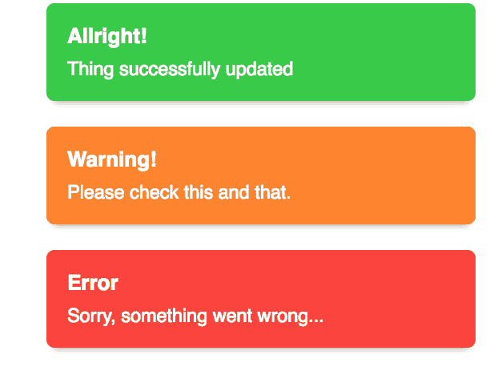

# 实现 Elm 祝酒词

> 原文：<https://dev.to/elmupdate/implementing-elm-toasts-3p7k>

当你想把简短显示的消息发送给你的 web 应用程序的用户时，祝酒词是一种很酷的方式。你知道那些出现在边上，过一会儿就消失的小盒子。

到目前为止，没有任何东西可以显示错误或确认活动，所以我去寻找 Elm 所能提供的东西。

没有太多的产品，但是 Toasty([http://package . elm-lang . org/packages/pablen/Toasty/1 . 0 . 4/Toasty](http://package.elm-lang.org/packages/pablen/toasty/1.0.4/Toasty))看起来有一些很好的定制功能，演示看起来也很合适。

[T2】](https://res.cloudinary.com/practicaldev/image/fetch/s--SjuP4TeE--/c_limit%2Cf_auto%2Cfl_progressive%2Cq_auto%2Cw_880/https://thepracticaldev.s3.amazonaws.com/i/f2g15g3fhk4r6fqtcv0r.png)

在我的理想世界中，我会安装这个包，编辑一个配置文件，然后开始调用这个模块。哎呀，这听起来像 Javascript...

在这种情况下，需要向模型中添加一些东西，初始模型、类型别名、更新分支和视图。不知道这是不是类型安全的代价，或者说让 Elm 模块更加独立的可能性有多大。我很感激有人在编写这些库。

作为第一步，我建议按照说明去做。

大约在这一点上，在玩了 Toasty.config 之后，事情对我不起作用了，因为我在屏幕上看到的文本消失了——好——但周围没有方框——不好。

通常我会略读一些东西，并抱着一种“开箱即用”的心态。当我遇到问题时，我会回去。在这种情况下，我重读了开头提到 Toasty.Defaults 的部分，这给了我一个简单的 Toast 定义，这很方便，但除此之外我并没有更聪明。

所以是时候阅读或者至少看看源代码了。这里有一个 App.elm 的例子，看起来是演示的代码。我还发现了 Defaults.css 和 Toasty。默认值，您可以自定义。例如，我需要重新摆放我的吐司，改变宽度。

如步骤 2 -带来 Defaults.css 和 Toasty。默认到应用程序中，并根据您的需求进行定制。然后，确保您对 myConfig 的所有引用都是为了烘托气氛。默认值. config

这为我提供了启动和运行所需的缺失部分。

现在我只剩下一个问题了。我真的想要一个最小的调用 api。网站建议把这个放在更新函数的末尾:

```
|> Toasty.addToast myConfig ToastyMsg (MyToast "Entity successfully created!") 
```

Enter fullscreen mode Exit fullscreen mode

我喜欢从更新函数中获取信息的想法，但是我不会在代码中加入太多的更新函数。

App.elm 示例有另一个版本的 addToast，它将事情简化为:

```
|> addToast (Toasty.Defaults.Success "Allright!" "Thing successfully updated") 
```

Enter fullscreen mode Exit fullscreen mode

我真的只是想用类似于:
的东西来覆盖 90%的使用

```
|> doToast Toasty.Defaults.Success "Success" "You did it" 
```

Enter fullscreen mode Exit fullscreen mode

这可以通过添加一个助手函数来实现，该函数采用配置文件和更新消息名:

```
doToast toast title message = 
    Toasty.addToast 
        Toasty.Defaults.config 
        ToastyMsg (toast title message) 
```

Enter fullscreen mode Exit fullscreen mode

或者我真正想要的是:

```
|> doToast "Success" "You did it!" 
```

Enter fullscreen mode Exit fullscreen mode

所以(纯粹主义者请转移视线):

```
doToast : String -> String -> ( Model, Cmd Msg ) -> ( Model, Cmd Msg )
doToast title message =

    let
        toast = case title of 
            "Success" -> 
                Toasty.Defaults.Success title message
            "Error" -> 
                Toasty.Defaults.Error title message
            "Warning" -> 
                Toasty.Defaults.Warning title message
            _ -> 
                Toasty.Defaults.Success title message
    in

    Toasty.addToast 
        Toasty.Defaults.config 
        ToastyMsg toast 
```

Enter fullscreen mode Exit fullscreen mode

如步骤 3。让你自己的助手为你保持简单和灵活。例如，您可能想要指定每个 toast 显示的时间长度。这只是 Toasty 的一个配置选项，我还没有在这里介绍。

简而言之:一个非常有用和灵活的模块，它并不需要很长时间就可以建立和运行。