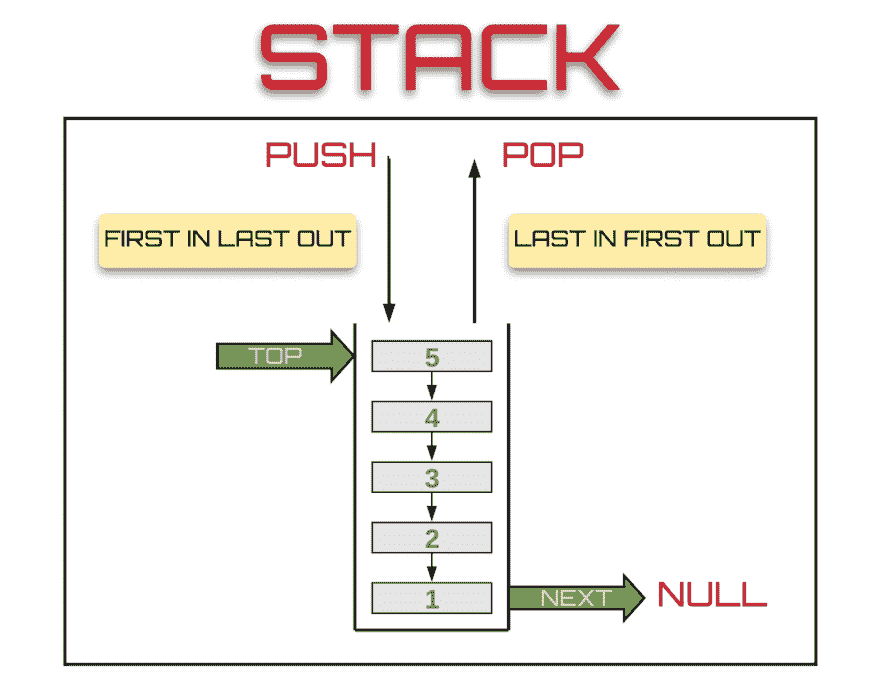

# 用 Javascript 实现堆栈数据结构

> 原文：<https://dev.to/theoutlander/implementing-the-stack-data-structure-in-javascript-4164>

在这个视频中，我们用 Javascript 实现了堆栈数据结构。虽然 JavaScript 数组可以作为一个堆栈使用，但这个视频是出于教育目的，因为我们将在未来进入更复杂的数据结构。

堆栈是一种简单的数据结构，它是根据后进先出原则插入和移除的对象的容器。只能从顶部添加和移除元素。

[链接到 YouTube 视频](https://www.youtube.com/watch?v=mnz05qPYzxo)
[链接到 CodeSandbox](https://codesandbox.io/s/pkl6pw3mo0?module=%2Fsrc%2Findex.js)

[T2】](https://res.cloudinary.com/practicaldev/image/fetch/s--s1Qbl8Gf--/c_limit%2Cf_auto%2Cfl_progressive%2Cq_auto%2Cw_880/https://thepracticaldev.s3.amazonaws.com/i/mwcwre09s12vqa3gvl7a.png)

* * *

#### 如果这个视频有帮助，❤️ it 和[订阅我的 YouTube 频道](https://www.youtube.com/channel/UClCm-WAOgN6XLwCpefSVezg?sub_confirmation=1)。

 [## 如何改善你的开发体验

### 尼克·卡尔尼克 9 月 22 日 185 分钟阅读

#beginners #career #development #productivity](/theoutlander/how-to-improve-your-development-experience-ldl)