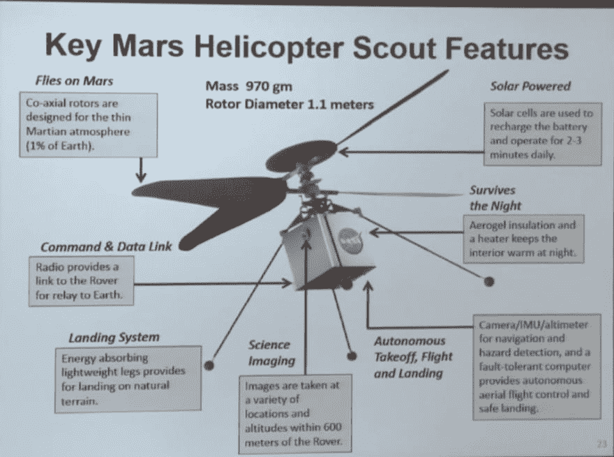

# 火星:改进现代概念

> 原文：<https://dev.to/sfrias/improving-modern-concepts-2kl6>

鸣谢美国宇航局/加州理工学院/JPL

Scout 对太空探索无人机有了新的概念，可以用新的概念来改进:Doroon Max Pro

将所需的 220 瓦功率降低到 154 瓦，安装空气静力体，其中气凝胶由氦制成，以保护核心处理器/控制/能源电池，通过轻质集中器增加太阳辐射。这是我个人的挑战，我与大家分享。