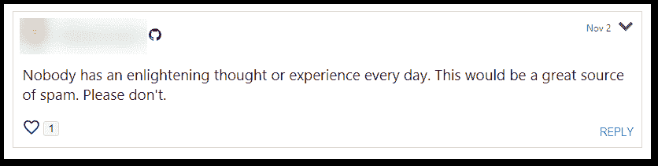
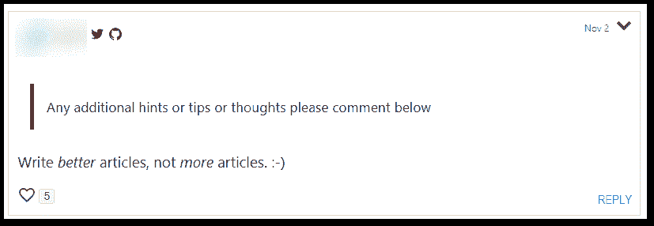
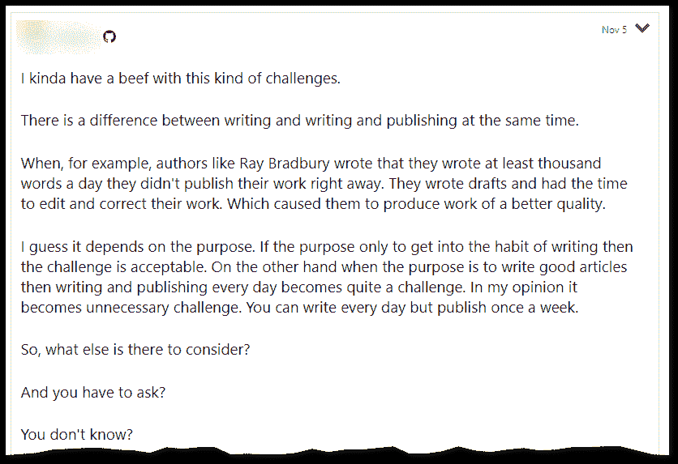
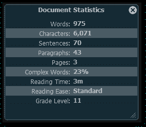

# 几乎是在为纳米瑞莫辩护

> 原文：<https://dev.to/anonjr/in-defence-of-almost-nanowrimo-4dkf>

还不到去[的 1/6 路程几乎是 NaNoWriMo](https://www.anonjr.com/2018/11/Almost-NaNoWriMo.html) ，我承认感觉有点防守。今天早上，我原本是想对这篇文章进行抽查或反思，但如果我直言不讳的话，这是从昨晚开始就在我脑海中慢慢燃烧的一些评论:

<figure> 

<figcaption>
</figcaption>

</figure>

<figure> 

<figcaption>
</figcaption>

</figure>

现在请不要听到我没有说的话:我不是在判断评论者的*意图*，只是判断*方法*和*潜在结果*。关于后一部分，我不会假装为其他人说话——我失去了一点从开始结束、找到一些[同道](https://dev.to/mark_nicol/an-article-a-day-for-november-41f5) [精神](https://dev.to/lvrbrtsn/article-a-day-375h)和看到鼓励的评论中获得的激情和热情。

对于第一个评论者，我当然理解这种情绪。

> 没有人每天都有启发性的想法或经历。这将是一个很大的垃圾邮件来源。请不要。

我在互联网上已经有一段时间了。我有一个推特账户。我充分意识到每天发布轻率的帖子会产生什么样的后果，我不会鼓励更多这样的事情发生。

我还认为，好好审视自己的生活并不是不可能的。每天都掌握一条或多条新信息、对现有信息的新见解和/或新观点的生活。在这样的挑战中，许多问题都可以以简短或详细的形式分享。就这一点而言，我可以很容易地看到有人抓住《每日作家》的一篇文章，把它们作为对比、扩展或其他更离题的东西的发射台。就这一点而言，这些年来我写了不少评论，它们真的可以成为一篇博文的起点(如果不是一篇博文本身的话……我有时会长篇大论)。

第二个评论者也一样，我明白他们的意思。

> 写*更好的*文章，而不是*更多的*文章。😃

质量通常胜过数量，我们都希望看到我们最喜欢的地方充满更好的文章，而不是更多的文章。我离开了一些我最喜欢的网站，因为他们因为这样或那样的原因提高了数量，而在这个过程中质量水平直线下降。

然而容易被忽略的部分是，如果不浏览*更多的*文章，你就无法获得更好的*文章；或者至少是更多有特定心态和方法的文章。*

我用一个类比结束了本系列的第一篇文章，现在可能是一个很好的时机来为这个类比提供一些背景知识。

> 坦率地说，我感觉自己就像一个经过长期恢复的运动员，最终回到了训练中。现在想想，这可能是一个比我愿意承认的更恰当的类比。

这种类比之所以贴切，部分原因是我经历过一些健身过山车——在不同时间长度的时期，我定期锻炼，身体状况良好，而在另一些时期，我……嗯，不是。我也帮助过其他人度过相似的时期。在大学里，我在当地基督教青年会的游泳部工作，在那里(除了其他工作之外)我教游泳课，并且是一些小学、初中和高中游泳队的助理教练(我获得了 ASCA 好奇者 2 级教练的许可)。

在运动领域，我们认识到几件事:

*   老锯“熟能生巧”少了几个字——“熟能生巧*永久*；熟能生巧”。
*   如果你不做更多的*5000 米跑，你就无法达到更好的*5000 米。(我游过的最长的一次泳。那里有一个故事。)**

我们在编程领域也认识到了这一点，我们知道成长需要在项目、练习和使用各种培训项目上努力。

这就把我们带回到写作上来——不写*更多*的文章，你就写不出*更好*的文章；或者至少是更多有特定心态和方法的文章。我们可以在一些更有帮助的评论中看到这一点。

<figure> 

<figcaption>
</figcaption>

</figure>

它将采取深思熟虑的、有重点的步骤来获得需要的质量。对我来说，开始的几天只是一个露面的问题。如果你不出现，就很难提高。这是其他做“十一月日报”的人所指出的。

这篇文章和接下来的几篇文章是我花了多一点时间创建的，我想弄清楚我想表达什么。我还会关注代笔人提供的阅读便利和其他统计数据。目前我不会对它们做太多，只要看看我实际上在做什么，这样我就知道我需要从那里去哪里。我的目标是达到 T2 第 10 级的阅读水平。这比通常的建议要高一点，但比我在这篇文章中所做的要好得多。(我会在最后放一张截图)

做完[项目项目](https://www.anonjr.com/2018/11/Projects-Projects-Projects.html)后，我对自己真正想做的事情有了一个很好的想法(或者至少在不久的将来我想专注于什么)，从那里我可以建立一个更有条理的时间表。可能不会在接下来的一两篇文章中出现，但应该会在本周末之前出现。我得把车放在店里，这样我就有足够的时间走到咖啡店去思考。😃

哦，对于那些想知道的人，这是这篇文章的统计数据。

<figure> 

<figcaption>
代笔人的文档统计
</figcaption>

</figure>