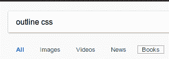

# 为了赞美易接近性，概述。

> 原文：<https://dev.to/papaponmx/in-praise-of-accessibility-outline-3m78>

## [T1】简介](#intro)

*TLDR；*让我们感同身受，永不去除。*滚动到底部查看代码。

在我作为开发人员的第一天，我渴望学习任何东西。我读了一本书，这本书启发我关注前端，是唐纳德·a·诺曼的《日常用品的设计》。

我的前提是，作为开发人员，我们可以帮助改善世界，授权并为人们提供令人惊叹的技术。

这些年来，我一直坚持的一个主要观点是:

> 如果你不是飞行员，发现自己在飞机机舱里试图操作飞机，你预计会有问题，但如果你是普通人，你开门有困难应该不太合理。

然而，这种情况经常发生，这是我们所希望的。如果你想看到一个更好的例子，请阅读这本书或谷歌诺曼门。

大多数开发人员不是设计师，反之亦然。作为一个开发者，你并不期望提供设计，很多时候我们没有技能，也没有创造良好设计的敏感性，但是我认为，如果你看到一些可以改善用户体验的东西，你应该说点什么。

想象一下，某个需求到达你的手中，你被要求删除当你点击一个图标时出现的奇怪线条。在 CSS 中，它是一个名为 [`outline`](https://developer.mozilla.org/en-US/docs/Web/CSS/outline) 的属性。

 
看到图片左下方，那是轮廓。

这件事发生在我工作期间，有时会发生这种情况，因为人们很匆忙，或者仅仅是因为无知。所以这篇文章是我创造性的解决方案，有一些开源代码，希望能丰富我们所有人。

## 什么是大纲？

轮廓与边框非常相似，区别之一是轮廓从不占用空间，因为它们是在元素内容之外绘制的。它们通常出现在你关注网站的可点击元素时。

如果您使用 React，您可能会看到一个错误，要求您包含一个`role`属性或一个`tab-index`。这是为了确保不使用鼠标的用户可以访问页面中的可点击元素。

## 为什么有关系？

这是一个简短的列表。

*   Web 在生活的许多方面都是越来越重要的资源:教育、就业、政府、商业、医疗保健、娱乐等等。为了向具有不同能力的人提供平等的访问和平等的机会，网络必须是可访问的。
*   再读一遍介绍。
*   搜索引擎优化。
*   您所在国家的法律可能会要求这样做。

## 如何着手呢？

首先。如果你被要求删除它，确保你表达了你的关注，确保做决定的人意识到后果和影响，很多时候设计师删除它是因为无知或缺乏意识。

很多时候，他们可能不知道更好，我做这个代码是为了探索替代方案。

让我们保持网络畅通，干杯伙计们。

### 进一步的资源。

*   [网络无障碍简介](https://www.w3.org/WAI/fundamentals/accessibility-intro/)。
*   [关于易访问性+ SEO 你应该知道的事情](https://moz.com/blog/accessibility-seo-1)。
*   [stack overflow:html](https://stackoverflow.com/questions/10403138/what-is-the-purpose-of-the-role-attribute-in-html)中角色属性的用途是什么。
*   [用 React](https://medium.com/@andreasmcd/creating-an-accessible-tab-component-with-react-24ed30fde86a) 创建一个可访问的标签组件。
*   [悉尼奥运会网站无障碍案例研究](https://www.w3.org/WAI/bcase/socog-case-study)。
*   [标签索引](https://developer.mozilla.org/en-US/docs/Web/HTML/Global_attributes/tabindex)。
*   [网络无障碍法律和政策](https://www.w3.org/WAI/policies/?q=government)。
*   [检查对比度的工具](http://contrast-ratio.com/#%2300FA9A-on-%23093145)。