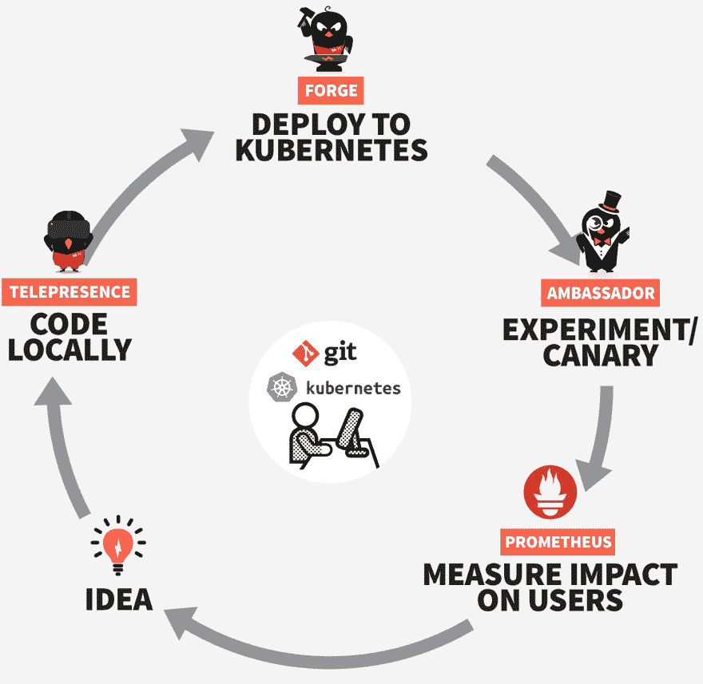

# 用 Kubernetes 寻找有效的开发者体验

> 原文：<https://dev.to/datawireio/in-search-of-an-effective-developer-experience-with-kubernetes--42nn>

在 [Datawire](https://www.datawire.io/) 我们正在帮助许多拥有[的组织将应用](https://www.datawire.io/faster/)部署到 Kubernetes。通常，我们最重要的投入是与开发团队紧密合作，帮助他们建立有效的持续集成和持续交付(CI/CD)管道。这主要是因为在 Kubernetes 上创建一个有效的[开发人员工作流程](https://www.datawire.io/faster/dev-workflow-intro/)具有挑战性——生态系统仍在发展，并且不是所有的平台组件都是即插即用的——还因为许多工程团队没有意识到，为了在商业想法和假设上“闭环”,你还需要对应用程序进行可观察性测试。我们经常认为，通过管道将应用程序第一次部署到产品中只是连续交付过程的开始，而不是像一些人认为的那样是结束。

我们所有人都在开发软件来支持[向我们的客户和业务交付价值](https://itrevolution.com/book/the-art-of-business-value/)，因此[“开发者体验”(DevEx)](https://www.infoq.com/news/2017/07/remove-friction-dev-ex)——从想法产生到生产中的运行(和观察)——必须快速、可靠并提供良好的反馈。当我们帮助我们的客户为 Kubernetes 创建有效的连续交付管道(以及相关的工作流)时，我们看到了几种模式的出现。我们热衷于分享我们对这些模式的观察，并解释我们如何在用于将应用部署到 Kubernetes 的开源工具的[集合中捕获一些最佳模式。](https://www.datawire.io/reference-architecture/)

[T2】](https://res.cloudinary.com/practicaldev/image/fetch/s--aJqmh_n9--/c_limit%2Cf_auto%2Cfl_progressive%2Cq_auto%2Cw_880/https://www.datawire.io/wp-content/uploads/2018/02/reference-architecture-diagram.png)

## 从观念到(可观察到的)价值

作为工程师，我们所做的一切都始于一个想法。从这个想法中出现了一个假设——例如，修改 web 表单的布局将提高转化率，或者提高网站的 p99 延迟将导致更多的收入——我们可以在我们的示例中提取适当的观察转化和页面加载延迟的指标。

## 为 Kubernetes 建造和包装

一旦我们同意了我们的假设和度量标准，我们就可以开始编写代码并打包，准备在 Kubernetes 上部署。我们已经创建了开源的 [Forge](https://forge.sh/) 框架来协助整个开发过程，从自动创建和管理样板 Kubernetes 配置，到允许我们参数化运行时属性和资源，以便于使用[单一 CLI 指令](https://forge.sh/docs/tutorials/quickstart#deploy-a-service)将应用部署到 Kubernetes。

如果我们在一个需要“探索”的假设上工作——例如，重构现有的功能，或者解决一个技术集成问题——我们经常在白板上写下想法，并开始使用像测试驱动开发(TDD)这样的技术编码，在我们进行的过程中注意设计可观察性(业务度量、监控和日志记录等)。如果我们在一个需要“实验”的假设上工作——例如，一个新的业务特性——我们通常定义行为驱动开发(BDD)风格的测试，以帮助我们专注于“由外向内”地构建功能。

## 消除代码-部署-实验循环中的摩擦

我们试图在尽可能类似生产的环境中进行开发，因此我们经常构建与更完整的远程 Kubernetes 集群部署交互的本地服务。我们已经创建了开源工具 [Telepresence](https://www.telepresence.io/) ，它允许我们执行和调试本地服务，就像它是远程环境的一部分一样(有效地从我们的本地开发机器到远程 Kubernetes 集群的双向代理)。

我们喜欢“尽早发布，经常发布”，因此更喜欢使用 [canary 和 dark launches】在产品中运行测试。这样，我们可以向少量真实用户展示新功能，并观察他们与我们的假设相关的行为。与生产环境中的任何部署一样，显然存在一定的风险，我们通过在检测到严重问题时引入警报和自动回滚来减轻这种风险。为此，我们创建了开源 API 网关](https://www.getambassador.io/about/microservices-api-gateways#testing-and-updates)[大使](https://www.getambassador.io/)。

## 通过 Ambassador API 网关实现智能路由和监控

大使是使用受欢迎的[特使代理](https://www.envoyproxy.io/)建造的，这个代理来自[马特·克莱恩](https://twitter.com/mattklein123?lang=en)和[他在 Lyft](https://eng.lyft.com/envoy-7-months-later-41986c2fd443) 的团队的工作。Ambassador 允许在向 Kubernetes 部署应用程序时对流量进行“智能路由”,底层技术已经被证明可以在 Lyft 内大规模运行。一旦应用程序接收到生产流量，我们就可以根据之前的假设观察指标。我们通常使用 [Prometheus](https://prometheus.io/) 收集数据，使用 [Grafana](https://grafana.com/) 通过仪表盘显示结果。我们创建了开源的 prometheus-ambassador 项目，以便从 ambassador 轻松导出指标，例如延迟和返回的 5xx HTTP 响应代码的数量。

## 周而复始

一旦我们分析了我们的度量标准，开发周期可以再次开始，或者迭代我们现有的解决方案并运行额外的金丝雀实验，或者如果我们已经证明了(或否定了)我们最初的假设，我们可以产生另一个新的想法和假设。

*这篇文章最初出现在由 [Daniel Bryant](https://twitter.com/danielbryantuk) 撰写的 [Datawire.io](https://www.datawire.io/) 上的[代码快速指南](https://www.datawire.io/faster)的一部分。*