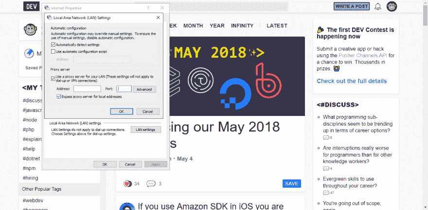
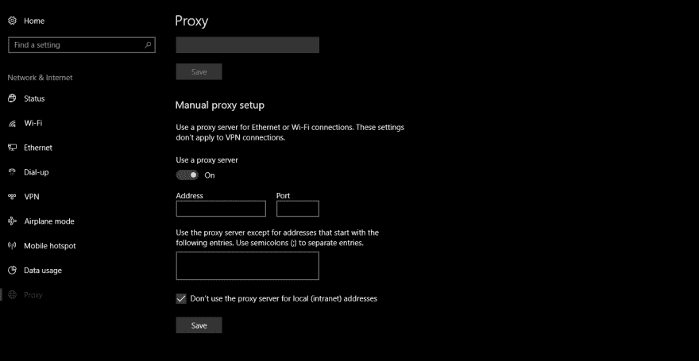

# 在 Windows (10)中，如何为所有网络连接而不仅仅是“互联网”配置全局代理设置？

> 原文：<https://dev.to/jochemstoel/in-windows-10-how-to-configure-global-proxy-settings-for-all-network-connections-and-not-just-the-internet-48oa>

我在某台 Ubuntu 机器上运行一个 squid 代理服务器。我用装有谷歌 Chrome 的 Windows 10 客户端匿名冲浪，看黄色视频。

微软浏览器和 Chrome 的代理设置都指向 Windows 的*互联网选项*。Firefox 有自己的设置，允许你只为 Firefox 配置代理。

[T2】](https://res.cloudinary.com/practicaldev/image/fetch/s--bGr_8hi4--/c_limit%2Cf_auto%2Cfl_progressive%2Cq_auto%2Cw_880/https://thepracticaldev.s3.amazonaws.com/i/qqnz13pk35e227u2pog3.png)

许多应用程序(如 cmd.exe、WinSCP、putty、mIRC、Node、youtube-dl、...)忽略互联网选项中的代理配置，直接连接。

如果我在浏览器中访问[https://api.ipify.org/?format=json](https://api.ipify.org/?format=json)，响应中的 ip 地址是我的代理的 IP 地址，但如果我从命令行运行 [ipify](https://www.npmjs.com/package/ipify-cli) (它只是向同一个 url 发出 http 请求)，它会显示客户端(我的)IP 地址。

大多数应用程序允许您配置代理，但并非所有应用程序都允许。为了避免必须为每个应用程序配置代理设置的痛苦，以及包装、沙箱化或虚拟化没有代理设置的应用程序的痛苦，我认为我们可以在操作系统级别的某个地方更改代理设置。

[T2】](https://res.cloudinary.com/practicaldev/image/fetch/s--ifF6-yRf--/c_limit%2Cf_auto%2Cfl_progressive%2Cq_auto%2Cw_880/https://thepracticaldev.s3.amazonaws.com/i/kkfqybqw7kauu16emdhy.png)

此处的配置反映了互联网选项的配置。它们是相同的设置，只是在两个屏幕上编辑它们。

## 如何配置适用于每个应用程序中所有连接的“全局”代理？