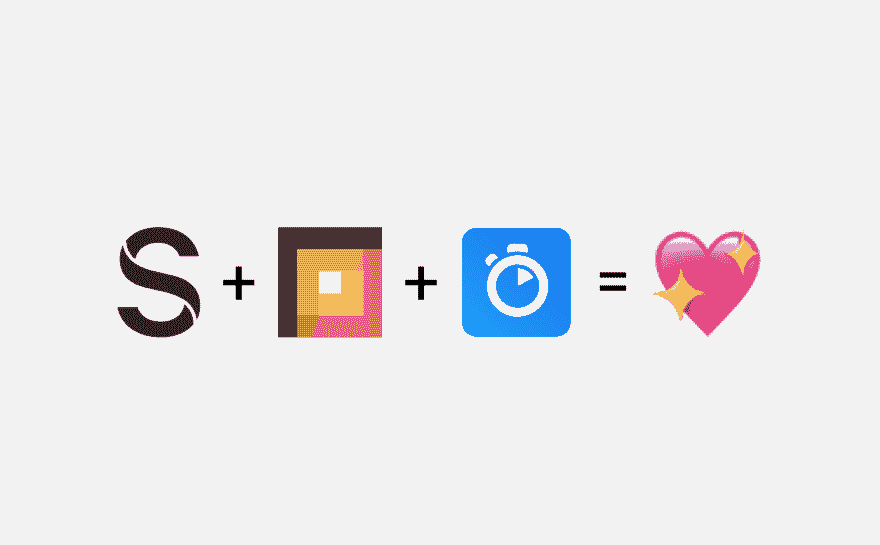
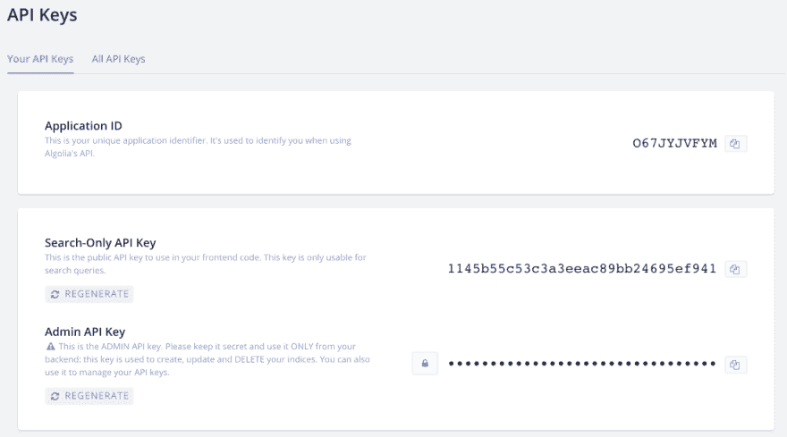
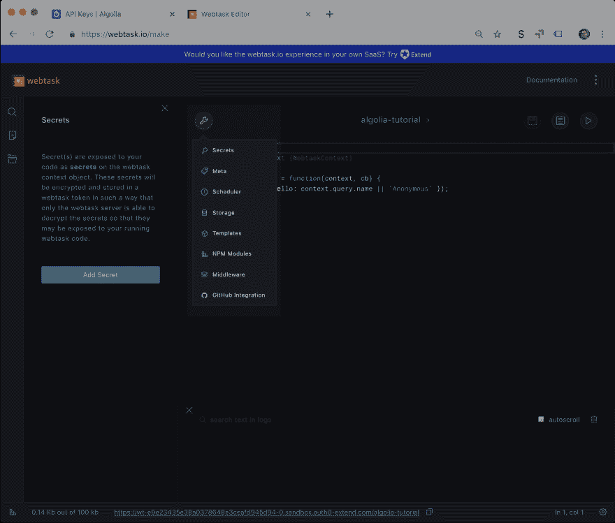
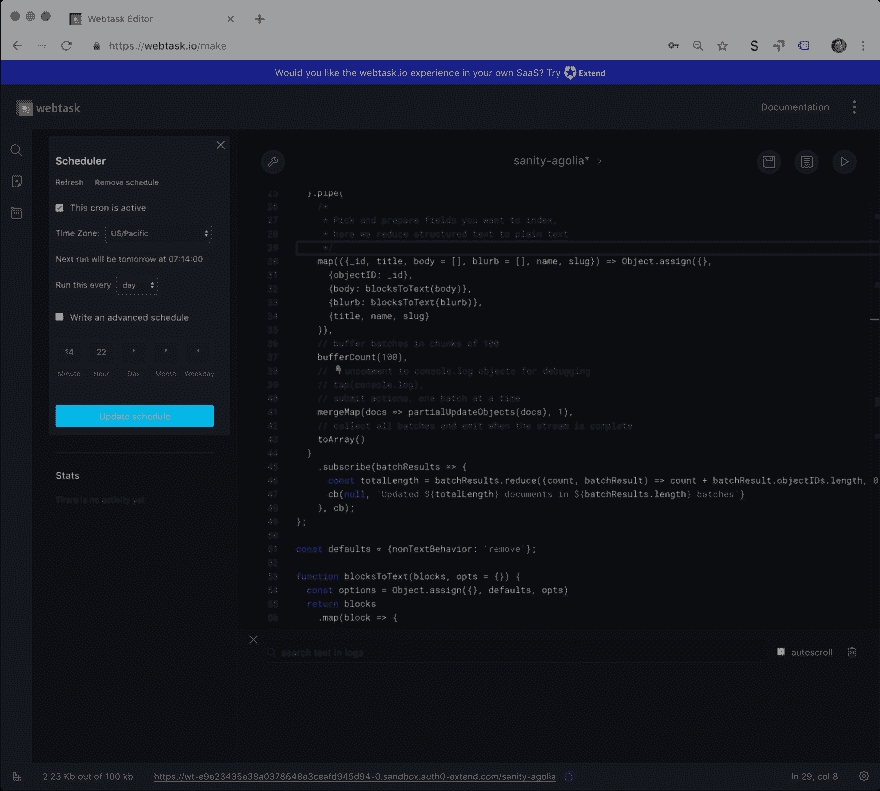

# 索引在 Algolia 使用无服务器功能(和可观！)

> 原文：<https://dev.to/sanity-io/indexing-in-algolia-using-serverless-functions-and-observables-3d91>

**T2`<Movie trailer voice>`**

在一个巨石破碎的世界里，开发人员用高耸的 JAMstacks、无服务器功能和史诗般的云服务构建新的令人兴奋的服务。然而他们面临一个挑战:将数据从一个服务转移到另一个服务。*介绍可观测量*。代码模式接受数据流，根据您的喜好对其进行修改，然后毫不费力地将其传输到另一个地方。即将来到你身边的代码编辑器。

**T2`</Movie trailer voice>`**

借助 Sanity 强大的导出 API，您可以轻松地创建一个小型的无服务器功能，以便在 Algolia 中为您的所有内容编制索引，以便利用其搜索功能。这也是了解 JavaScript 中可观察事物的好方法。

[Algolia](https://www.algolia.com/) 是一个强大的搜索即服务，可以轻松地为您的前端搜索提供加权搜索、统计和丰富的用户界面。由 [Auth0](https://auth0.com) 开发的 [Webtask](https://webtask.io) 是一项服务，它使得在浏览器中构建无服务器功能变得容易。在本教程中，我们将进一步研究如何使用 Sanity 的 export API，通过一个预定的无服务器函数，快速获取您想要索引到 Algolia 中的内容。

[](https://res.cloudinary.com/practicaldev/image/fetch/s--NOzO-t38--/c_limit%2Cf_auto%2Cfl_progressive%2Cq_auto%2Cw_880/https://cdn.sanity.img/3do82whm/production/75d6c6fb486107294b86c60c6845d4310a5df13e-1974x1223.png) 理智+网络任务+阿果莉娅=💖

## 设置 Algolia 并获取一些 API 密钥

首先你必须[在 Algolia 注册一个账户](https://www.algolia.com/users/sign_up)。这应该很简单。一旦你建立了一个帐户，进入侧边栏的**API 密钥* *。你应该能够做这个关于免费计划的教程，但是请注意在某些时候会有一些限制。

[](https://res.cloudinary.com/practicaldev/image/fetch/s--B5qcKhDs--/c_limit%2Cf_auto%2Cfl_progressive%2Cq_auto%2Cw_880/https://cdn.sanity.img/3do82whm/production/f5f5868a948db4da92f9f7886bc90769d8f4afb6-1097x609.png)Algolia 中的应用 ID 和 API 密钥

准备好钥匙，因为我们在设置无服务器功能时会用到它们。

## 在 webtaks.io 上设置无服务器功能

设置无服务器功能的伟大服务有很多:[begin.com](https://begin.com)， [code.xyz](https://code.xyz) ， [Netlify functions](https://www.netlify.com/docs/functions/) ， [AWS Lambda](https://aws.amazon.com/lambda/) ， [Now](https://zeit.co/now) ， [Google Cloud Functions](https://cloud.google.com/functions) ，不胜枚举。对于本教程，我们将使用 [webtask.io](https://webtask.io) ,因为它易于设置，在浏览器中运行，并且具有调度功能。不过，将这些代码应用到其他服务中应该不会有太多的工作。

### 添加秘密令牌

前往[webtask.io/make](https://webtask.io/make)，登录并从一个空模板创建一个新功能。去🔧扳手菜单，选择**秘密**和**添加秘密**。

[](https://res.cloudinary.com/practicaldev/image/fetch/s--DVYhgOHA--/c_limit%2Cf_auto%2Cfl_progressive%2Cq_auto%2Cw_880/https://cdn.sanity.img/3do82whm/production/cb3caccc52b566921da4e05c6c198c8d553b519c-2164x1842.png) 选择秘笈🔧菜单

调用您的“秘密密钥”`ALGOLIA_TOKEN`，并将您的**管理 API 密钥**从 Algolia 复制粘贴到“秘密值”字段。换句话说:你应该小心保存它的位置。该键现在可以在您的函数中的`context.secrets.ALGOLIA_TOKEN`下获得。

### 什么是无服务器功能？

```
module.exports = function myServerlessFunction(context, callback) {
  // do something!
  callback(null, 200);
}; 
```

无服务器函数通常类似于下面的代码片段。它是一个带两个参数的函数，一个是 HTTP 请求和附加信息(例如存储在“函数即服务”中的密钥)，另一个是回调或响应函数，您可以在最后运行该函数来返回该函数需要返回的任何反馈或数据。不同的服务支持不同的编程语言，所以无服务器功能也可以用 Python、Java 或 Go 等语言编写。在本教程中，我们将在 Node.js 环境中使用 JavaScript。

在 Webtask 中，您用两个参数调用回调函数，第二个参数是当有人调用您的函数时您将返回的内容，它可以是一个 HTTP 状态代码(`200`表示正常，`500`表示错误)，一个字符串，甚至是一个对象。

无服务器功能通常具有有限的执行时间。这意味着无论它做什么，都必须在服务的时限内完成。有时候是 30 秒，或者长达 15 分钟。这意味着无服务器功能最适合单一的快速任务。为了索引，您的所有内容可能听起来不像这样，但是 Sanity 的导出 API 非常快，只需要几秒钟。所以事不宜迟，让我们开始吧！

### 设置 Algolia 连接

首先，我们必须使函数能够连接到 Algolia 中的索引。

```
const algoliasearch = require('algoliasearch');

const algoliaApp = 'your_app_id';
const algoliaIndex = 'what_you_want_to_call_your_index';

module.exports = function indexContent(context, cb) {
  // Initiate an Algolia client
  const client = algoliasearch(algoliaApp, context.secrets.ALGOLIA_TOKEN);
  // Initiate the Algolia index
  const index = client.initIndex(algoliaIndex);
  cb(null, 200);
}; 
```

当您添加“require”-语句时，Webtask 将在行号左侧显示一个“+”标记，单击此处可导入您指定的 npm 模块。您还可以通过扳手菜单添加 NPM 模块。

### 设置健全连接

虽然我们可以使用 Sanity JavaScript 客户端和 GROQ 来获取一些内容，但是我们将使用 export API 来实现这个功能。export API 将以 ndjson 格式传输所有公共内容，并且只需一次 API 调用就能非常快速地完成。

```
const algoliasearch = require('algoliasearch');
const request = require('request');
// Algolia configuration
const algoliaApp = 'your_app_id';
const algoliaIndex = 'what_you_want_to_call_your_index';
// Sanity configuration
const projectId = 'your_project_id';
const dataset = 'your_dataset_name';
const sanityExportURL = `https://${projectId}.api.sanity.io/v1/data/export/${dataset}`;

module.exports = function(context, cb) {
  // Initiate an Algolia client
  const client = algoliasearch(algoliaApp, context.secrets.ALGOLIA_TOKEN);
  // Initiate the Algolia index
  const index = client.initIndex(algoliaIndex);
  cb(null, 200);
}; 
```

### 为流式内容准备一个可观察对象

export API 最终可以通过流传递大量数据。在许多情况下，我们可能会将所有这些数据写入内存(即一个变量)，然后将其发送给 Algolia，但更健壮和可伸缩的模式是使用一种称为 Observables 的东西在流中完成。为此，我们将使用一个名为 [RxJS](https://rxjs-dev.firebaseapp.com/) 的库(我们在 Sanity 中广泛使用)。我们首先将 Algolia 客户端的[save objects](https://www.algolia.com/doc/api-reference/api-methods/save-objects/)-方法(基于回调)转换为一个函数，该函数使用 RxJS 中一个名为 [bindNodeCallback](https://rxjs-dev.firebaseapp.com/api/index/function/bindNodeCallback) 的函数返回一个可观察对象。

```
const algoliasearch = require('algoliasearch');
const request = require('request');
const {bindNodeCallback} = require('rxjs');

// Algolia configuration
const algoliaApp = 'your_app_id';
const algoliaIndex = 'what_you_want_to_call_your_index';
// Sanity configuration
const projectId = 'your_project_id';
const dataset = 'your_dataset_name';
const sanityExportURL = `https://${projectId}.api.sanity.io/v1/data/export/${dataset}`;

module.exports = function indexContent(context, cb) {
  // Initiate an Algolia client
  const client = algoliasearch(algoliaApp, context.secrets.ALGOLIA_TOKEN);
  // Initiate the Algolia index
  const index = client.initIndex(algoliaIndex);

  // bind the update function to use it as an observable
  const partialUpdateObjects = bindNodeCallback((...args) => index.saveObjects(...args));

  cb(null, 200);
}; 
```

### 添加可观察管道

现在有趣的事情！首先，我们必须导入我们需要的方法，将从导出 API 获得的流通过管道传输到 Algolia。思路是，我们希望获得所有数据，进行一些操作并挑选出我们想要索引的内容，然后批量将更新发送到 Algolia。当工作完成时，我们希望函数返回一条消息，告诉我们更新了多少文档，更新了多少批次。最终结果将是这样的:

```
const algoliasearch = require('algoliasearch');
const request = require('request');

const ndjson = require('ndjson');
const {bindNodeCallback} = require('rxjs');
const {streamToRx} = require('rxjs-stream');
const {bufferCount, map, mergeMap, toArray, tap} = require('rxjs/operators');

// Algolia configuration
const algoliaApp = 'your_app_id';
const algoliaIndex = 'what_you_want_to_call_your_index';
// Sanity configuration
const projectId = 'your_project_id';
const dataset = 'your_dataset_name';
const sanityExportURL = `https://${projectId}.api.sanity.io/v1/data/export/${dataset}`;

module.exports = function indexContent(context, cb) {
  // Initiate an Algolia client
  const client = algoliasearch(algoliaApp, context.secrets.ALGOLIA_TOKEN);
  // Initiate the Algolia index
  const index = client.initIndex(algoliaIndex);

  // bind the update function to use it as an observable
  const partialUpdateObjects = bindNodeCallback((...args) => index.saveObjects(...args));
  streamToRx(
    request(sanityExportURL).pipe(ndjson())
  ).pipe(
    /* 
     * Pick and prepare fields you want to index,
     * here we reduce structured text to plain text
     */
    map(function sanityToAlgolia(doc) {
      return {
        objectID: doc._id,
        body: blocksToText(doc.body || []),
        blurb: blocksToText(doc.blurb || []),
        title: doc.title,
        name: doc.name,
        slug: doc.slug
      };
    }),
    // buffer batches in chunks of 100
    bufferCount(100),
    // 👇uncomment to console.log objects for debugging
    // tap(console.log),
    // submit actions, one batch at a time
    mergeMap(docs => partialUpdateObjects(docs), 1),
    // collect all batches and emit when the stream is complete
    toArray()
  )
    .subscribe(batchResults => {
      const totalLength = batchResults.reduce((count, batchResult) => count + batchResult.objectIDs.length, 0);
      cb(null, `Updated ${totalLength} documents in ${batchResults.length} batches`);
    }, cb);
}; 
```

让我们放大，仔细看看这里发生了什么。

```
 streamToRx(
      request(sanityExportURL).pipe(ndjson())
    ) 
```

最初，我们用`request(sanityExportURL)`设置对导出 API URL 的请求，这将返回一个由描述的 JSON 对象组成的[节点流](https://nodejs.org/api/stream.html)，我们用`pipe`到`ndjson()`将数据转换成对象并将其发送给对象。

```
.pipe(
    map(({_id, title, body = [], blurb = [], name, slug}) => Object.assign({},
      {objectID: _id},
      {body: blocksToText(body)},
      {blurb: blocksToText(blurb)},
      {title, name, slug}
    ))

// ... 
// below the module.export function
const defaults = {nonTextBehavior: 'remove'};

function blocksToText(blocks, opts = {}) {
  const options = Object.assign({}, defaults, opts)
  return blocks
    .map(block => {
      if (block._type !== 'block' || !block.children) {
        return options.nonTextBehavior === 'remove' ? '' : `[${block._type} block]`;
      }

      return block.children.map(child => child.text).join('');
    })
    .join('\n\n');
} 
```

这个对象流然后被转换成 RxJS 流，通过管道传递给`map`操作符。map 操作符将每个对象传递给一个函数。这里我们使用[参数析构](https://developer.mozilla.org/en-US/docs/Web/JavaScript/Reference/Operators/Destructuring_assignment#Object_destructuring)来挑选出我们想要的那些字段，并使用`Object.assign`构建一个新对象(我们本来可以使用 [ES6 扩展语法](https://developer.mozilla.org/en-US/docs/Web/JavaScript/Reference/Operators/Spread_syntax)，但是 Webtask 中的节点环境似乎还没有那些)。

并不是所有传递给这个函数的对象都有所有的键，都是`undefined`。请注意，我已经默认了数组字段，因为它们被发送给了一个函数(可能还有许多其他方法可以处理这个问题)。在这个文件的底部，我们添加了一个[小助手函数](https://github.com/sanity-io/sanity-recipes)，它从 Sanity 中提取结构化文本并将其转换为简单的文本字符串。我们将它声明为一个函数，以便[提升](https://developer.mozilla.org/en-US/docs/Glossary/Hoisting)它，使它可以在上面使用。

```
 // buffer batches in chunks of 100
  bufferCount(100),
  // 👇uncomment to console.log objects for debugging
  // tap(console.log),
  // submit actions, one batch at a time
  mergeMap(docs => partialUpdateObjects(docs), 1),
  // collect all batches and emit when the stream is complete
  toArray() 
```

管道方法中的后续参数是`bufferCount`，它从`map`收集对象，并在达到指定数量(100)时传递它们。我们使用`mergeMap`将每个块一个一个地传递给`partialUpdateObjects`函数。它将等待异步操作(比如向 Algolia 传递数据)并返回响应。最后我们在`toArray()`把它们收集成一个数组。以便我们可以对它们进行计数，并返回作业进展情况的摘要。

```
.subscribe(batchResults => {
  const totalLength = batchResults.reduce((count, batchResult) => count + batchResult.objectIDs.length, 0)
  cb(null, `Updated ${totalLength} documents in ${batchResults.length} batches`)
}, cb); 
```

我们用`subscribe`接收发出的包含所有对象的数组，用`reduce`对所有对象求和。最后，我们调用通过无服务器函数传递的回调函数，并返回一个字符串，其中包含我们更新了多少文档，以及更新了多少批文档。

## 调度无服务器功能

当然，我们可以通过请求显示在 webtask UI 底部的 URL 来手动运行这个函数。你应该对这个 URL 保密，因为你不希望任何人只是触发一个重新索引(截图中的功能被删除)。但是同步搜索索引是自动完成的一个很好的例子。你也可以将这个 URL 添加到一个 webhook，这样它就会在每次有更新的时候运行(几秒钟后就会完成)，但是这样做可能有点过头了，而且很可能会耗尽你的配额。这就是时间安排的由来。如果您再次打开扳手菜单并选择**调度器**，您将打开一个面板，您可以在其中选择重复该功能的时间跨度。它应该尽可能的频繁，这取决于你的内容变化的程度。当然，您仍然可以通过调用 URL 来手动触发索引。

[](https://res.cloudinary.com/practicaldev/image/fetch/s--ZcBZdRO0--/c_limit%2Cf_auto%2Cfl_progressive%2Cq_auto%2Cw_880/https://cdn.sanity.img/3do82whm/production/bee8c2864f70984e4b5262862fd3ef380ee2755d-2312x2078.png)web task 中的调度器

## 让我们退一步…

您现在所做的非常棒:在不到 60 行的代码中，您设置了一个无服务器的函数，通过一个 API 调用从 Sanity 流式传输您的所有内容，处理每个文档并将其传递给另一个服务。它可以在几秒钟内完成大量内容。在这种情况下，我们用 Algolia 进行了实验，但可能还有大量其他用例可以从这种设置中进行调整。我们迫不及待地想听到他们的消息——所以请在你自己的博客、 [twitter](https://twitter.com/kmelve) 和我们的[社区 Slack](https://slack.sanity.io) 上告诉我们。