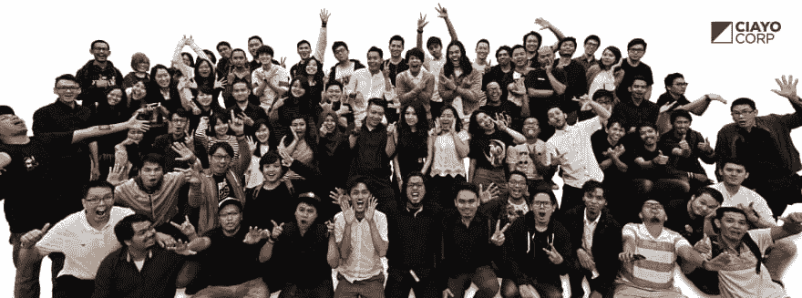
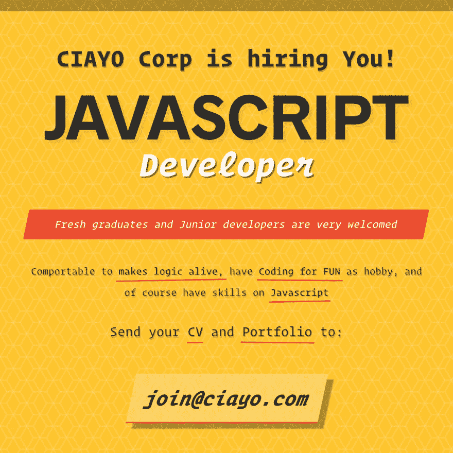

# 印度尼西亚创业公司 CIAYO Corp

> 原文：<https://dev.to/ervandra/indonesian-startup---ciayo-corp-1l02>

[T2】](https://res.cloudinary.com/practicaldev/image/fetch/s--Mk_UwSKL--/c_limit%2Cf_auto%2Cfl_progressive%2Cq_auto%2Cw_880/https://thepracticaldev.s3.amazonaws.com/i/3r0cno04j2fh4yhvgbc5.jpg)

在这个技术日新月异的时代，谁能快速应对，谁就能获得成功。

数字驱动的营销和开发努力的兴起为商业格局带来了新的视角，甚至创意产业现在也在发生变化。它会变得更好。

作为一家公司，我们希望确保您的企业有一个了解竞争环境的合作伙伴，无论是通过广告、社交媒体、开发、品牌和数字激活战略，所有这些都通过相关渠道完成，抓住您的目标市场的核心。我们想确保他们会毫不妥协地记住你。通过我们的专业人员和从业人员的年轻头脑，我们希望对我们提供的每一个解决方案都有一个全新的看法。

我们把数字放在首位。
我们是 [CIAYO 公司](https://facebook.com/ciayocorp)

已知公司的产品有:

*   [CIAYO 漫画](https://www.ciayo.com)
*   [CIAYO Games](https://games.ciayo.com)
*   [CIAYO 博客](https://blog.ciayo.com)
*   [CIAYO 流](https://stream.ciayo.com)
*   [芯片&公司](https://chips.ciayo.com)
*   [CIAYO 漫画奖励](https://rewards.ciayo.com)

我们目前正在招聘可能的前端开发人员:

[T2】](https://res.cloudinary.com/practicaldev/image/fetch/s--p6RipXf6--/c_limit%2Cf_auto%2Cfl_progressive%2Cq_auto%2Cw_880/https://thepracticaldev.s3.amazonaws.com/i/dwj2fdoc2cyob37c8mmu.png)

[T2】](https://res.cloudinary.com/practicaldev/image/fetch/s--Z31Tg7iM--/c_limit%2Cf_auto%2Cfl_progressive%2Cq_auto%2Cw_880/https://thepracticaldev.s3.amazonaws.com/i/zsnk5c77xo1e7h9xjooj.png)

将简历和作品集发送给[join@ciayo.com](mailto:join@ciayo.com)
填写主题:*前端开发者*