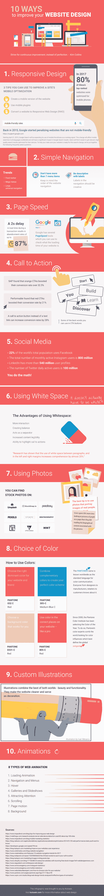

# 信息图:改进网站设计的 10 种方法

> 原文：<https://dev.to/neshaz/infographic-10-ways-to-improve-your-website-design--k7g>

如今，一家公司的网站类似于与某人的第一次握手——它代表着潜在合作的良好(或糟糕)开端。然而，握手不仅仅是一种问候方式。

握手可以建立信任，同时给你消除负面第一印象的力量。网站也是如此。

一个网站应该像首席执行官的握手一样有力。这是什么意思？

不管市场如何，公司的竞争越来越激烈，顾客/消费者越来越不耐烦。你的访问者需要很好的内容来吸引他们。

在 2009 年的一项研究 *[网页设计:网站成功的关键因素](https://www.researchgate.net/publication/220419456_Web_design_A_key_factor_for_the_website_success)* 中，作者 Carlos Flavián、Raquel Gurrea 和 Carlos Orús 强调了网站设计的重要性。

作者指出，一个好的网站设计会对在线消费者的感知和行为产生影响。此外，作者将创意和从需求的角度创建网站定义为网站设计的关键因素之一。

努力改进你的网站设计有很多好处:

*   顾客能够在各种形式的交流中认出你的品牌，
*   在消费者中建立信任，
*   区分所有其他内容的机会，例如使用[渐变](https://kolosek.com/everything-you-need-to-know-about-gradient/)。

如果你想留下一个好的第一印象，一定要遵循这 10 个步骤。

想在你的网站或/和社交媒体上分享这张照片吗？只需复制并粘贴下面的代码。

```
<textarea onclick='this.focus();this.select()' style='width:700;height:400'><p><strong>Please include attribution to kolosek.com with this graphic.</strong><br /><br /><a href='https://kolosek.com/10-ways-to-improve-your-website-design/'></a></p></textarea> 
```

还是横版:

```
<textarea onclick='this.focus();this.select()' style='width:700;height:400'><p><strong>Please include attribution to kolosek.com with this graphic.</strong><br /><br /><a href='https://kolosek.com/10-ways-to-improve-your-website-design/'></a></p></textarea> 
```

[T2】](https://res.cloudinary.com/practicaldev/image/fetch/s--7LTb-QT1--/c_limit%2Cf_auto%2Cfl_progressive%2Cq_auto%2Cw_880/http://kolosek.com/conteimg/2018/02/Infographic-main.png)

这篇文章最初发表在 [Kolosek 博客](https://kolosek.com/10-ways-to-improve-your-website-design/)上。