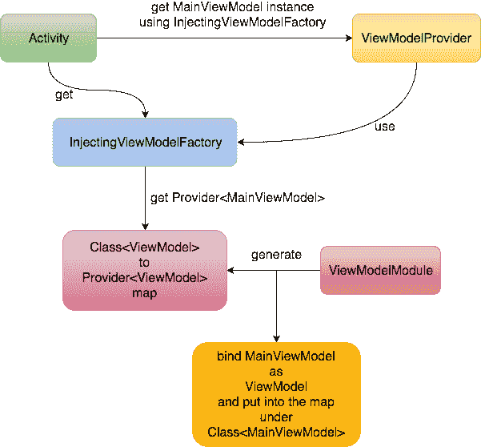

# 可注射 Android 视图模型

> 原文：<https://dev.to/brightdevs/injectable-android-viewmodels--1d5l>

在接下来的文章中，我将展示一个简单(几乎没有样板文件)但功能强大的使用 Dagger 的 Android 视图模型依赖注入实现。

如果你还没有读过最新的 [Android 架构组件库](https://developer.android.com/topic/libraries/architecture/index.html)、MVVM 模式和 [ViewModel](https://developer.android.com/topic/libraries/architecture/viewmodel.html) 类，请先阅读一下，这里我就不解释了。

# 安卓的弱点

我认为谷歌决定通过创建自己的库来帮助开发者在 Android 平台上支持 MVVM 模式是一个非常好的举措。

在它发布的几个月前，我想知道在 Android 上引入 MVP 或 MVVM 模式的最佳方法是什么。我在 GitHub 上测试或查看了几个库，但没有一个对我来说足够好——要么是因为它们的局限性，要么是因为它们需要大量的样板代码。此外，它们的实现方式和报告的错误数量也不令人鼓舞。

我很羡慕 iOS 开发人员拥有的简单方法——他们可以自己实例化一个视图控制器，并直接将视图模型传递给它(例如，通过构造函数)。当屏幕方向改变时，iOS 系统也不会终止视图控制器，因此它不必再次获取视图模型，同时，当不再需要视图控制器时，视图模型会被销毁(前提是您没有对它的另一个引用)。

但是在 Android 上，你从一个活动组件开始，你不能在它的生命周期之外容易地准备视图模型。同样，只在活动中存储对视图模型的引用，而活动在每次配置改变(如屏幕方向)时都会被破坏，这也将破坏视图模型，并且不方便。如果您希望视图模型继续存在，您必须在其他地方保存对它的引用，但是另一个问题出现了，例如，当不再需要它时如何清理视图模型，或者如何使同一类的每个活动使用不同的视图模型实例。

谷歌的`ViewModel`旨在帮助解决这些问题。不幸的是，它仍然需要在活动生命周期中创建，但是通过几次微调，您可以轻松地将任何视图模型的依赖项注入其中。

[T2】](https://res.cloudinary.com/practicaldev/image/fetch/s--41k5l2C5--/c_limit%2Cf_auto%2Cfl_progressive%2Cq_auto%2Cw_880/https://thepracticaldev.s3.amazonaws.com/i/0t277ysyk3nsna9uk3t6.jpg)

# 可注射视图模型

在我们开始玩代码之前，我想补充一点，我已经 googled 了其他人查看模型注入的方法，我不太喜欢它们，因为有大量的样板代码(例如，为每个视图模型编写一个单独的视图模型工厂)。最好的一个，也是我的例子所基于的，来自于 [Google 的样本库](https://github.com/googlesamples/android-architecture-components/tree/master/GithubBrowserSample)。我已经简化了它的一些部分，并用 Kotlin 重写了它。

*注意:你可以在 GitHub 上访问本例[中使用的全部代码。](https://github.com/azabost/simple-mvvm-example)*

## 简单工厂

默认库的工厂使用空构造函数实例化视图模型。当然，我们不能使用它，因为我们要创建带有非空构造函数的视图模型，传递从 Dagger 获得的依赖关系。

`ViewModelProvider.Factory`接口只定义了一个方法:

```
@NonNull
<T extends ViewModel> T create(@NonNull Class<T> modelClass); 
```

Enter fullscreen mode Exit fullscreen mode

如您所见，它接受视图模型的类，并且必须返回它的实例。

为了对所有视图模型使用一个简单通用的工厂(这是本文的重点),我们需要为每个视图模型类创建一个`Provider`的映射。当我在分析上面提到的谷歌示例时，我不知道地图生成是如何工作的，也不太容易理解，所以我将在这里多解释一下，以免麻烦你。

### 生成地图

如果您已经使用过 Dagger，您可能还会注意到它生成的代码。大多数代码是“T0”、“T1”、“T2”等等。`Provider`是*提供给*某个类的实例的对象(`Factory`也是一个`Provider`)。

`MapKey`注释([文档](https://google.github.io/dagger/api/2.13/dagger/MapKey.html))让你生成由 Dagger 或这些对象的`Provider`提供的对象的地图。在我们的示例中，我们需要以下地图:

`Map<Class<? extends ViewModel>, Provider<ViewModel>>`

可以翻译成 Kotlin:

`Map<Class<out ViewModel>, @JvmSuppressWildcards Provider<ViewModel>>`

*注意:Dagger 生成 Java 源代码，这就是为什么我们必须记住 Java 和 Kotlin 之间的方差差异([泛型文档](https://kotlinlang.org/docs/reference/generics.html)， [Java 到 Kotlin 互操作性文档](https://kotlinlang.org/docs/reference/java-to-kotlin-interop.html))，如果不使用`@JvmSuppressWildcards`注释，这可能会很麻烦，导致以下错误:*

> 错误:[dagger . Android . Android injector . inject(T)]Java . util . map，？如果没有@ Provides-annoted 方法，则无法提供 extends javax.inject.Provider>。

这个映射的条目由一个键(任何视图模型的一个类)和一个值(任何视图模型的一个`Provider`)组成。显然，我们必须为每个视图模型提供相应的`Provider` s，例如`ViewModelA -> Provider<ViewModelA>`。有了这样的映射，工厂将能够很容易地返回任何视图模型的实例，它的所有依赖项都由 Dagger 完成。

为了生成映射，我们需要两个元素:一个映射键定义和一个带有视图模型绑定的模块。

映射键定义是一种注释类型，它有一个类型为映射键类型的成员。可能是这样的:

```
import android.arch.lifecycle.ViewModel
import dagger.MapKey
import kotlin.reflect.KClass

@MustBeDocumented
@Target(AnnotationTarget.FUNCTION)
@Retention(AnnotationRetention.RUNTIME)
@MapKey
annotation class ViewModelKey(val value: KClass<out ViewModel>) 
```

Enter fullscreen mode Exit fullscreen mode

然后我们可以在下面的模块中使用它。

```
import android.arch.lifecycle.ViewModel
import com.azabost.simplemvvm.ui.main.MainViewModel
import dagger.Binds
import dagger.Module
import dagger.multibindings.IntoMap

@Module
abstract class ViewModelModule {

    @Binds
    @IntoMap
    @ViewModelKey(MainViewModel::class)
    abstract fun bindMainViewModel(mainViewModel: MainViewModel): ViewModel
} 
```

Enter fullscreen mode Exit fullscreen mode

`@Binds`方法是简单返回注入参数的`@Provides`方法的替代。将它与`@IntoMap`和我们的键(`@ViewModelKey`)结合起来，将把返回对象的提供者放入映射中由键注释的参数指定的键下。在这种情况下，`Provider<MainViewModel>`实例将被放在`MainViewModel::class`键下。Kotlin 还将把`KClass`翻译成`Class`以实现 Java 兼容性。

*注:您可能想阅读`Binds` [文档](https://google.github.io/dagger/api/2.13/dagger/Binds.html)、`IntoMap` [文档](https://google.github.io/dagger/api/2.13/dagger/multibindings/IntoMap.html)和多绑定[文档](https://google.github.io/dagger/multibindings.html)。*

### 在工厂中使用地图

使用生成的地图的视图模型工厂将像这样简单:

```
import android.arch.lifecycle.ViewModel
import android.arch.lifecycle.ViewModelProvider
import javax.inject.Inject
import javax.inject.Provider
import javax.inject.Singleton

@Singleton
class InjectingViewModelFactory @Inject constructor(
        private val viewModelProviders: Map<Class<out ViewModel>, @JvmSuppressWildcards Provider<ViewModel>>
) : ViewModelProvider.Factory {

    @Suppress("UNCHECKED_CAST")
    override fun <T : ViewModel> create(modelClass: Class<T>): T {
        val provider = viewModelProviders[modelClass]
                ?: viewModelProviders.entries.first { modelClass.isAssignableFrom(it.key) }.value

        return provider.get() as T
    }
} 
```

Enter fullscreen mode Exit fullscreen mode

而且我们还可以把它添加到同一个匕首模块:

```
import android.arch.lifecycle.ViewModel
import android.arch.lifecycle.ViewModelProvider
import com.azabost.simplemvvm.ui.main.MainViewModel
import dagger.Binds
import dagger.Module
import dagger.multibindings.IntoMap

@Module
abstract class ViewModelModule {

    @Binds
    @IntoMap
    @ViewModelKey(MainViewModel::class)
    abstract fun bindMapViewModel(mapViewModel: MainViewModel): ViewModel

    @Binds
    abstract fun bindViewModelFactory(factory: InjectingViewModelFactory): ViewModelProvider.Factory
} 
```

Enter fullscreen mode Exit fullscreen mode

## 获取视图模型

在活动中，您现在可以注入工厂:

```
@Inject
lateinit var vmFactory: ViewModelProvider.Factory 
```

Enter fullscreen mode Exit fullscreen mode

并使用它获得视图模型:

```
val vm = ViewModelProviders.of(this, vmFactory).get(MainViewModel::class.java) 
```

Enter fullscreen mode Exit fullscreen mode

不要忘记用`@Inject` :
注释视图模型的构造函数

```
class MainViewModel @Inject constructor(
        private val gitHubClient: GitHubClient
) : ViewModel(), MainVM, LoadingVM, DataVM {
    ...
} 
```

Enter fullscreen mode Exit fullscreen mode

如果对你来说太复杂了，请看看下面的图表。这可能有助于你看清大局。

[T2】](https://res.cloudinary.com/practicaldev/image/fetch/s--1pfEUB_X--/c_limit%2Cf_auto%2Cfl_progressive%2Cq_auto%2Cw_880/https://thepracticaldev.s3.amazonaws.com/i/lbjwwl51j0zlt1guqo7s.png)

最初发布于 [brightinventions.pl](https://brightinventions.pl/blog/)

作者 Andrzej Zabost，光明发明
[博客](https://azabost.com/)，[电子邮件](//andrzej.zabost@brightinventions.pl)的安卓开发者