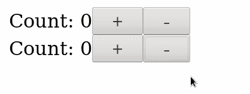
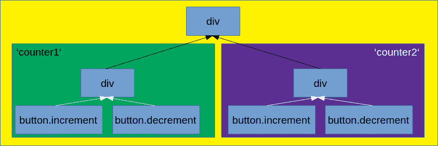
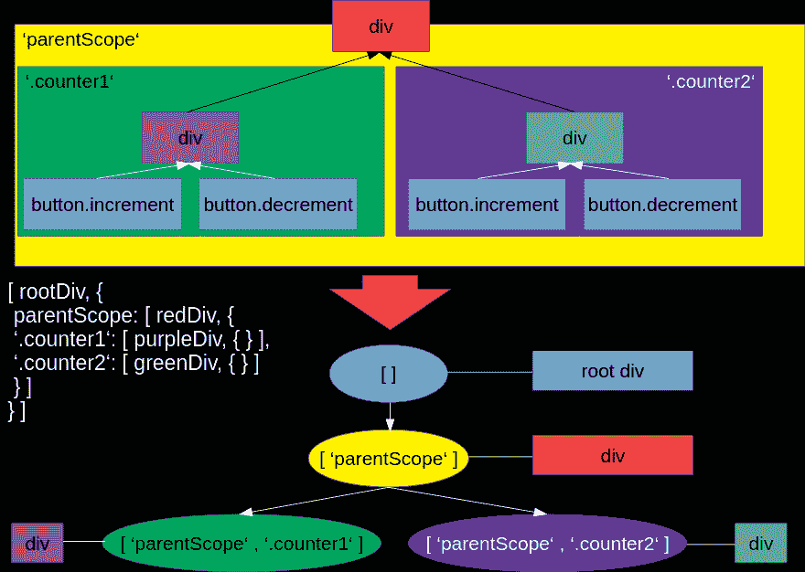

# 框架内部——cycle . js DOM 驱动程序如何工作

> 原文：<https://dev.to/jvanbruegge/inside-a-framework---how-the-cyclejs-dom-driver-works-3deb>

通常，我们在使用一个框架时并不真正了解它内部是如何工作的。有时，我们在没有任何内部工作线索的情况下，对那个框架做出了贡献。

对我来说，Cycle.js 就是这种情况。我甚至被邀请成为核心团队成员，除了“它在引擎盖下使用虚拟 DOM”之外，我对它的 DOM 部分如何工作没有任何线索。

最近，我无意中发现了 DOM 驱动程序中的严重问题，这些问题(以及更老的问题)促使我深入研究它，并从零开始重写它。

在本文中，我想向您展示使 DOM 驱动程序高效且易于使用的主要算法和数据结构。

## 主要问题——隔离

Cycle.js 组件只是一个从一些输入(源)到一些输出(接收器)的纯函数。这个看起来是这样的:

```
function Counter(sources) {
    const increment$ = sources.DOM.select('.increment')
        .events('click').mapTo(+1); // On every click on the .increment
                                    // button emit a 1

    const decrement$ = sources.DOM.select('.decrement')
        .events('click').mapTo(-1); // Same but with -1

    const state$ = xs.merge(increment$, decrement$)
        .fold((last, curr) => last + curr, 0) // Starting with 0, add up all
                                            // numbers on the stream

    const view$ = state$.map(count => div([
        span(['Count: ' + count]),
        button('.increment'),
        button('.decrement')
    ]));

    return {
        DOM: view$
    };
} 
```

Enter fullscreen mode Exit fullscreen mode

但是如果你调用这个函数两次:

```
function main(sources) {
    const sink1 = Counter(sources);
    const sink2 = Counter(sources);

    const view$ = xs.combine(sink1.DOM, sink2.DOM)
        .map(children => div(children));

    return {
        DOM: view$
    };
} 
```

Enter fullscreen mode Exit fullscreen mode

你得到这个:

[T2】](https://res.cloudinary.com/practicaldev/image/fetch/s--ScXv20v1--/c_limit%2Cf_auto%2Cfl_progressive%2Cq_66%2Cw_880/https://raw.githubusercontent.com/jvanbruegge/articles/master/2018/cyclejs/dom-driver/no_isolation.gif)

为什么？因为如果你看一下 DOM，你会看到有两个元素带有`.increment`类，所以任何一个都会触发事件的发射:

[T2】](https://res.cloudinary.com/practicaldev/image/fetch/s--0irPE5s_--/c_limit%2Cf_auto%2Cfl_progressive%2Cq_auto%2Cw_880/https://raw.githubusercontent.com/jvanbruegge/articles/master/2018/cyclejs/dom-driver/dom_no_isolation.svg)

您可以通过使用`isolate()`来解决这个问题，它将事件限定到它们的组件:

```
function main(sources) { -    const sink1 = Counter(sources);
-    const sink2 = Counter(sources); +    const sink1 = isolate(Counter, 'counter1')(sources);
+    const sink2 = isolate(Counter, 'counter2')(sources); 
    const view$ = xs.combine(sink1.DOM, sink2.DOM)
        .map(children => div(children));

    return {
        DOM: view$
    };
} 
```

Enter fullscreen mode Exit fullscreen mode

[T2】](https://res.cloudinary.com/practicaldev/image/fetch/s--Msja3CR0--/c_limit%2Cf_auto%2Cfl_progressive%2Cq_auto%2Cw_880/https://raw.githubusercontent.com/jvanbruegge/articles/master/2018/cyclejs/dom-driver/dom_total_isolation.svg)

## 搭建 API 之间的桥梁

我们的目标是在 DOM 驱动程序的声明性 API(包括隔离)和浏览器的本地 DOM API 之间建立桥梁。

为此，我们需要知道浏览器如何处理事件。当一个事件在一个元素上发出时，它首先通过**捕获阶段**。在我们的例子中，这意味着事件自上而下地从`<html>`运行到`<button>`，触发指定`useCapture: true`的事件监听器。

然后，更广为人知的**冒泡阶段**。现在事件在 DOM 树中自底向上运行，触发所有在捕获阶段没有触发的事件侦听器。

因此，对于我们的隔离，我们希望阻止事件传播到当前范围之外。遗憾的是我们不能使用`stopPropagation`，因为捕获阶段总是从 DOM 树的根开始，而不是我们的隔离范围的根。

我们希望冒泡阶段看起来像这样:

[T2】](https://res.cloudinary.com/practicaldev/image/fetch/s--JU_F1Vlr--/c_limit%2Cf_auto%2Cfl_progressive%2Cq_auto%2Cw_880/https://raw.githubusercontent.com/jvanbruegge/articles/master/2018/cyclejs/dom-driver/bubbling_total_isolation.svg)

## 实现自定义事件传播算法

正如我们已经说过的，我们不能使用 DOM 的本地事件冒泡。为了让我们的生活变得简单一点，我们将在 cycle 应用程序的根目录下附加一个本机事件侦听器，并使用冒泡来捕捉 DOM 中发生的所有事件(是的，有一些事件没有冒泡，但为了简单起见，我将在这里排除它们)。

这个根事件监听器如下所示:

```
root.addEventListener('click', function(event) {
    const element = event.target;
    // do something
}); 
```

Enter fullscreen mode Exit fullscreen mode

我们知道事件发生的元素，但是不知道这个元素在哪个隔离范围内，因为 DOM 不知道任何关于隔离的事情。这意味着我们需要从元素到隔离范围的映射。

但是还记得我之前说过，我对 DOM 驱动程序的唯一了解是，它使用虚拟 DOM？我们如何获得实际的 DOM 节点，而不是 vnodes？

## 钩入 VDOM

Cycle.js 使用的虚拟 dom 实现 Snabbdom 允许创建可以挂钩到 DOM 节点创建/更新/删除生命周期的模块。一个基本模块是这样的:

```
const myModule = {
  create: function(emptyVnode, vnode) {
    // invoked whenever a new virtual node is created
    // the actual DOM element is under vnode.elm
  },
  update: function(oldVnode, vnode) {
    // invoked whenever a virtual node is updated
  },
  delete: function(vnode) {
    // invoken whenever a DOM node is removed
  }
}; 
```

Enter fullscreen mode Exit fullscreen mode

因此，如果我们将隔离范围信息附加到 vnode，我们可以使用`create`钩子来保存范围以及对 DOM 节点的引用。

## 附加范围信息

如果我们再看一下`isolate()` API，我们可以看到它是一个**高阶函数**，所以一个函数接受一个函数作为输入并且(在我们的例子中)返回一个新函数:

```
const isolatedComponentFunction = isolate(Component, scope); 
```

Enter fullscreen mode Exit fullscreen mode

如果我们想象 isolate 的内部工作方式，并忽略除 DOM 之外的所有其他驱动程序，它看起来会有点像这样:

```
function isolate(Component, scope) {
    return function IsolatedComponent(sources) { // Return isolated component
        const isolatedSource = sources.DOM.isolateSource(sources.DOM, scope);
        const sinks = Component({ ...sources, DOM: isolatedSource });

        return {
            ...sinks,
            DOM: sources.DOM.isolateSink(sink.DOM, scope)
        };
    }
} 
```

Enter fullscreen mode Exit fullscreen mode

所以我们有两个攻击点，`isolateSource`和`isolateSink`。同样，正如你所看到的，`sources.DOM`是一个对象，而不是一个普通的流，所以我们可以用它存储信息。我们可以使用`isolateSink`将这些存储的信息添加到用户创建的虚拟 dom 节点中。这可能看起来像这样:

```
class DOMSource {
    constructor(namespace) {
        this.namespace = namespace;
    }

    isolateSource(source, scope) {
        return new DOMSource(this.namespace.concat({ type: 'total', scope }));
    }

    isolateSink(vnode$, scope) {
        return vnode$
            .map(node => ({
                ...node,
                data: {
                    ...node.data,
                    isolate: this.namespace.concat(scope)
                }
            }));
    }
} 
```

Enter fullscreen mode Exit fullscreen mode

现在我们可以使用 Snabbdom 模块来挂钩 dom 创建并跟踪名称空间和元素:

```
class IsolateModule {
    constructor() {
        this.namespaceMap = new Map();
    }

    createModule() {
        const self = this;
        return {
            create(empty, vnode) {
                if(vnode.data && vnode.data.isolate) {
                    self.namespaceMap.set(vnode.elm, vnode.data.isolate);
                }
            },
            delete(vnode) {
                self.namespaceMap.delete(vnode.elm);
            }
        };
    }
} 
```

Enter fullscreen mode Exit fullscreen mode

## 利用信息分发事件

为了获得我们想要的 API`sources.DOM.events(eventType)`，我们必须在 DOM 源上实现一个名为`events`的函数。这个函数必须在一个中心位置注册它的事件类型，我们称之为**事件委托者**。为什么？因为这是我们实现自定义事件冒泡功能的地方。这个 register 函数必须返回一个未来事件流，该函数可以将这些事件返回给用户。我们还将添加一个`select`函数，该函数将一个 css 选择器添加到名称空间中，以便稍后可以过滤掉元素。

```
class DOMSource {
    constructor(eventDelegator, namespace) {
        this.namespace = namespace;
        this.eventDelegator = eventDelegator;
    }

    events(eventType) {
        return this.eventDelegator.registerListener(this.namespace, eventType);
    }

    select(selector) {
        return new DOMSource(
            this.eventDelegator, this.namespace.concat({
                type: 'selector', scope: selector
            })
        );
    }

    isolateSource(source, scope) { /* ... */ }
    isolateSink(vnode$, scope) { /* ... */ }
} 
```

Enter fullscreen mode Exit fullscreen mode

如何才能实现`registerListener`？即使事件还没有发生，我们如何返回一个事件流？这个问题的答案是一个**题目**。一个主题就像传送带的起点。它的输出是一个事件流，但是您可以通过函数调用将事件放到这个流中。

```
class EventDelegator {
    constructor(isolateModule) {
        this.isolateModule = isolateModule;
    }

    registerListener(namespace, eventType) {
        const subject = xs.create(); // our subject
        // TODO: save subject with namespace in some data structure
        return subject;
    }
} 
```

Enter fullscreen mode Exit fullscreen mode

我们希望将所有侦听器主题保存在一个中央数据结构中。当我给它命名空间时，这个数据结构应该能够给我一个主题。我们的第一个想法是再次使用`Map`，但是这是不可能的，因为名称空间是一个数组:

```
let test = new Map();
test.set([1,2,3], "test");
test.get([1,2,3]); // undefined 
```

Enter fullscreen mode Exit fullscreen mode

问题是，Javascript 不检查数组是否*等于*但*相同*。这意味着，这是可行的:

```
let test = new Map();
const arr = [1,2,3];
test.set(arr, "test");
test.get(arr); // "test" 
```

Enter fullscreen mode Exit fullscreen mode

因此，我们需要一个不同的数据结构。

## 树木前来救援

因为我们的应用程序是一个组件树，就像 DOM 是一个节点树一样，我们的隔离范围也像一个树，其中每个子树共享父树的名称空间，另外还有自己的范围。所以我们可以实现一个树，它可以在每个节点携带一个元素，并且有引用作用域的子元素。参见这种树的类型签名:

```
type Node = [Element | undefined, InternalTree];
interface InternalTree {
    [scope: string]: Node;
} 
```

Enter fullscreen mode Exit fullscreen mode

如您所见，`Node`是一个元素(或`undefined`)和一个对象，包含作为键的范围和作为值的节点。如你所见，这是一个递归定义。为了更容易理解，这里有一个这样的树的示例图:

[T2】](https://res.cloudinary.com/practicaldev/image/fetch/s--5uzDDPmJ--/c_limit%2Cf_auto%2Cfl_progressive%2Cq_auto%2Cw_880/https://raw.githubusercontent.com/jvanbruegge/articles/master/2018/cyclejs/dom-driver/event_handling_3.svg)

这个树的实现细节并不重要，但是如果你感兴趣，你可以在 [GitHub](https://github.com/cyclejs/cyclejs/blob/b1197f2252b7065fd40e720f1aef2196d9ee2225/dom/src/SymbolTree.ts) 上看到。

## 完成我们的听众注册

有了这棵树，我们最终可以实现`registerListener`。

```
class EventDelegator {
    constructor(isolateModule) {
        this.isolateModule = isolateModule;
        this.listenerTree = new SymbolTree();
    }

    registerListener(_namespace, eventType) {
        let namespace = _namespace.filter(scope => scope.type !== 'selector');
        let map = this.listenerTree.get(namespace);
        if(map && map.get(eventType)) {
            return map.get(eventType);
        }

        if(!map) {
            map = new Map();
            this.listenerTree.insert(namespace, map);
        }

        const subject = xs.create(); // our subject
        const arr = map.get(eventType) || [];

        map.set(eventType, arr.concat({
            namespace: _namespace,
            selector: _namespace.filter(scope => scope.type === 'selector').join('  '),
            subject
        });

        return subject;
    }

    getListeners(namespace, eventType) {
        const map = this.listenerTree.get(
            namespace.filter(scope => scope.type !== 'selector'),
        );
        return map ? map.get(eventType) : [];
    }
} 
```

Enter fullscreen mode Exit fullscreen mode

## 书写我们自己冒泡的事件

现在我们已经注册了我们的侦听器，但是它们仍然没有接收到任何事件。该是我们编写自己的事件冒泡实现的时候了。

为此，让我们回顾一下每个事件开始时我们从哪里开始。

```
root.addEventListener('click', function(event) {
    const element = event.target;
    // do something
}); 
```

Enter fullscreen mode Exit fullscreen mode

有了我们当前的数据结构，我们可以将这段代码扩展一点:

```
root.addEventListener('click', function(event) {
    const element = event.target;
    const namespace = isolateModule.getNamespace(element);
    const namespaceRoot = isolateModule.getRootElement(namespace);
    const listeners = eventDelegator.listenerTree.get(namespace);

    //TODO: Capture phase, starting at root element, ending at element

    //TODO: Bubbling phase, starting at element, ending at root
}); 
```

Enter fullscreen mode Exit fullscreen mode

理想情况下，我们将能够从事件中获得冒泡路径，事实上，这可能是将来使用`event.path`属性的情况，但目前我们必须自己构建冒泡路径。每个元素都有一个属性`parentNode`，所以我们可以从`element`开始，向上到`namespaceRoot`。

```
let arr = [];
let curr = element;
while(curr && curr !== namespaceRoot) {
    arr.push(curr);
    curr = curr.parentNode;
}
arr.push(namespaceRoot);

for(let i = arr.length - 1; i >= 0; i--) {
    // do bubble step
} 
```

Enter fullscreen mode Exit fullscreen mode

现在我们可以遍历数组来模拟冒泡。但是这个实现有一个很大的缺陷:它在每次运行时都分配一个数组。之后不再需要这个数组，所以它将被丢弃，并最终被垃圾回收。如果我们使用一个频繁发生的事件，比如`mousemove`，这可能是一个真正的性能瓶颈。

## 递归救援

我们也可以使用递归来遍历 DOM 树，而不是首先记住所有元素，然后遍历它们，但是不需要分配数组！对于捕获阶段，我们希望首先走到最顶层的元素，然后在返回的路上，我们希望执行我们的气泡逻辑。诀窍是，首先进入递归调用**，然后执行逻辑。** 

```
function bubble(elm, event)
    if(elm && elm !== namespaceRoot) {
        bubble(elm.parentNode, event);
    }

    // do bubble step
} 
```

Enter fullscreen mode Exit fullscreen mode

如您所见，递归实现不仅性能更高，而且更易于阅读。实现每个冒泡步骤现在相当容易了，我们从监听器获取 css 选择器，并检查元素是否匹配这个选择器。

```
function doBubbleStep(elm, event) {
    for(let i = 0; i < listeners.length; i++) {
        if(elm.matches(listeners[i].selector)) {
            listeners[i].subject.shamefullySendNext(event);
        }
    }
} 
```

Enter fullscreen mode Exit fullscreen mode

## 结论

实现 DOM 驱动程序是一个有趣的挑战。作为一个框架的一部分，你希望它是高性能的，但也易于使用。实现不应该泄露给用户，我们必须在给定的 API 范围内工作。

你可以在 GitHub PR 上找到新 DOM 驱动的完整代码。

如果您对本文或 GitHub 上的实现有任何问题，请随时提问！**