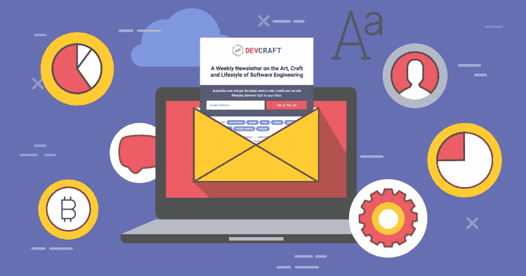
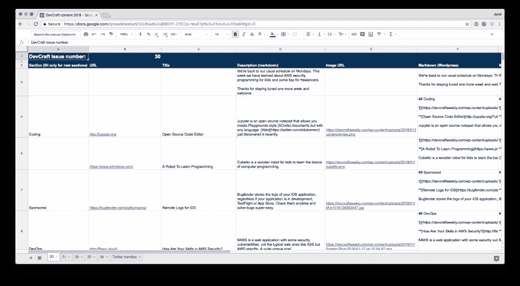
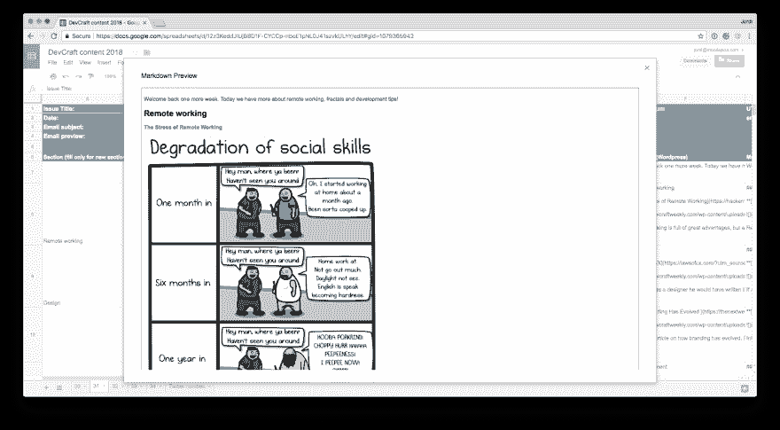
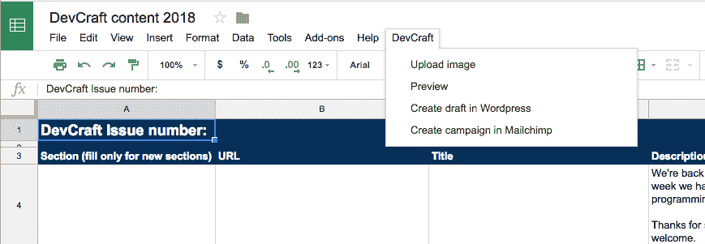
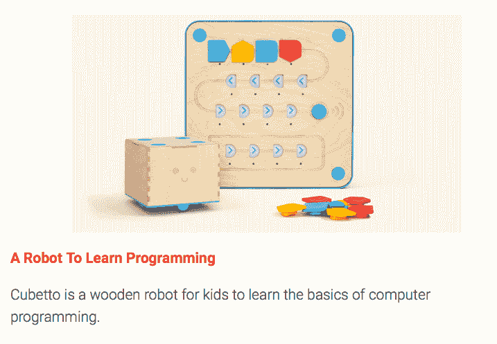

# DevCraft 内幕:我们学到了什么为开发人员创建时事通讯

> 原文：<https://dev.to/bugfenderapp/inside-devcraft-what-weve-learned-building-a-newsletter-for-developers-4p0d>

*这篇文章最初发表在我们的[博客](https://bugfender.com/blog/inside-devcraft-what-weve-learned-building-a-newsletter-for-developers/)上。*

[T2】](https://res.cloudinary.com/practicaldev/image/fetch/s--wgxS9xRe--/c_limit%2Cf_auto%2Cfl_progressive%2Cq_auto%2Cw_880/https://bugfender.com/wp-content/uploads/2018/03/Inside-DevCraft.jpg)

## 软件工程师是出了名的难缠群体

那么，我们为什么要为他们制作一份时事通讯呢？我们就是控制不住自己。

输入: [DevCraft](https://devcraftweekly.com) 。由于种种原因，软件工程师是糟糕的用户。我们知道这一点，因为开发人员不像你爸爸那样转发电子邮件，他们也没有超级连接到主流社交媒体。工程师很难捉摸。

但是我们确实知道一些关于他们的关键事情:**开发人员在他们不断扩展的领域中不断学习新的工具和软件，他们通常欣赏可笑的幽默，哦，他们喜欢免费的东西。**

在 [Bugfender](https://bugfender.com/) 和 [Mobile Jazz](https://mobilejazz.com/) ，我们知道这一点，因为我们是工程师。我们不断地通过 Slack 向对方发送这种教育和实用工具(以及迷因)。我们创建了 DevCraft，试图与世界分享这些文章、漫画和工具的精华。

## 建立 MVP

DevCraft 最初是 Rúben 的一个副业，但我们很快发现他做了一些好事。最初只是一个简单的登录页面+注册表单，现在开始真正聚集用户群，是时候开始利用这些了。

我们最初考虑过使用 [curated.io](http://cuated.io) ，但最终决定放弃，因为我们认为我们可以自己建立类似的东西，而且便宜得多。(我们最终花了更多的钱来创建我们自己的系统，但后来花了更多的钱。)

随着越来越多的开发人员对此感兴趣，我们开始使用 MailChimp 发送每周时事通讯。为了方便访问和搜索引擎优化，我们认为在我们的网站上提供[档案](https://devcraftweekly.com/archives/)是有益的。我们喜欢时不时地选择写博客，所以我们决定安装好的旧 WordPress，因为它安装快捷，易于主题化，并且有很棒的 API。

但是，当我们意识到每周制作一份高质量的时事通讯是一个巨大的挑战，并且比我们想象的要花费更多的时间和金钱时，现实发生了。

为我们分享的每篇文章或工具整理好的内容并写一个摘要是非常耗时的，尤其是对于一群工程师来说。为了维持一个固定的读者群，我们也知道我们必须每周发送一些东西。

我们从不缺少素材，因为我们有来自 MJ 团队的稳定的内容流。虽然我们不鼓励拖延，但我们的团队成员似乎不可避免地成为有趣想法和发明的永无止境链接的源泉。

但是每周创建这个该死的东西花费了太多的时间，所以很明显我们需要尽可能的自动化。我们需要更多的时间来确定哪些测试真正有效，推广时事通讯，并扩大我们的订户群。

## 自动化，自动化，自动化！

在我们自动化 DevCraft 之前，我们自己做所有的事情。手动。开会讨论内容，编写和格式化内容，获取和调整图像大小，为博客和电子邮件活动准备 HTML，安排 tweets 等。

为了制作一份人们会真正阅读的高质量的时事通讯，我们不能走捷径。

但是我们知道，除了实际准备内容之外，所有的事情都需要尽可能的轻量级，因为这是不会增加太多价值的工作。

我们做出的最佳决定是开始使用 **Google Sheets** 撰写时事通讯。鉴于我们时事通讯的内容是由特定的部分组成的(标题+照片+内容+阅读更多内容的链接)，我们希望利用 Google Sheets 提供的宏和自定义脚本。我们设置了一个宏来获取我们的内容单元格，并将它们组装到一个新的单元格中，该单元格使用 Markdown 格式，并依次使用 HTML 格式。

[T2】](https://res.cloudinary.com/practicaldev/image/fetch/s--Y3TZlSmW--/c_limit%2Cf_auto%2Cfl_progressive%2Cq_auto%2Cw_880/https://bugfender.com/wp-content/uploads/2018/02/inside-devcraft-1.png)

对于一群开发人员来说，自动化相当容易上瘾。在我们用宏“打破封印”之后，我们想让它更加自动化，继续使用 [Google Apps 脚本](https://developers.google.com/apps-script/overview)。这是谷歌工作表的一个鲜为人知的特性，类似于 VBA 脚本对于微软 Excel 的作用。

所以我们走进兔子洞，看看有多少可以自动化。首先，我们将[摊牌](https://github.com/showdownjs/showdown)库添加到 Google Sheets 中，将宏生成的 Markdown 呈现为 HTML，这样我们就可以预览它了:

[T2】](https://res.cloudinary.com/practicaldev/image/fetch/s--Cbkdv2ID--/c_limit%2Cf_auto%2Cfl_progressive%2Cq_auto%2Cw_880/https://bugfender.com/wp-content/uploads/2018/02/inside-devcraft-3.png)

接下来，因为图像需要调整大小并上传到 WordPress，我们使用 [WordPress REST API](http://v2.wp-api.org/) 将它们直接添加到我们站点的媒体库中，调整大小，裁剪并返回一个链接。这确保了图像的轻量级，所以它们不会减慢我们的电子邮件和网站。我们走在正确的道路上。

我们使用相同的 API 来创建和发布时事通讯档案。此外，我们使用 MailChimp 的 API 创建新的活动，将生成的 HTML 内容添加到其中。

所有这些功能都可以通过我们创建的这个漂亮的自定义菜单来实现:

[T2】](https://res.cloudinary.com/practicaldev/image/fetch/s--NMCwYGDC--/c_limit%2Cf_auto%2Cfl_progressive%2Cq_auto%2Cw_880/https://bugfender.com/wp-content/uploads/2018/02/inside-devcraft-2.png)

我们也开始使用 Hiplay 和 Buffer 在我们的 Twitter 和脸书账户上更频繁地发帖，所以我们的提要中总是有一些有趣的东西可以阅读。

## 弄清楚什么(有点)管用

通过做一件我们知道如何做得最好的事情(例如，编写定制功能的脚本)，我们将自己解放出来，投入到市场、实验和测试我们的时事通讯中。我们能够研究我们的行动，并找出有效的方法。

首先，我们改变了时事通讯的结构和内容类型。我们的订户似乎喜欢我们分享的每篇文章或工具下面的**自定义描述——只要它们简短、直截了当，有助于略读**。当我们决定在每个链接的描述上投入更少的时间时，我们只看到了温和的反应。点击率下降了，一些用户退订了，但没有太大的变化。

[T2】](https://res.cloudinary.com/practicaldev/image/fetch/s--UUHM1ECM--/c_limit%2Cf_auto%2Cfl_progressive%2Cq_auto%2Cw_880/https://bugfender.com/wp-content/uploads/2018/02/inside-devcraft-4.png)

然后我们选择了最常被点击的链接主题(通常是关于远程工作的)，并把它放在时事通讯的末尾。事实证明，这个链接仍然是点击最多的，所以我们了解到，我们的订户确实通读了整个简讯来寻找宝石。

就像网上约会一样，看起来有效的方法就是坚持不懈地把自己放出去。与 Twitter、脸书、Reddit、黑客新闻、&上的人进行真正的互动和交流，Slack 频道似乎很管用。我们仍在寻找新读者，以完善我们的集客营销，尽管每次我们找到一个新的发帖渠道，我们的用户群都会略有增长。

定期发帖提醒人们我们在这里。或许我们还挺酷的。

## 我们现在在哪里

当我们开始开发 DevCraft 时，我们并不知道它将带我们走上一段旅程，也不知道我们将学到什么。我们每天都在 Slack 上分享链接，我们认为与世界分享它们会很容易。

有几个服务可以在简单的包中提供时事通讯和订户管理，但是我们想创建一个开销最小的 MVP。我们不知道我们自己会投入多少时间，经常想我们是否应该创建一个纯文本的时事通讯，或者使用一个可用的服务。

在设计/展示和内容方面，我们本可以走捷径，但我们要与成千上万的时事通讯竞争。我们仍然希望 DevCraft 能够反映 Bugfender 和 Mobile Jazz 的开发者和设计者的[动态社区。](https://mobilejazz.com/blog/how-to-bring-a-remote-office-together/)

由于我们已经建立了自动化，DevCraft 已经变得可持续，现在每个版本需要一到两个小时。话虽如此，我们仍在试图找出它的路径和目的。如今，人们被新闻和娱乐狂轰滥炸，所以拥有另一份时事通讯(即使是高质量的)可能不是人们所追求的。DevCraft 是否满足了实际需求仍然是个问题，我们需要在适当的时候弄清楚。

也就是说，我们的订户稳步增长，我们有一个忠实的粉丝群，退订者很少。最近，一家代理公司主动联系我们，让我们在下一期杂志上做广告，所以它越来越受欢迎，逐渐成为一项独立的业务。

如果您想了解我们分享的内容并跟随我们的旅程，[今天就注册](http://devcraftweekly.com)！

*这篇文章最初发表在我们的[博客](https://bugfender.com/blog/inside-devcraft-what-weve-learned-building-a-newsletter-for-developers/)上。*