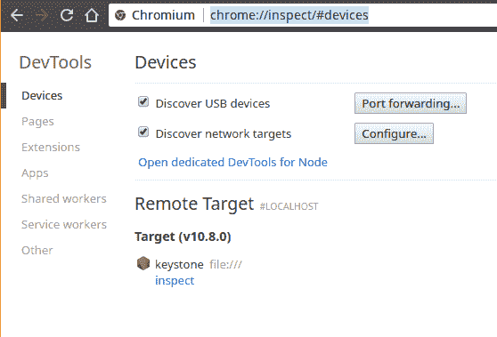
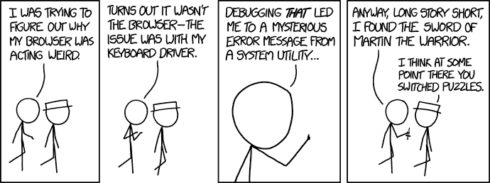

# 在不同的机器上检查您的节点应用程序

> 原文：<https://dev.to/attilavm/inspect-your-node-application-on-a-different-machine-3laf>

## 问题

你编写了一个 node 应用程序，它可以在你的工作站上工作，但不能在你的服务器上工作，你计划使用你的 Chrome 来调试远程应用程序。

## 警告

在公共服务器上调试任何东西，尤其是在生产服务器上，是一个极其典型的周一早晨的错误。如果您的服务器运行在容器或虚拟机中，您可以使用 Docker 或 vagger 在您的本地机器上运行一个等效的实例，下面的方法仍然有效，如果没有额外的网络开销，它甚至会更快。

## 解

幸运的是，我们的问题很容易用强大的 [SSH](https://en.wikipedia.org/wiki/Secure_Shell) 命令来解决，除了其他惊人的特性之外，它还允许您将 TCP 连接从本地机器转发到主机，反之亦然。因此，我们将把指向工作站上的节点调试端口的连接转发到我们的主机。

1)在主机上使用`--inspect`开关
启动您的应用程序

```
$ node --inspect myapp 
```

Enter fullscreen mode Exit fullscreen mode

在输出中，您应该找到这样一行。

```
Debugger listening on ws://127.0.0.1:9229/e9580cde-b1ee-4ed1-a23b-e8178390b1b9 
```

Enter fullscreen mode Exit fullscreen mode

它告诉我们两件重要的事情。首先，IP `127.0.0.1`确保我们调试器不会接受来自网络的任何连接，这可能会有一些可疑的人物潜伏在周围，尤其是如果你在互联网上这样做而不顾我的警告，那么让我敬畏地拿着你的啤酒。

其次，IP 后面的`9229`号是调试器使用的端口号，渴望接受来自本地 chrome 的连接。

2)在本地计算机上键入以下命令。

```
 ssh -L9229:localhost:9229 user@remote_hostname_or_ip 
```

Enter fullscreen mode Exit fullscreen mode

它会将任何指向本地 9229 端口的 TCP 连接转发到主机上的同一端口。

3)如果一切正常，现在可以像调试本地应用程序一样调试远程应用程序了。把这一行放到你的地址栏里。

```
chrome://inspect/#devices 
```

Enter fullscreen mode Exit fullscreen mode

下面的页面将呈现给你。

[T2】](https://res.cloudinary.com/practicaldev/image/fetch/s--7tygxQwt--/c_limit%2Cf_auto%2Cfl_progressive%2Cq_auto%2Cw_880/https://thepracticaldev.s3.amazonaws.com/i/sood2o247t3xf5ye3q92.png)

4)只需点击检查

5)猎杀虫子。

[](https://res.cloudinary.com/practicaldev/image/fetch/s--BjzzQmYA--/c_limit%2Cf_auto%2Cfl_progressive%2Cq_auto%2Cw_880/https://imgs.xkcd.com/comics/debugging.png)T3】图片来源: [xkcd 漫画](https://xkcd.com/)