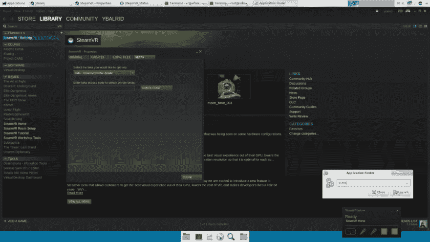
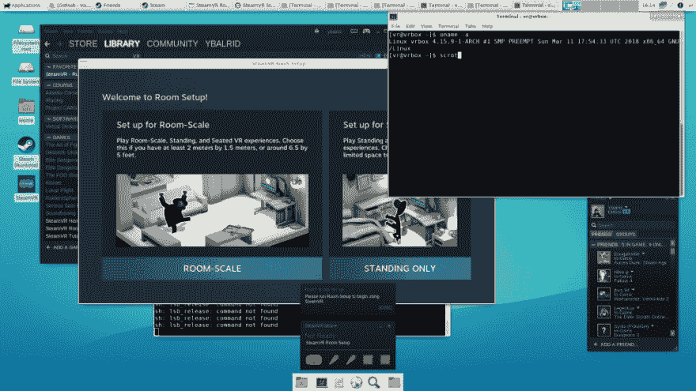

# 在 ArchLinux 上安装并运行 SteamVR(使用 HTC-Vive ),并进行 OpenGL/OpenVR 开发

> 原文：<https://dev.to/ybalrid/install-and-run-steamvr-on-archlinux-for-using-an-htc-vive-and-do-openglopenvr-developement-h1c>

所以，我最近有机会在一台 **Linux** 机器上试用了一台 HTC-Vive。自然我就在上面装了 Arch！😉

安装非常简单，但是如果你想在 Linux 上用 OpenVR 开发 OpenGL(OpenVR 是你用来和 SteamVR 运行时对话的 API)。)

SteamVR 从 2017 年 2 月开始有 Linux **beta** 。他们还宣布 SteamVR 运行时本身只用 **Vulkan** 实现。

首先，我不知道目前是否有可能在 Linux 上更新基站的固件，我使用的设置也在 Windows 上运行，并且固件已经在该平台上更新。这是我不能告诉你的一件事。

所以，开始时，你需要让蒸汽在你的机器上运行。ArchLinux 现在是一个只有 64 位的发行版，Steam 是一个只有 32 位的程序。因此，如果还没有，您需要为 pacman 激活*【多库】*存储库。(只需在/etc/pacman.conf 中取消对它的排序)

先说第一件事，做 VR，确实需要一个好的 GPU。在这里，我正在运行一个带有专有驱动程序的 Nvidia GTX 1070。你可以使用 AMD 的最新版本的 mesa 驱动程序。我没有接触到任何现代 AMD 显卡，所以我不能说。

然后，您需要安装以下软件包:

*   蒸汽
*   LSB-释放
*   您的图形驱动程序包为 32 位(lib32-nvidia-utils，lib32-libvdpau)

一旦你安装了 Steam，启动它，连接或创建一个帐户，并安装 SteamVR 包，然后你想打开测试版:

[T2】](https://blog.ybalrid.info/wp-content/uploads/2018/03/2018-03-20-103200_1920x1080_scrot.png)

一旦你在你的机器上安装了 steam VR，在你把 Vive 插到电脑上之前，你需要安装一些 udev 规则来允许应用程序直接访问设备。

创建一个文件**/lib/udev/rules . d/60-HTC-Vive-perms . rules**，并在其中写入以下内容:

```
# HTC Vive HID Sensor naming and permissioning KERNEL=="hidraw\*", SUBSYSTEM=="hidraw", ATTRS{idVendor}=="0bb4", ATTRS{idProduct}=="2c87", TAG+="uaccess" KERNEL=="hidraw\*", SUBSYSTEM=="hidraw", ATTRS{idVendor}=="28de", ATTRS{idProduct}=="2101", TAG+="uaccess" KERNEL=="hidraw\*", SUBSYSTEM=="hidraw", ATTRS{idVendor}=="28de", ATTRS{idProduct}=="2000", TAG+="uaccess" KERNEL=="hidraw\*", SUBSYSTEM=="hidraw", ATTRS{idVendor}=="28de", ATTRS{idProduct}=="1043", TAG+="uaccess" KERNEL=="hidraw\*", SUBSYSTEM=="hidraw", ATTRS{idVendor}=="28de", ATTRS{idProduct}=="2050", TAG+="uaccess" KERNEL=="hidraw\*", SUBSYSTEM=="hidraw", ATTRS{idVendor}=="28de", ATTRS{idProduct}=="2011", TAG+="uaccess" KERNEL=="hidraw\*", SUBSYSTEM=="hidraw", ATTRS{idVendor}=="28de", ATTRS{idProduct}=="2012", TAG+="uaccess" SUBSYSTEM=="usb", ATTRS{idVendor}=="0bb4", ATTRS{idProduct}=="2c87", TAG+="uaccess" # HTC Camera USB Node SUBSYSTEM=="usb", ATTRS{idVendor}=="114d", ATTRS{idProduct}=="8328", TAG+="uaccess" # HTC Mass Storage Node SUBSYSTEM=="usb", ATTRS{idVendor}=="114d", ATTRS{idProduct}=="8200", TAG+="uaccess" SUBSYSTEM=="usb", ATTRS{idVendor}=="114d", ATTRS{idProduct}=="8a12", TAG+="uaccess" 
```

你现在可以打开 SteamVR 了，应该会提示你运行房间设置程序来配置你的“游戏空间”

[T2】](https://blog.ybalrid.info/wp-content/uploads/2018/03/2018-03-16-161458_1920x1080_scrot.png)

然后，如果你想用 OpenVR 渲染到带 OpenGL 的 Vive，你就需要一个 Vulkan 运行时和开发包。为此，您需要安装

```
vulkan-devel 
```

包裹。

您可能还需要在 steam 运行时下启动您的程序，这是使用以下脚本完成的:

```
~/.steam/steam/ubuntu12\_32/steam-runtime/run.sh ./my\_steamvr\_app 
```

应该差不多了。链接到 [OpenVR](https://github.com/ValveSoftware/openvr) API 的程序现在可以“正常工作”了。

本文信息来自我自己的经历，本文来自 Valve:【https://github.com/ValveSoftware/SteamVR-for-Linux】T4

Annwvyn，我的游戏引擎现在已经“正式”兼容带 OpenVR 的 Linux 了。！😉

如果可以在 Linux 上使用 Oculus Rift，我会非常高兴，但是现在还没有什么好的解决方案。Oculus 几年前就冻结了 Linux 的开发工作，所以我们不会很快看到官方的 SDK。OpenHMD 项目已经取得了“一些”进展，但是现在还没有什么真正有用的东西。