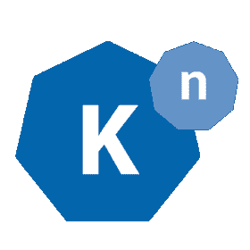
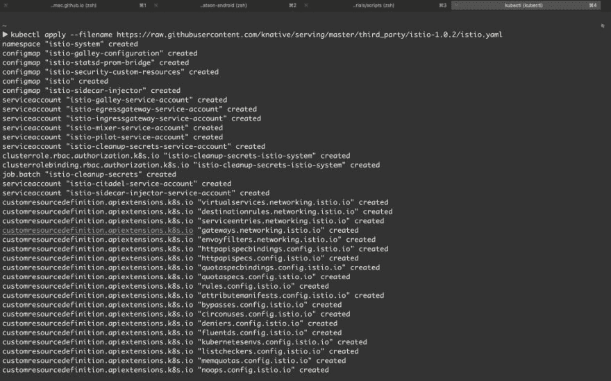

# 在 IBM Cloud 上安装带 Istio 的 Knative:艰难之路

> 原文：<https://dev.to/vidyasagarmsc/install-knative-with-istio-on-ibm-cloud-2fd9>

在本教程中，了解在 IBM Cloud Kubernetes Service(IKS)上使用 Istio 安装 Knative、构建映像并将其推送到 IBM Cloud Container Registry 以及部署 nodejs 应用程序是多么容易。

在进入说明之前，让我们快速了解 Knative 是什么，它的关键组件是什么。

Knative 扩展了 Kubernetes，提供了开发人员创建现代的、以源代码为中心的、基于容器的、云原生应用程序所需的构建模块。

[T2】](https://res.cloudinary.com/practicaldev/image/fetch/s--O8ivla6C--/c_limit%2Cf_auto%2Cfl_progressive%2Cq_auto%2Cw_880/https://cdn-images-1.medium.com/max/280/1%2ApzF__5c3GXD8phF0pCBcfQ.png)

Knative 项目下的每个组件都试图确定常见的模式，并整理现实世界中基于 Kubernetes 的成功框架和应用程序所共享的最佳实践，例如:

*   编排从源到容器的工作流程
*   部署期间路由和管理流量
*   根据需求扩展和调整资源
*   将运行服务绑定到事件生态系统

Knative 专注于每个人都需要的“无聊但困难”的部分，但没有人会从自己重新做一遍中受益。这反过来又解放了开发人员，让他们花更多的时间编写应用程序代码，而不用担心如何构建、部署、监控和调试应用程序。

### 什么是知识成分？

目前，Knative 由以下顶级存储库组成:

*   [构建](https://github.com/knative/build)和[构建——模板](https://github.com/knative/build-templates)——自动的、可重复的服务器端容器构建
*   [服务](https://github.com/knative/serving) —扩展到零，请求驱动的计算
*   [事件](https://github.com/knative/eventing) —事件的管理和交付

我们预计随着更多领域的确定，这个列表还会增加。

### 先决条件

*   [节点和 npm](https://www.npmjs.com/get-npm)
*   [下载并安装 ibmcloud 命令行工具](https://console.bluemix.net/docs/cli/index.html#overview)

### 设置 CLI

> 如果您已经安装了 ibmcloud CLI 和 ibmcloud 插件，您可以跳过这些步骤。

*   安装 cs(容器服务)和 cr(容器注册)插件

```
$ ibmcloud plugin install container-service -r Bluemix

$ ibmcloud plugin install container-registry -r Bluemix 
```

*   授权 ibmcloud:

```
$ ibmcloud login 
```

### 创建一个 Kubernetes 集群并设置 Istio

在本节中，您将在 IBM Cloud Kubernetes service(IKS)上提供一个 Kubernetes 集群，并安装 Istio+k active 组件。

*   [设置环境变量](https://github.com/knative/docs/blob/master/install/Knative-with-IKS.md#setting-environment-variables)
*   按照步骤[创建一个 Kubernetes 集群](https://github.com/knative/docs/blob/master/install/Knative-with-IKS.md#creating-a-kubernetes-cluster)(总是选择**稳定**版本)
*   由于 Knative 依赖于 Istio，所以让我们安装最新版本的 Istio

```
$ kubectl apply --filename https://raw.githubusercontent.com/knative/serving/master/third_party/istio-1.0.2/istio.yaml 
```

<figure>[](https://res.cloudinary.com/practicaldev/image/fetch/s--yVblYX-z--/c_limit%2Cf_auto%2Cfl_progressive%2Cq_auto%2Cw_880/https://cdn-images-1.medium.com/max/1024/1%2AogetR49JlqDlMJeA9Sj87Q.png) 

<figcaption>安装 Istio</figcaption>

</figure>

*   用 istio-injection=enabled 标记默认名称空间:ku bectl label namespace default istio-injection = enabled
*   监视 Istio 组件，直到所有组件都显示运行或完成状态:ku bectl get pods-namespace Istio-system
*   按照说明[在 IKS 集群上安装活动组件](https://github.com/knative/docs/blob/master/install/Knative-with-IKS.md#installing-knative-components)
*   要检查已知安装，请运行以下命令

```
kubectl api-resources | grep knative 
```

> 需要 kubectl 客户端版本 1.11 或更高版本

<figure>[](https://res.cloudinary.com/practicaldev/image/fetch/s--tRAE1ZNF--/c_limit%2Cf_auto%2Cfl_progressive%2Cq_auto%2Cw_880/https://cdn-images-1.medium.com/max/1024/1%2AvSO4ZX1LYIs-UlDatTPfYg.png) 

<figcaption>验证安装</figcaption>

</figure>

### 构建并部署应用

本节使用了对 [helloworld-nodejs](https://github.com/knative/docs/tree/master/serving/samples/helloworld-nodejs) 应用程序的重新组合。其他编程语言(Go、Python、C#、Java 等)的代码示例。，)，参考 [Knative 上菜样本应用](https://github.com/knative/docs/tree/master/serving/samples)

*   将 [repo](https://github.com/VidyasagarMSC/knative-deploy) 和 cd 克隆到文件夹中

```
$ git clone https://github.com/VidyasagarMSC/knative-deploy.git

$ cd knative-deploy 
```

*   安装依赖项

```
$ npm install 
```

*   通过替换和值，构建 Docker 映像并将其推送到 IBM Cloud Container 注册表

```
$ ibmcloud cr build -t registry.<region>.bluemix.net/<namespace>/knative-node-app . 
```

> **注意:**要检查您所在的地区，请运行 ibmcloud cr regionand，要设置新的名称空间，请参考[此链接](https://console.bluemix.net/docs/services/Registry/index.html#registry_namespace_add)

*   在 service.yaml 中，替换 image 值并运行以下命令