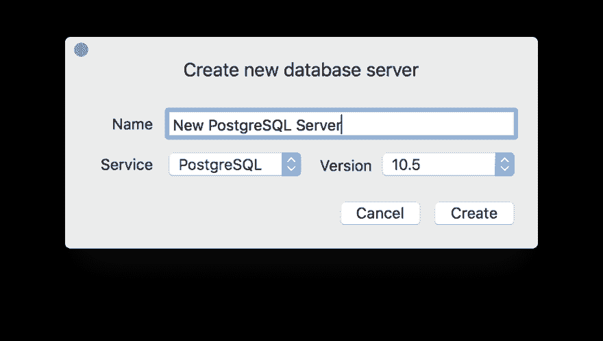
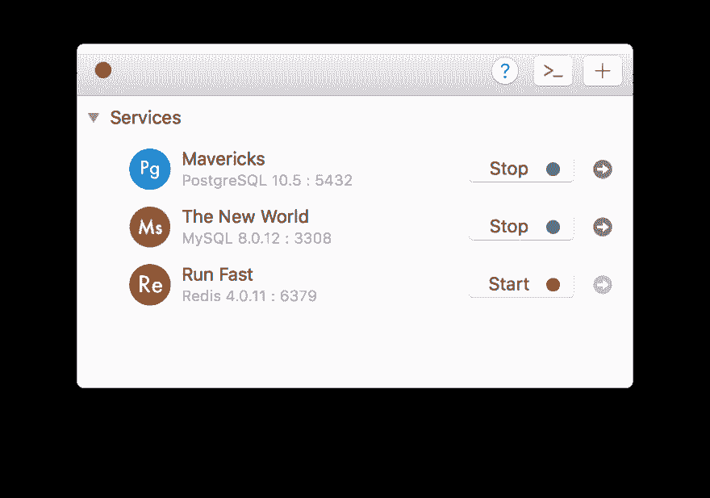

# 1 分钟内在 Mac 上安装 PostgreSQL 服务器

> 原文：<https://dev.to/tungtono/install-postgresql-server-on-mac-in-1-minute-3dfi>

在 Mac 上安装 PostgreSQL，最常见的两种方式是 Docker 和 Homebrew service。但是 Docker 可能太大，会吃掉很大一部分内存，或者有时您会觉得使用命令行配置本地服务器很笨拙。

另一方面，在你的电脑上安装和管理多个版本的 PostgreSQL 真的很难。

在本帖中，我们将使用 [DBngin](https://dbngin.com/) ，这是一个在 Mac 上进行数据库版本管理的免费工具。

DBngin 是一个用户友好的 Mac 应用程序，旨在帮助您在 Mac 上部署多个数据库管理系统，包括各种版本的 MySQL、PostgreSQL、Redis，只需点击一下鼠标。

此外，DBngin 将自动创建一个新的数据库集群和一个可以通过简单的服务器控制器管理的数据库。

*   首先，进入 [DBngin](https://dbngin.com/) ，在你的 Mac 上下载并安装该应用。

*   打开 DBngin，点击+新建服务器按钮。

*   从驱动程序列表中选择 PostgreSQL，选择 PostgreSQL 版本并命名您的服务器以创建新服务器。您可以稍后编辑服务器并更改端口。

[T2】](https://res.cloudinary.com/practicaldev/image/fetch/s---0-1-_XQ--/c_limit%2Cf_auto%2Cfl_progressive%2Cq_auto%2Cw_880/https://dbngin.com/resourcimg/new-server%402x.png)

现在，您的计算机上已经运行了一个本地 PostgreSQL 服务器。

[T2】](https://res.cloudinary.com/practicaldev/image/fetch/s--Ntps_Ro2--/c_limit%2Cf_auto%2Cfl_progressive%2Cq_auto%2Cw_880/https://dbngin.com/resourcimg/welcome%402x.png)

使用 DBngin，您不仅可以安装和管理 PostgreSQL 的多个服务器，还可以安装和管理 MySQL、Redis 的多个服务器。您可以通过单击来打开和关闭任何数据库服务器。需要时打开，完成后退出。没有依赖。