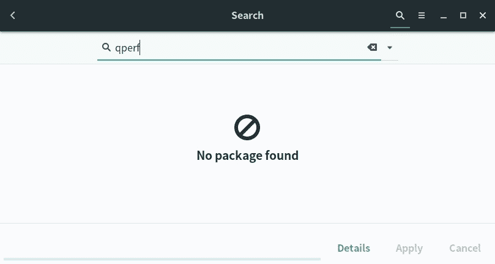
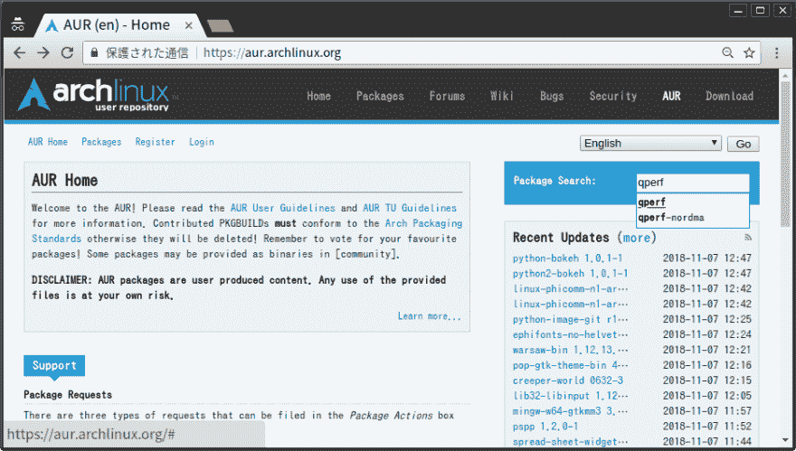
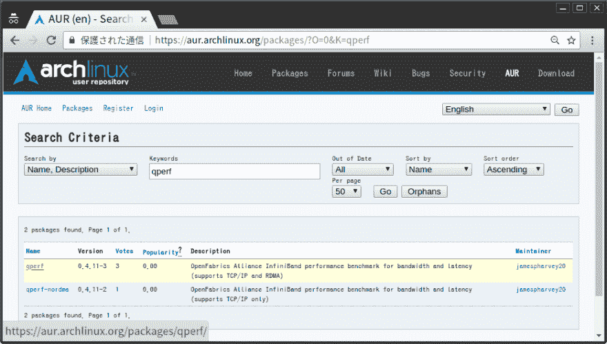
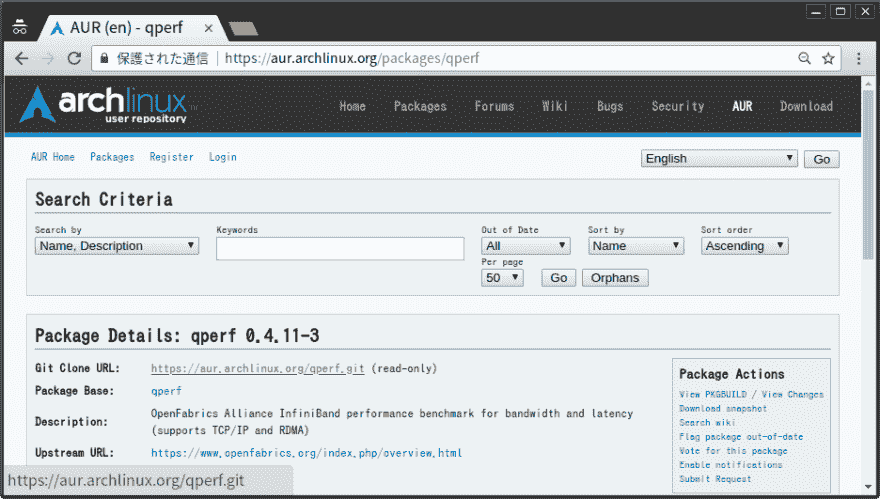
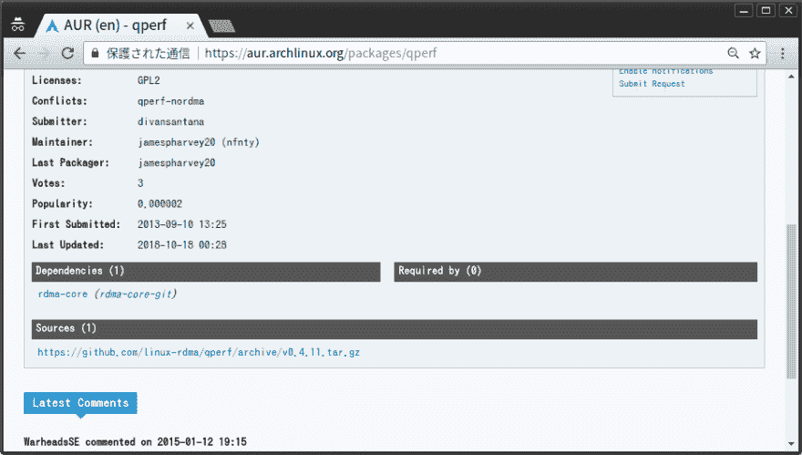

# 安装 AUR 软件包

> 原文：<https://dev.to/nabbisen/installing-aur-packages-bdf>

# 总结

Arch Linux 是最流行的 Linux 发行版之一。
它由 [AUR](https://aur.archlinux.org/) 支持，“一个”rch Linux“U”ser“R”epository，这是一个由 Arch 用户和开发者组成的非常大的社区，并且托管大量的软件包。通过善用它们，我们可以让我们的环境变得更方便或更强大。

基于 Arch Linux 的 [Linux 发行版也是如此，比如](https://distrowatch.com/search.php?basedon=Arch#simple) [Manjaro Linux](https://manjaro.org/) 和[ante gos](https://antergos.com/)。

* * *

### 参考: [AUR 用户指南](https://wiki.archlinux.org/index.php/AUR_User_Guidelines)声明

开头是:

> Arch 用户库(AUR)是一个社区驱动的 Arch 用户库。它包含包描述(PKGBUILDs ),允许您使用 makepkg 从源代码编译一个包，然后通过 pacman 安装它。创建 AUR 是为了组织和共享来自社区的新包，并帮助加速将流行的包包含到社区存储库中。本文档解释了用户如何访问和使用 AUR。
> 
> 进入官方仓库的许多新包都是从 AUR 开始的。在 AUR，用户能够贡献他们自己的包构建(PKGBUILD 和相关文件)。AUR 社区有能力投票支持 AUR 的一揽子计划。如果一个包变得足够流行——只要它有一个兼容的许可证和良好的打包技术——它可能会进入社区存储库(pacman 或 abs 可以直接访问)。

接下来是:

> **警告** : AUR 包是用户制作的内容。对所提供文件的任何使用都由您自己承担风险。

* * *

嗯，我建议 Manjaro 用户在使用 AUR 之前在 Manjaro 软件包管理器中搜索。如果在更可靠的地方有一些解决方案，你为什么不先去那里看看呢？
如果那里没有，那就换个方式想:

[T2】](https://res.cloudinary.com/practicaldev/image/fetch/s--MkjJWWF8--/c_limit%2Cf_auto%2Cfl_progressive%2Cq_auto%2Cw_880/https://thepracticaldev.s3.amazonaws.com/i/4fwxmsa3xdpx7zgn1txy.jpg)

<center>✿✿✿</center>

# 如何使用

### 简述

**得到“Git 克隆 URL”，`git clone` it，`makepkg -si` it** ，就完成了。

### 第一步:获取“Git 克隆 URL”

游览 https://aur.archlinux.org/ AUR:并搜索套餐:

[T2】](https://res.cloudinary.com/practicaldev/image/fetch/s--YhcjmujB--/c_limit%2Cf_auto%2Cfl_progressive%2Cq_auto%2Cw_880/https://thepracticaldev.s3.amazonaws.com/i/vo0ehowm804u3jd7ums2.png)

转到软件包页面:

[T2】](https://res.cloudinary.com/practicaldev/image/fetch/s--qlIRLIOo--/c_limit%2Cf_auto%2Cfl_progressive%2Cq_auto%2Cw_880/https://thepracticaldev.s3.amazonaws.com/i/9lwgqg6me6bxcim3a0wn.png)

获取“Git 克隆 URL”:

[T2】](https://res.cloudinary.com/practicaldev/image/fetch/s---O8C1SWb--/c_limit%2Cf_auto%2Cfl_progressive%2Cq_auto%2Cw_880/https://thepracticaldev.s3.amazonaws.com/i/xnec3olcm50ww8yq1sj3.png)

根据需要确认“许可证”、“受欢迎程度”、“上次更新时间”、“依赖关系”等:

[T2】](https://res.cloudinary.com/practicaldev/image/fetch/s--fTSmyF0R--/c_limit%2Cf_auto%2Cfl_progressive%2Cq_auto%2Cw_880/https://thepracticaldev.s3.amazonaws.com/i/uzc37qlzzw15izmlupi6.png)

### 第二步:构建软件包并安装

`git clone [the package]`、`cd [the package]`、`makepkg -si`，大功告成！

这是一个名为 qperf 的包的例子。
**注:qperf 是测量网络带宽和节点间延迟的工具。*

第一个半步:

```
$  # git clone [the package]
$  git clone https://aur.archlinux.org/qperf.git 
```

第二个半步:

```
$  # cd [the package]
$  cd qperf
$  makepkg -si 
```

完成😁

# 一个题外话

实际上，在安装 qperf 的过程中，并没有遇到任何问题...

[](/nabbisen) [## 安装 AUR 软件包的疑难解答

### hed di nab bisen 11 月 8 日 184 分钟阅读

#archlinux #manjarolinux #aur #linux](/nabbisen/troubleshooting-around-installing-aur-packages-neg)

毕竟，我完成了软件包的安装😃