# AWS RDS 上的即时图表

> 原文：<https://dev.to/hasurahq/instant-graphql-on-aws-rds-221c>

让我们在[亚马逊 RDS](https://aws.amazon.com/rds/) 上部署 [Hasura GraphQL 引擎](https://hasura.io)，以在 RDS Postgres 数据库上获得即时、超快的 GraphQL APIs。

[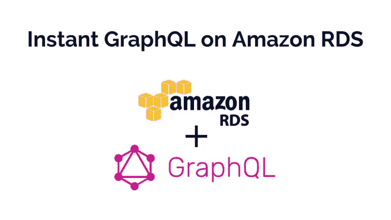T2】](https://res.cloudinary.com/practicaldev/image/fetch/s--nqvJyhx8--/c_limit%2Cf_auto%2Cfl_progressive%2Cq_auto%2Cw_880/https://blog.hasura.io/conteimg/downloaded_images/instant-graphql-on-aws-rds-1edfb85b5985/1-gQl_wmXMJ3qCCBmc6hN71w.jpeg)

## TL；速度三角形定位法(dead reckoning)

*   创建 RDS 实例或使用现有实例
*   在 Heroku 或 ec2+dock 上部署 Hasura 图形 SQL
*   RDS 上的即时 GraphQL APIs

## 创建一个 RDS 实例

如果您已经有一个 RDS 实例，请跳过这一节，转到下一节。

登录你的 [AWS 控制台](https://console.aws.amazon.com/console/home)，点击 EC2 链接进入 [RDS 控制台](https://console.aws.amazon.com/rds/home)，点击蓝色的“创建数据库”按钮:

[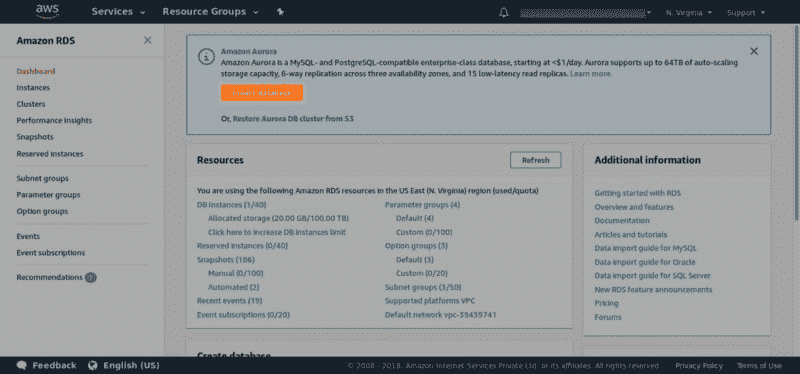T2】](https://res.cloudinary.com/practicaldev/image/fetch/s--wj8nJeBN--/c_limit%2Cf_auto%2Cfl_progressive%2Cq_auto%2Cw_880/https://blog.hasura.io/conteimg/downloaded_images/instant-graphql-on-aws-rds-1edfb85b5985/1-mVdn6aKLnXP-RuCB-I49nA.png)

确保在创建实例时选择“PostgreSQL”引擎:

[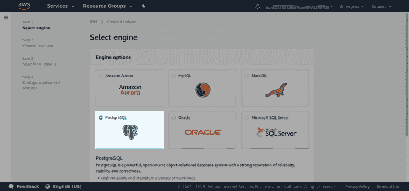T2】](https://res.cloudinary.com/practicaldev/image/fetch/s--_Ju99en4--/c_limit%2Cf_auto%2Cfl_progressive%2Cq_auto%2Cw_880/https://blog.hasura.io/conteimg/downloaded_images/instant-graphql-on-aws-rds-1edfb85b5985/1-HaQHcwGf9fWt7PJy4Oo6lw.png)

***注:截至撰写本文时 Postgres 10.3 及以下工作。***[***Postgres 10.4 不工作***](https://forums.aws.amazon.com/thread.jspa?threadID=286822) ***。**T13】*

单击“下一步”,并根据您的使用案例选择“生产”或“开发/测试”。

为 RDS 数据库选择合适的实例:

[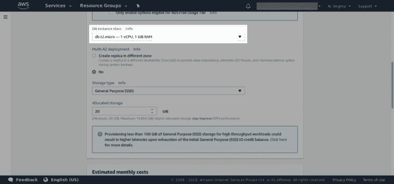T2】](https://res.cloudinary.com/practicaldev/image/fetch/s--AxZN26zp--/c_limit%2Cf_auto%2Cfl_progressive%2Cq_auto%2Cw_880/https://blog.hasura.io/conteimg/downloaded_images/instant-graphql-on-aws-rds-1edfb85b5985/1-Dh760IGBGPFlmfsMZWim7g.png)

向下滚动并设置凭证。记录凭证(主用户名和密码、数据库名称等。)，后面会用到。

[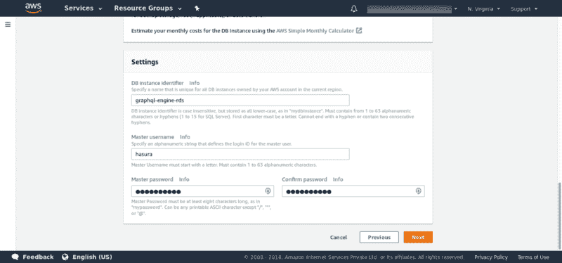T2】](https://res.cloudinary.com/practicaldev/image/fetch/s--4xO4JVX3--/c_limit%2Cf_auto%2Cfl_progressive%2Cq_auto%2Cw_880/https://blog.hasura.io/conteimg/downloaded_images/instant-graphql-on-aws-rds-1edfb85b5985/1-F-SeyBHRG5VhTrWFEGPm-Q.png)

选择 VPC 和安全组:

[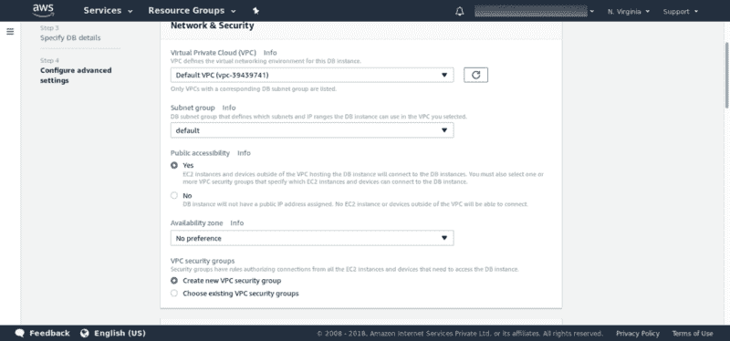T2】](https://res.cloudinary.com/practicaldev/image/fetch/s--fGnEDbhJ--/c_limit%2Cf_auto%2Cfl_progressive%2Cq_auto%2Cw_880/https://blog.hasura.io/conteimg/downloaded_images/instant-graphql-on-aws-rds-1edfb85b5985/1-2edU24eoa8BhQQHgSlKIeA.png)

如果您打算在 AWS 上部署 GraphQL 引擎，那么请确保这里使用的 VPC 与 EC2/ECS 实例使用的 VPC 相同。

***注意:*** 如果您计划在 AWS 之外部署 Hasura(例如 Heroku)，那么您必须使这个 DB 实例可公开访问。

***注意:*** 确保您选择的安全组对来自部署 GraphQL 引擎的任何地方的入站连接都有适当的规则。

最后，点击“创建数据库”按钮。

## 使用现有的 RDS 实例

如果您已经有一个包含现有数据的 RDS 实例，您可以按照下面的步骤部署 Hasura GraphQL 引擎。

***注意:*** 如果您计划在 AWS 之外部署 Hasura，那么您必须使这个 DB 实例可公开访问。

***注意:*** 确保与您的 RDS 实例相关联的安全组具有来自 GraphQL 引擎的入站连接的适当规则。

您还需要为 Postgres 用户设置适当的权限。有关 Postgres 用户权限的详细信息,请参见我们的[文档。](https://docs.hasura.io/1.0/graphql/manual/deployment/postgres-permissions.html)

## 在 Heroku 上部署 Hasura GraphQL

按照我们的文档中概述的步骤在 Heroku 上部署 Hasura GraphQL。

您必须配置`HASURA_GRAPHQL_DATABASE_URL`环境变量来指向您的 RDS 实例。仅此而已！

## 在 AWS 上部署 Hasura GraphQL

要在 AWS 上部署 Docker 容器，有两种可能的方法:

1.  使用 EC2 实例并在其上安装 docker
2.  使用 AWS [ECS](https://aws.amazon.com/ecs/)

如果您的目标是生产设置，您应该使用 [ECS](https://aws.amazon.com/getting-started/tutorials/deploy-docker-containers/) 。

在本文中，我们将使用 EC2 上的 Docker 进行部署。

### 启动一个 EC2 实例

登录你的 [AWS 控制台](https://console.aws.amazon.com/console/home)，点击 EC2 链接进入 [EC2 控制台](https://console.aws.amazon.com/ec2/v2/home)，点击蓝色的“启动实例”按钮:

[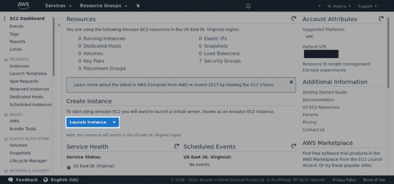T2】](https://res.cloudinary.com/practicaldev/image/fetch/s--rWc-PMz7--/c_limit%2Cf_auto%2Cfl_progressive%2Cq_auto%2Cw_880/https://blog.hasura.io/conteimg/downloaded_images/instant-graphql-on-aws-rds-1edfb85b5985/1-lxvzAp1Xqx2YrXucIXTjBg.png)

在下一页，您需要选择一个 [Amazon 机器映像](https://docs.aws.amazon.com/AWSEC2/latest/UserGuide/AMIs.html) (AMI)来运行在您的 EC2 实例上。对于本教程，只需选择顶部的选项，即`Ubuntu Server 16.04 LTS`:

[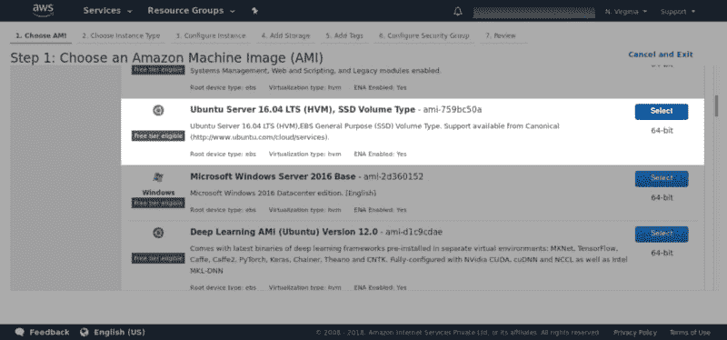T2】](https://res.cloudinary.com/practicaldev/image/fetch/s--kJf7XSTt--/c_limit%2Cf_auto%2Cfl_progressive%2Cq_auto%2Cw_880/https://blog.hasura.io/conteimg/downloaded_images/instant-graphql-on-aws-rds-1edfb85b5985/1-B5u_-kQkdrMy1PrDYk7yuA.png)

接下来，您需要选择[实例类型](https://aws.amazon.com/ec2/instance-types/)，它决定了您的服务器将拥有什么样的 CPU、内存、存储和网络容量。坚持使用默认选项`t2.micro`，并单击灰色的“下一步:配置实例细节”按钮:

[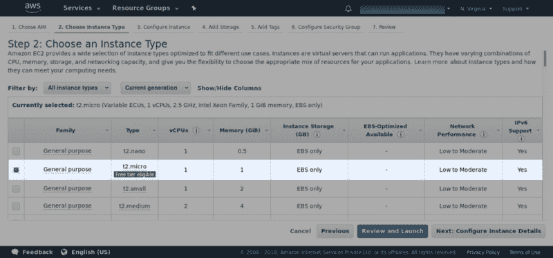T2】](https://res.cloudinary.com/practicaldev/image/fetch/s--91CWsCMn--/c_limit%2Cf_auto%2Cfl_progressive%2Cq_auto%2Cw_880/https://blog.hasura.io/conteimg/downloaded_images/instant-graphql-on-aws-rds-1edfb85b5985/1-PdvTBtipNJ7RtZHApy9gbA.png)

在实例详细信息配置中，**确保选择 RDS 实例使用的相同 VPC。**

[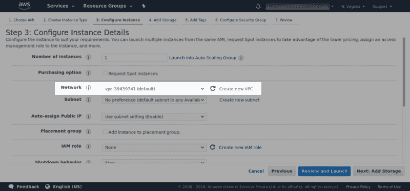T2】](https://res.cloudinary.com/practicaldev/image/fetch/s--4weyKSPd--/c_limit%2Cf_auto%2Cfl_progressive%2Cq_auto%2Cw_880/https://blog.hasura.io/conteimg/downloaded_images/instant-graphql-on-aws-rds-1edfb85b5985/1-HVkQiYmF-LuX2-57nKr4Xg.png)

然后继续点击“下一步”,直到进入“配置安全组”页面。一个[安全组](https://docs.aws.amazon.com/AWSEC2/latest/UserGuide/using-network-security.html)是一组防火墙规则，为您的实例控制网络流量。默认情况下，所有传入端口都被阻止，因此使用此页面添加允许来自任何来源(`0.0.0.0/0`)的传入 SSH (TCP，端口 22)、HTTP (TCP，端口 80)和 HTTPS (TCP，端口 443)请求的规则。给安全组起一个名字，比如`graphql-engine-test-sg`，然后点击蓝色的“查看并启动”按钮:

[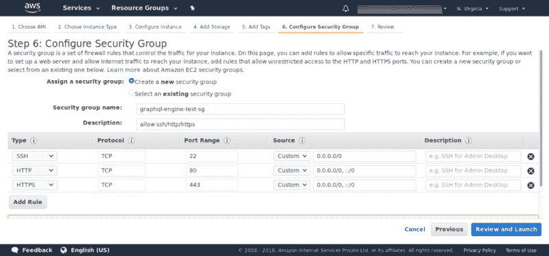T2】](https://res.cloudinary.com/practicaldev/image/fetch/s--IKDdKrQ8--/c_limit%2Cf_auto%2Cfl_progressive%2Cq_auto%2Cw_880/https://blog.hasura.io/conteimg/downloaded_images/instant-graphql-on-aws-rds-1edfb85b5985/1-hSyOd5Akyje-Pn4Slt_KqA.png)

在“查看实例启动”页面上，单击蓝色的“启动”按钮。这将弹出一个模式，要求您选择一个[密钥对](https://docs.aws.amazon.com/AWSEC2/latest/UserGuide/ec2-key-pairs.html)。这用于通过 SSH 连接到您的 EC2 实例。从下拉菜单中选择“创建新的密钥对”，给密钥对起一个类似`my-ec2-key-pair`的名字，然后点击“下载密钥对”:

[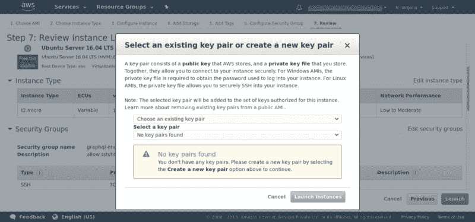T2】](https://res.cloudinary.com/practicaldev/image/fetch/s--XP1CqASx--/c_limit%2Cf_auto%2Cfl_progressive%2Cq_auto%2Cw_880/https://blog.hasura.io/conteimg/downloaded_images/instant-graphql-on-aws-rds-1edfb85b5985/1-CW8PXo657yhSV12ICWBbgw.png)

**注意:**将密钥对`.pem`文件保存到您计算机上的一个安全且可访问的位置(一旦您关闭此模式，您将再也无法下载此`.pem`文件，因此请务必保存它！).

现在，如果您转到 EC2 仪表板，您应该看到 EC2 实例正在运行。

### 安装对接器

下一步是在 EC2 实例上安装 Docker。打开一个终端，`cd`到您保存密钥对的文件夹，并运行以下命令:

```
$ cd ~/my-aws-key-pairs
$ chmod 400 my-ec2-key-pair.pem
$ ssh -i my-ec2-key-pair.pem ubuntu@<EC2-INSTANCE-PUBLIC-IP-ADDRESS> 
```

Enter fullscreen mode Exit fullscreen mode

登录后，安装 Docker:

```
$ sudo apt-get update
$ sudo apt-get -y install docker docker-compose 
```

Enter fullscreen mode Exit fullscreen mode

然后让我们将这个用户添加到 docker 组，这样我们就可以在没有`sudo` :
的情况下运行 docker 命令

```
$ sudo usermod -a -G docker ubuntu 
```

Enter fullscreen mode Exit fullscreen mode

退出 shell 并再次登录。检查 docker 是否工作:

```
$ exit
$ ssh -i my-ec2-key-pair.pem ubuntu@<EC2-INSTANCE-PUBLIC-IP-ADDRESS>
$ docker info 
```

Enter fullscreen mode Exit fullscreen mode

### 部署 Hasura GraphQL 引擎

将以下 docker-compose 片段保存到文件`docker-compose.yaml`