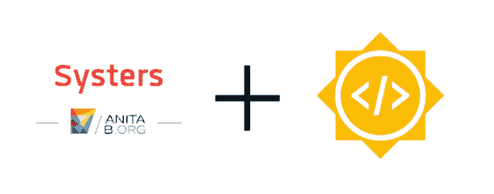

# 谷歌系统开源代码之夏简介

> 原文：<https://dev.to/isabelcmdcosta/intro-to-google-summer-of-code-with-systers-open-source-4eip>

[T2】](https://res.cloudinary.com/practicaldev/image/fetch/s--YpgzCqWh--/c_limit%2Cf_auto%2Cfl_progressive%2Cq_auto%2Cw_880/https://thepracticaldev.s3.amazonaws.com/i/b8uo1gk79hsn2dllfedl.PNG)

我非常感激被[系统开源社区](http://systers.io/)接纳为今年[谷歌代码之夏(GSoC)](https://summerofcode.withgoogle.com/) 的学生。结果于 4 月 23 日公布，我非常期待这个机会。

我在三月初开始接触 Systers 社区。起初，在一个开源社区中发言真的很吓人，就像我的每一条消息都是对一群人广播一样，但是随着时间的推移，我开始越来越习惯于大胆发言和提问。我真的很喜欢这个社区非常认真地对待行为准则，并为每个人营造一个友好的环境。我已经从申请阶段学到了很多。我学到的一件事是[我们可以用比代码](http://systers.io/newcomers)更多的东西来帮助开源社区。很快我会在博客上分享申请过程。

对于这一期的 GSoC，我决定提出一个有益于 Systers 社区的新想法，这将允许我探索更多的 Android 开发。我提出了[systems 导师制](https://summerofcode.withgoogle.com/projects/#5331289322815488)，一个让女性互相帮助的应用程序。该项目的目标是在预先设定的时间内建立导师关系，在此期间，导师自愿抽出时间在一些与职业发展相关的话题上帮助学员。这种指导不一定是关于技术主题，而是关于技术职业的其他方面，如博客、公开演讲、采访等。我认为这真的可以帮助刚进入这个行业，但不知道如何驾驭它的新女性。

你可以从我对想法的[初始提议中看到更多细节，其中包括:今年夏天的初始提议时间表、应用程序要求、数据模型概述和初始模拟屏幕。很快我会发一些帖子，提供更多关于导师制提案的见解。](https://docs.google.com/document/d/1TkyLWbVyW9WHEoqFBwpE1GE6vDRf7aoITT6i7tBFKsw/edit#heading=h.dg1yimad8ycj)

今年夏天，我将在导师的指导下开发手机应用程序的后端和初始版本(Android 版本)。

我将有两位导师，迪卢希·皮乌姆瓦丹和 T2·穆拉德和项目经理 T4·梅比林·布尔戈斯。

这些项目将是完全开源的，因此任何人都可以提出建议并成为其中的一部分。你可以加入[systems 开源 Slack 社区](http://systers.io/slack-systers-opensource/)。以下是我将使用的主要 Github 库:[系统/导师-后端](https://github.com/systers/mentorship-backend)和[系统/导师-android](https://github.com/systers/mentorship-android) 。

我对这次经历感到非常兴奋，并期待着向我的导师、项目经理、GSoC 的同学们和开源社区学习。

今年夏天，我将在伊莎贝尔·科斯塔 GSoC 媒体刊物上记录我的旅程。我已经有几篇文章在酝酿中；)

* * *

[*这个也贴在介质上。*T3】](https://medium.com/isabel-costa-gsoc/intro-to-google-summer-of-code-with-systers-open-source-dbdaa92bd189)

你可以在 [Twitter](https://twitter.com/isabelcmdcosta) 、 [LinkedIn](https://www.linkedin.com/in/isabelcmdcosta) 、 [Github](https://github.com/isabelcosta) 、 [Medium](https://medium.com/@isabelcmdcosta) 、[我的个人网站](https://isabelcosta.github.io/)上找到我。