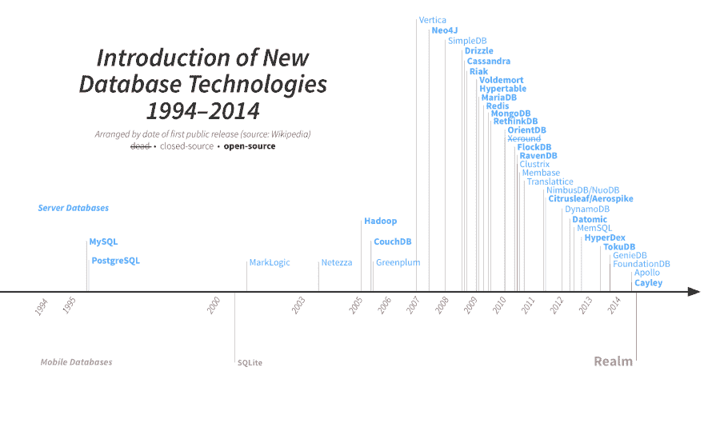
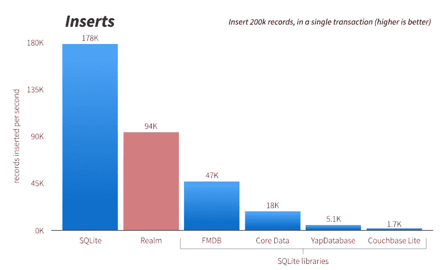
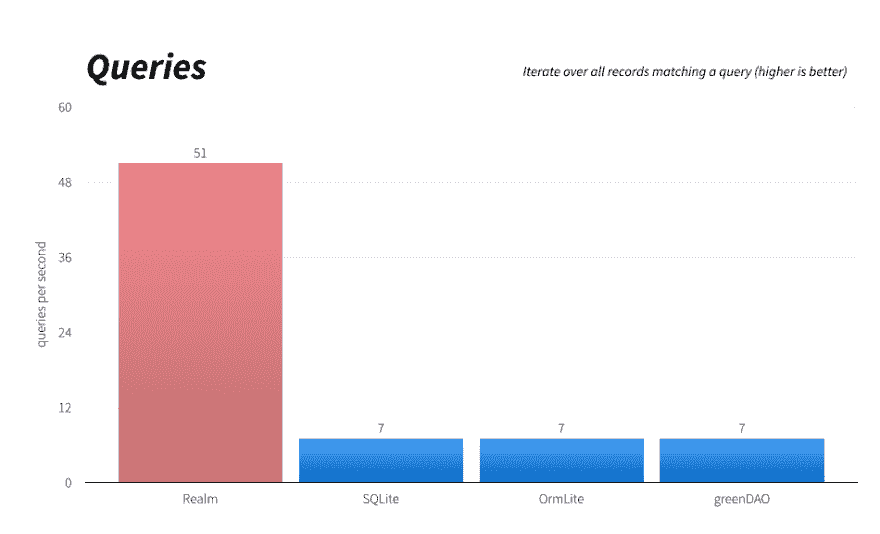
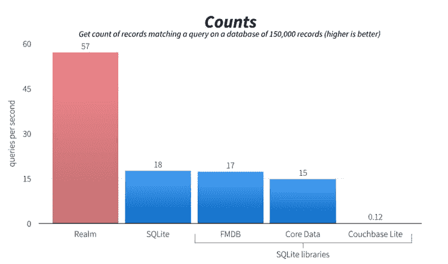
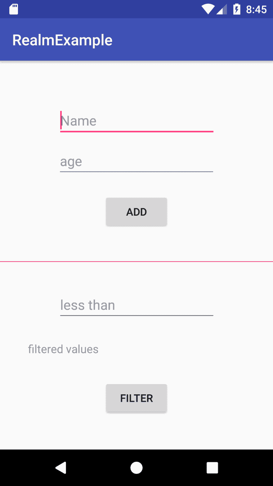

# 领域数据库简介

> 原文：<https://dev.to/lemuelogbunude/intro-to-realm-database-1g3o>

如今，在决定选择数据库解决方案时，我们有很多选择。我们有不同的有吸引力的选择，每一个都有它的优点和缺点。我发现一个突出的是领域数据库。Realm 数据库可以被 Android、IOS、React 甚至 Xamarin 开发者使用。

## 什么境界🤔

如今，大多数应用程序都需要某种持久数据，解决这一问题通常会使应用程序变得更加复杂，并增加更多的代码行。许多工程组织都非常熟悉开发复杂性增加的痛苦，这导致了更长的周期、超负荷的资源和笨拙的代码库。Realm 和其他新的数据库解决方案正在解决这个复杂性问题。

Realm 简化了您的应用程序架构，同时为您提供了非常强大的功能。Realm 平台实际上由两个主要组件组成。领域数据库和领域对象服务器。根据官方文档，这两个组件协同工作，自动同步数据，支持从离线应用到复杂后端集成的许多用例。我不打算在本文中讨论领域对象服务器，因此，你可以在这里阅读更多关于领域对象服务器的内容。

Realm 如此特别的一个关键因素是，它是为我们的现代移动开发需求而构建的，我们使用的许多解决方案实际上并不是为手机、平板电脑或可穿戴设备设计的:
[](https://res.cloudinary.com/practicaldev/image/fetch/s--qUt2QV4X--/c_limit%2Cf_auto%2Cfl_progressive%2Cq_auto%2Cw_880/https://images.ctfassets.net/3c9g5h7ou6jg/79erDXfQZ2qgCiKggQUcwm/2e4925499ac2c34155423681b630ec17/introducing-realm-timeline.png)

很长一段时间以来，SQLite 一直是我们在移动设备上持久化的主要选择，即使它没有被直接使用，它也被许多提供方便包装的库使用，如 Couchbase Lite、Core Data、ORMLite 等。

Realm 也以速度著称，根据文档，Realm 在普通操作上甚至比原始 SQLite 更快，同时保持了极其丰富的特性集。

[](https://res.cloudinary.com/practicaldev/image/fetch/s--fSYs-dxA--/c_limit%2Cf_auto%2Cfl_progressive%2Cq_auto%2Cw_880/https://thepracticaldev.s3.amazonaws.com/i/hjq0d7c9pgtfko8m1gxq.png)
[](https://res.cloudinary.com/practicaldev/image/fetch/s--T-Gkp1jw--/c_limit%2Cf_auto%2Cfl_progressive%2Cq_auto%2Cw_880/https://thepracticaldev.s3.amazonaws.com/i/jh5q87w8pfhdwulqc4s2.png)
[](https://res.cloudinary.com/practicaldev/image/fetch/s--3-rP6z2q--/c_limit%2Cf_auto%2Cfl_progressive%2Cq_auto%2Cw_880/https://thepracticaldev.s3.amazonaws.com/i/pr1jrip58drv4z80yu4s.png)

Realm 也很容易使用，下面是一些基本 Realm 事务的示例代码:

对于 Java:

```
public class Dog extends RealmObject {
  public String name;
  public int age;
}

Dog dog = new Dog();
dog.name = "Rex";
dog.age = 1;

Realm realm = Realm.getDefaultInstance();
realm.beginTransaction();
realm.copyToRealm(dog)
realm.commitTransaction();

RealmResults<Dog> pups = realm.where(Dog.class)
                               .lessThan("age", 2)
                               .findAll(); 
```

Enter fullscreen mode Exit fullscreen mode

对于 Swift:

```
class Dog: Object {
  @objc dynamic var name = ""
  @objc dynamic var age = 0
}

let dog = Dog()
dog.name = "Rex"
dog.age = 1

let realm = try! Realm()
try! realm.write {
  realm.add(dog)
}

let pups = realm.objects(Dog.self).filter("age < 2") 
```

Enter fullscreen mode Exit fullscreen mode

对于 Javascript:

```
class Dog {}

Dog.schema = {
  name: 'Dog',
  properties: {
    name: 'string',
    age: 'int',
  }
};

let realm = new Realm();
realm.write(() => {
  realm.create('Dog', {name: 'Rex', age: 1});
});

let pups = realm.objects('Dog').filtered('age < 2'); 
```

Enter fullscreen mode Exit fullscreen mode

对于 Xamarin:

```
public class Dog : RealmObject 
{
  public string Name { get; set; }
  public int Age { get; set; }
}

var realm = Realm.GetInstance();
realm.Write(() => 
{
  realm.Add(new Dog
  {
    Name = "Rex",
    Age = 1
  });
});

var pups = realm.All<Dog>().Where(d => d.Age < 2); 
```

Enter fullscreen mode Exit fullscreen mode

## 入门😁

我们将使用 Realm 数据库构建一个非常简单的应用程序。这将是一个 Android 应用程序。我会尽我所能让它变得简单，这样任何人都可以和它联系起来，并在他们希望的任何平台上实现它。

我们要做的应用程序只做基本的数据库操作，这只是给你一个使用 Realm 时会发生什么的概述。

我们有一个 Edittext 视图，用于将用户的姓名和年龄插入到数据库中。下面是一个添加按钮，将用户名和年龄插入数据库。还有一个*过滤器*按钮，用于查询特定用户的数据库。

[T2】](https://res.cloudinary.com/practicaldev/image/fetch/s--Buyj_dmb--/c_limit%2Cf_auto%2Cfl_progressive%2Cq_auto%2Cw_880/https://thepracticaldev.s3.amazonaws.com/i/4f4628hzq4hoi2p7v99m.png)

### 第一步🔥

将类路径依赖项添加到项目级 build.gradle 文件中。

```
buildscript {

    repositories {
        google()
        jcenter()
    }
    dependencies {
        classpath 'com.android.tools.build:gradle:3.1.2'

        classpath "io.realm:realm-gradle-plugin:5.1.0" //todo (1) add realm dependency

        // NOTE: Do not place your application dependencies here; they belong
        // in the individual module build.gradle files
    }
} 
```

Enter fullscreen mode Exit fullscreen mode

### 第二步🔥

将 realm-android 插件应用到应用程序级别 build.gradle 文件的顶部。

```
apply plugin: 'com.android.application'

apply plugin: 'realm-android' //todo (2) add realm plugin

android {
    compileSdkVersion 27
    defaultConfig {
... 
```

Enter fullscreen mode Exit fullscreen mode

## 定义模型类

通过扩展 RealmObject 定义您的模型类。它类似于你每天的 POJO 课程。

```
import io.realm.RealmObject;

//todo (3) Define your model class by extending RealmObject
public class User extends RealmObject{
    private String name;
    private int age;

    public User() {
    }

    public User(String name, int age) {
        this.name = name;
        this.age = age;
    }

    public String getName() {
        return name;
    }

    public int getAge() {
        return age;
    }

    public void setName(String name) {
        this.name = name;
    }

    public void setAge(int age) {
        this.age = age;
    }
} 
```

Enter fullscreen mode Exit fullscreen mode

## 初始化领域

首先，您需要初始化 Realm，每个应用程序只需要初始化一次，所以 onCreate 是一个很好的地方。

```
 @Override
    protected void onCreate(Bundle savedInstanceState) {
        super.onCreate(savedInstanceState);
        setContentView(R.layout.activity_main);
        ButterKnife.bind(this);

        //todo (4) Initialize Realm (just once per application)
        Realm.init(this);

        //todo (5) Get a Realm instance for this thread
        Realm realm = Realm.getDefaultInstance();
... 
```

Enter fullscreen mode Exit fullscreen mode

## 写道🔥

所以现在一切都准备好了。下一步是添加一个有姓名和年龄的新用户。如上图所示，通过单击“添加”按钮添加它们。编辑文本视图**名称**、**年龄**的 ID 分别为*名称 _ 文本*和*年龄 _ 文本*，而按钮的 ID 为*添加 _ 文本*。

```
 add_btn.setOnClickListener(v -> {
            // write operations in Realm must be wrapped in transactions.
            realm.beginTransaction();
            User user = realm.createObject(User.class); //todo  Create a new object
            user.setName(name_txt.getText().toString()); //todo get user name from Edittext and store in user object
            user.setAge(Integer.valueOf(age_txt.getText().toString())); //todo get user age from Edittext and store in user object
            realm.commitTransaction();
            // commit transaction

            Toast.makeText(this, "User added", Toast.LENGTH_LONG).show();
            clearText();
        }); 
```

Enter fullscreen mode Exit fullscreen mode

当开始一个领域写操作时，它必须被包装在事务中。基本上，在写操作结束时，您可以提交或取消事务。提交事务会将所有更改写入磁盘。如果取消写事务，所有更改都将被丢弃。

如果您注意到，本文中的第一个示例使用了 **copyToRealm()** 来添加一个新对象，这两种方法都会将数据插入到数据库中。

在上面的代码中，我们简单地从扩展了 *RealmObject* 的 User 类创建了一个新对象，我们设置了值，瞧！我们已经插入了数据。我没有向你隐藏任何额外的代码或类，这实际上是执行一个写操作所需要的。

## 查询🔥

现在我们可以插入可爱的数据了，下一个问题是如何把它取出来🤔。好吧，如果你认为插入数据的过程看起来很酷，那就等着看我们如何检索它吧。假设您想要获取所有年龄小于 45 岁的用户，那么查询应该是这样的:

```
 RealmResults<User> result = realm.where(User.class)
                            .lessThan("age", 45)//find all users with age less than 45
                            .findAll();//return all result that reach criteria 
```

Enter fullscreen mode Exit fullscreen mode

这不是很棒吗？这样做之后，您可以遍历领域结果并获得值，例如:

```
 StringBuilder stringBuilder = new StringBuilder();
                    for (int i = 0; i < result.size(); i++) {
                        stringBuilder.append(result.get(i).getName() + "  ");
                    } 
```

Enter fullscreen mode Exit fullscreen mode

我只是触及了表面，Realm 可以做的比我演示的更多，这只是一个介绍。你可以查看[文档](https://realm.io/docs)以获得更多关于查询、过滤、多线程、测试等等的信息。

你可以在这里找到上面示例应用的完整源代码:

##  [李慕碧](https://github.com/LEMUBIT) / [ RealmExample](https://github.com/LEMUBIT/RealmExample)

### 这是一个简单的项目，演示了如何使用 Realm 数据库进行 Android 开发。

<article class="markdown-body entry-content container-lg" itemprop="text">

# real me 示例

这是一个简单的项目，演示了如何使用 Realm 数据库进行 Android 开发。

</article>

[View on GitHub](https://github.com/LEMUBIT/RealmExample)