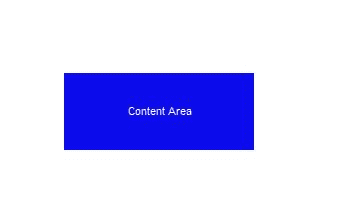
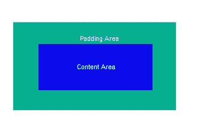
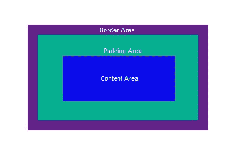
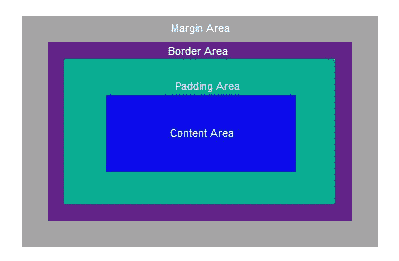

# CSS 盒子模型介绍。

> 原文：<https://dev.to/johnkennedy9147/intro-to-the-css-box-model-122e>

我最初写这篇文章是作为对 freeCodeCamp[*Guide*](https://guide.freecodecamp.org/)*项目的贡献。你可以在这里* *查看文章本身* [*。你可以在昆西 2017 年 9 月的*](https://guide.freecodecamp.org/css/the-box-model/) [*文章*](https://medium.freecodecamp.org/heres-a-new-way-to-learn-coding-tools-and-concepts-right-when-you-need-them-ee82d15c576d) *中了解该项目的目标。该项目的贡献者总是受欢迎的。*

理解 CSS 盒子模型对于正确布局网页至关重要。

当浏览器呈现(绘制)网页时，每个元素(例如一段文本或一幅图像)都被绘制为遵循 CSS 框模型规则的矩形框。

盒子的中心是内容本身，它占据了一定的高度和宽度。这个区域被称为**内容区域**。内容区域的大小可以自动确定，也可以显式设置高度和宽度的大小。(参见下面关于`box-sizing`的注释)

[T2】](https://res.cloudinary.com/practicaldev/image/fetch/s--waQNaCZJ--/c_limit%2Cf_auto%2Cfl_progressive%2Cq_auto%2Cw_880/https://cdn-images-1.medium.com/max/343/1%2A_r62OrD_SdDYYjccCfKGLA.jpeg)

在内容区域周围是一个被称为**填充区域**的区域。`padding`的大小可以完全相同，或者您可以分别设置顶部、底部、左侧和右侧的填充。如果您为元素使用背景，背景将延伸到填充区域。

[T2】](https://res.cloudinary.com/practicaldev/image/fetch/s--o1bT9LmR--/c_limit%2Cf_auto%2Cfl_progressive%2Cq_auto%2Cw_880/https://cdn-images-1.medium.com/max/343/1%2AisGpZLL9d9aaW3BGrpq37g.jpeg)

接下来是**边境地区**。这会在元素及其填充周围创建一个边框。您可以设置边框的粗细、颜色和样式。样式选项包括无、实线、虚线、点线和其他几种。(参见下面关于`box-sizing`的注释)

[T2】](https://res.cloudinary.com/practicaldev/image/fetch/s--u-tQ8QzN--/c_limit%2Cf_auto%2Cfl_progressive%2Cq_auto%2Cw_880/https://cdn-images-1.medium.com/max/399/1%2AY2wKEqxt3o1RWyyXLbWmCg.jpeg)

最后是**边缘区域**。这在元素、填充和边框周围创建了清晰的空间。同样，您可以单独设置上边距、下边距、左边距和右边距。在某些情况下，会发生边距折叠，并且相邻元素之间的边距可能会被共享。

[T2】](https://res.cloudinary.com/practicaldev/image/fetch/s--YwIthwH5--/c_limit%2Cf_auto%2Cfl_progressive%2Cq_auto%2Cw_880/https://cdn-images-1.medium.com/max/399/1%2ALCWYi8UVXqF24rgU-8sPHA.jpeg)

**`Box-Sizing`属性**

该属性默认为`content-box`。如果使用缺省值，那么框模型将允许作者指定内容区域的大小。但是，可以使用这些来指定边界区域的大小。这是通过将`box-sizing`属性更改为`border-box`来实现的。这有时可以使布局更容易。您可以根据需要设置每个元素的`box-sizing`属性。